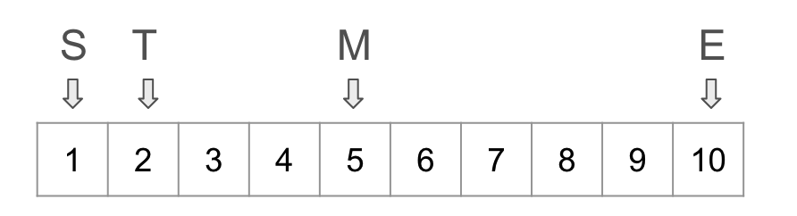
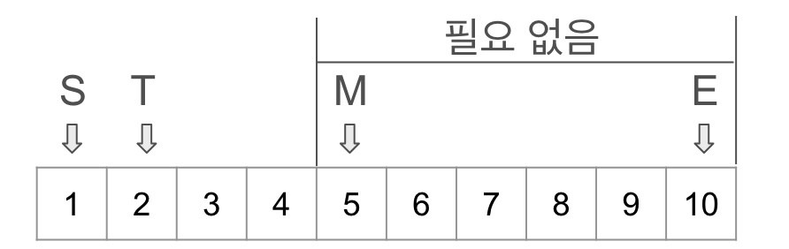
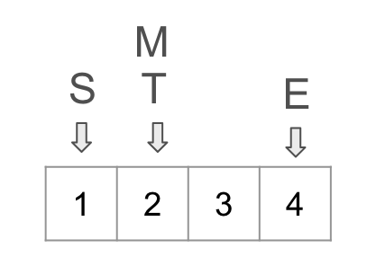

# 이진탐색

이진 탐색이란 정렬된 배열에서 특정 값을 `Log(n)`의 시간 복잡도로 원하는 값을 찾을 수 있는 알고리즘입니다.

아이디어 -> 중앙 값을 기준으로 필요없는 값은 모두 버려도 된다!

그럼 해당 아이디어를 코드를 통하여 알아보도록 하겠습니다.

```java
public class Main {
	private int target = 2;
	private int[] array = {1,2,3,4,5,6,7,8,9,10};

	public int binarySearch() {
		int start = 0;
		int end = 9;
	
		while (start < end) {
			int mid = start + (end - start) / 2;
			if (array[mid] < target) {
				start = mid + 1;
			} else if (array[mid] > target) {
				end = mid - 1;
			} else {
				return mid;
			}
		}
		return -1;
	}
}
```

초기 상태는 다음과 같습니다.



내가 찾고자 하는 값보다 중앙의 값이 작으므로 중앙에서 부터 끝까지는 필요 없는 부분으로 생각할 수 있습니다.



그러므로 필요없는 부분은 삭제합니다.



이후 중앙의 값을 찾으면 원하는 값과 동일한 것을 보실 수 있습니다.

이것과 같이 이진 탐색은 내가 찾고자하는 값이 없는 부분을 지워나가며 찾아가는 과정입니다.

# 응용

이진탐색을 알아 보았으니 응용법을 알아보도록 하겠습니다.

이진탐색의 응용법은 굉장히 많지만 여기서는 `LowerBound`와 `UpperBound`만을 다루도록 하겠습니다.

## LowerBound

`LowerBound`는 내가 찾고자하는 값보다 크거나 같은 첫번째 위치

아이디어 -> 내가 찾고자하는 값보다 작으면 모두 버린다.

```java

public class Main {
	private int target = 2;
	private int[] array = {1,2,3,4,5,6,7,8,9,10};

	public int lowerBound() {
		int start = 0;
		int end = 9;
	
		while (start < end) {
			int mid = start + (end - start) / 2;
			if (array[mid] < target) {
				start = mid + 1;
			} else {
				end = mid;
			}
		}
		return end;
	}
}

```

## UpperBound

`UpperBound`는 내가 찾고자하는 값보다 큰 첫번째 위치

아이디어 -> 내가 찾고자하는 값보다 작거나 같으면 모두 버린다.

```java

public class Main {
	private int target = 2;
	private int[] array = {1,2,3,4,5,6,7,8,9,10};

	public int upperBound() {
		int start = 0;
		int end = 9;
	
		while (start < end) {
			int mid = start + (end - start) / 2;
			if (array[mid] <= target) {
				start = mid + 1;
			} else {
				end = mid;
			}
		}
		return end;
	}
}

```
