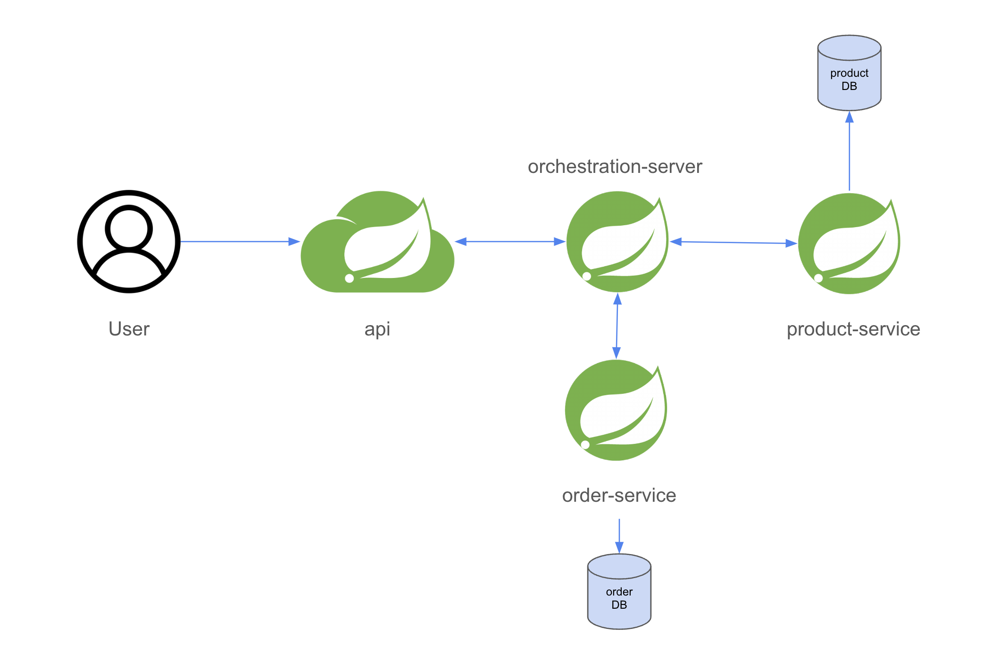

# Saga Pattern
## Saga란?
이야기 또는 과정을 뜻 합니다.
이야기는 사건(Event)가 진행되는 `과정`이라고 할 수 있습니다.
해당 어원에서 착안 한 것 같습니다.

## Saga Pattern이란?
마이크로 서비스간 `이벤트`를 주고 받아 특정 마이크로서비스에서 작업이 실패하면, 이전까지의 작업이 완료된 마이크로서비스에 보상 이벤트를 발행함으로써 원자성을 보장하는 패턴입니다.

대표적으로 `Coreography Saga`, `Orchestration Saga`패턴 2종류가 있습니다.
## Coreography Saga Pattern의 문제점

Application이 많아지면 구현이 복잡도가 증가합니다.

## Orchestration Saga Pattern의 문제점

중앙에 오케스트레이션 서버를 놓고 이 서버에서 메시지 라우팅, 이벤트 스토어 기능을 제공합니다.

오케스트레이션 서버를 별도로 개발 해야한다는 문제점이 발생합니다.

## 대안

### Axon Server도입
Axon은 Orchestration Saga 패턴을 비교적 손쉽게 구현 할 수 있습니다.
