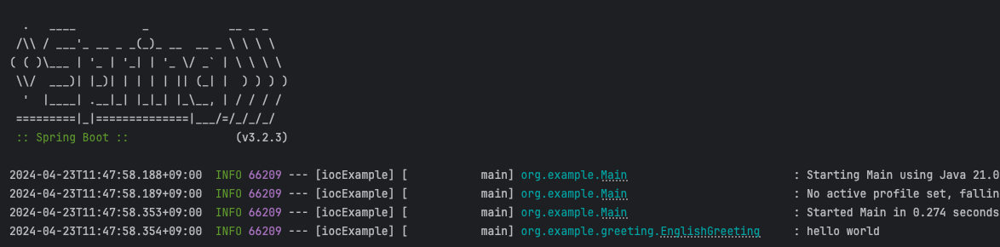

## 지금까지 우리가 로그를 어떻게 처리하고 있었나?

- `system.out.println()` 을 통해서 콘솔에 데이터를 찍고 있었다.
    
- 문제점
    

1. 성능 저하
    
    - System.out.println() 은 내부적으로 I/O 작업을 수행하기 때문에 많이 발생하는 경우 성능 저하가 많이 일어날 수 있다.
        
2. 로그 관리의 어려움
    
    - 로그마다 중요한 로그도 있고, 중요하지 않는 로그도 있을텐데, System.out.println() 에서는 구분할 수 있는 방법이 없다.
        
3. 확장성 및 유지보수 문제
    
    - 시스템의 어느 부분에서 어떤 로그가 발생하는지 추적하기 어렵고, 추후 로깅 방식을 변경하거나 업그레이드할 때 전체 코드를 수정해야 하는 문제가 있다.
        

## 스프링에서 이 것도 지원해주지 않을까?

- spring-boot-starter 에 포함
    

```xml
<dependency>
  <groupId>org.springframework.boot</groupId>
  <artifactId>spring-boot-starter-logging</artifactId>
  <version>3.2.5</version>
  <scope>compile</scope>
</dependency>
```

## Spring Framework 로깅

[[번외] SpringFramework 로깅](https://nhnent.dooray.com/share/pages/6lOTMWVzTr-xWdUPtHXMjw/3803912689840626340)

## spring-boot-starter-logging

- spring-boot-starter-logging 에서는 logback (구현체) 와 SLF4J (추상화 모듈) 을 추가하고
    

```xml
<dependency>
  <groupId>ch.qos.logback</groupId>
  <artifactId>logback-classic</artifactId>
  <version>1.4.14</version>
  <scope>compile</scope>
</dependency>
<dependency>
  <groupId>org.apache.logging.log4j</groupId>
  <artifactId>log4j-to-slf4j</artifactId>
  <version>2.21.1</version>
  <scope>compile</scope>
</dependency>
<dependency>
  <groupId>org.slf4j</groupId>
  <artifactId>jul-to-slf4j</artifactId>
  <version>2.0.12</version>
  <scope>compile</scope>
</dependency>
```

- logback-classic: logback 과 SLF4J 를 포함하는 라이브러리
    
- log4j-to-slf4j: Log4j 1.x 에서 발생하는 로그를 SLF4J로 전달
    
- jul-to-slf4j: Java Util Logging (JUL)에서 발생하는 로그를 SLF4J로 전달
    

## logback 으로 로그 사용

### lombok 사용

- @Slf4j 만 붙여주면, log.info(), log.warn() 등으로 활용할 수 있다.
    

```java
@Slf4j
public class EnglishGreeting implements Greeting {
    @Override
    public void sayHello() {
        log.info("hello world");
    }
}
```

### lombok 사용 x

- 롬복에서  
    `private static final org.slf4j.Logger log = org.slf4j.LoggerFactory.getLogger(EnglishGreeting.class);` 를 만들어주는 구조
    

```java
public class EnglishGreeting implements Greeting {

    private static final org.slf4j.Logger log = org.slf4j.LoggerFactory.getLogger(EnglishGreeting.class);

    @Override
    public void sayHello() {
        log.info("hello world");
    }
}
```



- 실행해보면, 기존에 찍히던 로그와 위화감이 없이 찍히고 있다.
    
- 스프링 내부적으로 이런 식으로 로그를 찍고 있었다는 걸 알 수 있다.
    
## 변수 출력, exception 출력

- 로그 메시지 중간에 `{}` 플레이스 홀더를 이용해서, 변수를 넣을 수 있다.
    
- 로그 메소들 호출 시, 예외객체를 마지막 인자로 넣으면, 스택트레이스를 로그에 추가해준다.
    

```java
@Slf4j
public class EnglishGreeting implements Greeting {

    @Override
    public void sayHello() {

        Integer intValue = 1;
        String stringValue = "sando";


        log.info("hello world - {} - {}", intValue, stringValue);

        try {
            throw new RuntimeException("This is expected exception");
        } catch (RuntimeException e) {

            log.info("Lets log exception.", e);
        }
    }
}
```

## log.info(), log.warn() 등으로 로그를 찍고 있는데, 이게 뭔가요?

### 로그 레벨

- 로그 레벨(log level)은 애플리케이션에서 발생하는 이벤트의 중요도를 나타내는 지표
    
- 로그 레벨을 설정함으로써, 개발자는 어떤 종류의 메시지가 로그에 기록되어야 하는지 결정할 수 있다.
    

### 로그 레벨 종류

- 다양한 로깅 시스템에서 사용되는 일반적인 로그 레벨
    
    - TRACE  
        가장 상세한 정보를 제공. 디버깅 목적으로 사용되며, 애플리케이션의 내부 상태나 변수의 변화, 함수 호출과 같은 매우 상세한 운영 정보를 로깅
        
    - DEBUG  
        개발 중에 일반적인 문제 해결을 위해 사용. 애플리케이션의 실행 흐름을 추적하거나 상태를 확인하는 데 필요한 상세 정보를 제공.
        
    - INFO  
        일반적인 운영에 필요한 유용한 정보를 로그. 시스템의 동작 상태나 중요한 이벤트 발생을 알릴 때 사용되며, 정상적인 작동 조건에서 유용.
        
    - WARN  
        잠재적인 문제를 예고하는 경고 메시지를 로그. 에러는 아니지만, 주의가 필요하거나 예상치 못한 상황이 발생했을 때 사용. 예를 들어, 사용되지 않는 API의 사용, 예상치 않은 상황 등이 여기에 해당.
        
    - ERROR  
        실제 오류나 문제가 발생했을 때 사용. 이 로그 레벨의 메시지는 주로 예외 처리와 연관되어 있으며, 시스템의 정상적인 동작에 영향을 미치는 중대한 이슈를 나타냄.
        
    - FATAL  
        가장 심각한 오류를 나타냄. 이 로그 레벨의 이벤트는 애플리케이션의 실행을 중단시킬 수 있는 치명적인 문제를 의미. 예를 들어, 시스템 컴포넌트의 실패나 데이터 손실 등이 이에 해당.
        
- 결국 로그를 찍는 당사자가 어느 레벨로 찍을지 결정하는 것. 별 것 아닌데 FATAL 로그를 찍을 수도 있고, 심각한 오류를 TRACE 로 찍을 수도 있다.
    

c.f) logback 은 FATAL 를 지원하지 않는다. ERROR 로 같이 처리한다.

## 로그 파일로 내보내기 (외부구성 이용)

- logging.file.name 이나 logging.file.path 활용
    
- logging.file.name: 로그 파일 이름
    
    ```
    logging.file.name=system.log
    ```
    
- logging.pattern.file: 파일에 적을 로그 패턴
    
    ```
    logging.pattern.file=%date %level [%thread] %logger{10} [%file:%line] %msg%n
    ```
    
- logging.level.{}: 로그 레벨 설정
    
    ```
    logging.level.root=info
    logging.level.{PATH}=info
    ```
    
## 로그가 너무 많을 때 (log rotate)

- Spring Boot 에서는 특정 조건이 되면 로그를 압축하는 설정이 있다.
    
    - logging.logback.rollingpolicy.clean-history-on-start: 프로그램 실행 시 기존 로그 삭제
        
    
    ```
    logging.logback.rollingpolicy.clean-history-on-start=false
    ```
    
    - logging.logback.rollingpolicy.file-name-pattern: 파일이 기준이 넘어갈 때 압축할 때 파일 이름 패턴
        
    
    ```
    logging.logback.rollingpolicy.file-name-pattern=${LOG_FILE}.%d{yyyy-MM-dd}.%i.gz)
    ```
    
- logging.logback.rollingpolicy.max-file-size: 최대 압축 파일 크기. 크기가 넘어갈 경우 압축하고 새로운 파일에 로그를 쓴다.
    
    ```
     logging.logback.rollingpolicy.max-file-size=10MB
    ```
    
- logging.logback.rollingpolicy.max-history: 압축 파일 최대 보관 기한
    
    ```
    logging.logback.rollingpolicy.max-history=7
    ```
    
- logging.logback.rollingpolicy.total-size-cap: 압축 파일 최대 보관 사이즈. max-history 속성 설정 시에만 동작.
    
    ```
    logging.logback.rollingpolicy.total-size-cap=0B
    ```
    

## 로그의 세심한 관리 (logback 설정)

- resources 하위에 logback-spring.xml 파일을 생성한다.
    
```xml
<configuration>
    <appender name="STDOUT" class="ch.qos.logback.core.ConsoleAppender">
        <encoder>
            <pattern>%d{yyyy-MM-dd HH:mm:ss} [%thread] %-5level %logger{36} - %msg%n</pattern>
        </encoder>
    </appender>

    <appender name="FILE" class="ch.qos.logback.core.FileAppender">
        <file>system.log</file>
        <append>true</append>
        <encoder>
            <pattern>%date %level [%thread] %logger{10} [%file:%line] %msg%n</pattern>
        </encoder>
    </appender>

    <logger name="org.example.greeting" level="info" additivity="false">
        <appender-ref ref="STDOUT"/>
    </logger>

    <root level="info">
        <appender-ref ref="STDOUT"/>
        <appender-ref ref="FILE"/>
    </root>

</configuration>
```

- `<configuration>` 모든 Logback 설정의 루트 요소.
    
- `<logger>`: 특정 패키지나 클래스에 대한 로그 설정. 로그 레벨과 appender 참조를 포함.
    
- `<root>` : 애플리케이션의 모든 로그에 적용될 기본 로거 설정. 로그 레벨과 appender 참조를 포함.
    
- `<appender>` : 로그 메시지를 출력할 대상을 정의. 여기에는 이름과 클래스, 로그 형식등의 설정이 포함.  
    ex) ConsoleAppender: 표준 출력(콘솔)으로 로그를 보내는 appender.  
    ex) FileAppender: 파일로 로그를 기록하는 appender.
    
    - `<encoder>`: 로그 메시지의 출력 형식을 정의.
        
    - `<pattern>`:로그 날짜, 로그 레벨, 스레드 이름, 로거 이름, 메시지 등을 지정.
        

# 용어 정리

## logger

- 로그 이벤트를 수집하여 appender 에 전달
    
- Logger는 `<logger>` 태그를 통하여 구성
    
    - name 속성이 필수
        
    - level 속성: 대소문자를 구분하지 않으며 TRACE, DEBUG, INFO, WARN, ERROR, ALL, OFF 중 하나의 값으로 지정. INHERITED 또는 NULL 인경우 상속하는 상위 로거의 level 을 따름
        
    - additivity 속성: true, false 값으로 중복 출력 방지
        

`<appender-ref>` : 0 개 이상을 가질 수 있으며, 어떤 appender 을 붙일지 결정

## root (root logger)

- 루트 로거는 `<root>` 태그를 통하여 구성
    
- 루트 로거의 이름은 이미 "ROOT"로 정해져 있기에 name 속성도 포함하지 않는다.
    
- level 속성으로는 기존 logger와 동일하게 level 값들을 가질 수 있다. 하지만 최상단의 로거이기 때문에 INHERITED 혹은 NULL 값은 level 값으로 가질 수 없다.
    

## appender

- logger 에서 로그 이벤트를 받아 실제 로그를 기록
    
- Appender는 `<appender>` 태그를 통하여 구성
    
    - name와 class 속성을 필수
        
    - name 속성은 appender의 이름을 명시
        
    - class 속성은 인스턴스화 시킬 appender 클래스
        

## 로거의 누적

- logger는 자신에게 부착된 appender 이외에 자신의 상위 logger의 appender에게 로그를 전달한다.
    
- 그렇기에 같은 appender를 다른 logger에 등록한다면 로그의 중복 출력에 주의해야한다.
    

- logger 의 additivity 속성을 false 로 선언하면 상위의 logger 에게 로그를 전달하지 않는다.
    

```xml
<configuration>
  <appender name="STDOUT" class="ch.qos.logback.core.ConsoleAppender">
    <encoder>
      <pattern>%d{HH:mm:ss.SSS} [%thread] %-5level %logger{36} - %msg%n</pattern>
    </encoder>
  </appender>

  <logger name="chapters.configuration">
    <appender-ref ref="STDOUT" />
  </logger>

  <root level="debug">
    <appender-ref ref="STDOUT" />
  </root>
</configuration>
```
## logback 설정 - 변수 선언 및 치환

- `<variable>` 태그를 통해 변수를 선언가능
    
- ${variable_name} 으로 변수 값 사용 가능
    

```xml
<configuration>

    <variable name="LOG_FOLDER" value="logs/"/>

    <appender name="FILE" class="ch.qos.logback.core.FileAppender">
        <file>${LOG_FOLDER}/system.log</file>
        <append>true</append>
        <encoder>
            <pattern>%date %level [%thread] %logger{10} [%file:%line] %msg%n</pattern>
        </encoder>
    </appender>

    <logger name="org.example.greeting" level="info">
        <appender-ref ref="STDOUT"/>
    </logger>

    <root level="info">
        <appender-ref ref="FILE"/>
    </root>

</configuration>
```

- 변수는 `<variable>` 태그 대신 시스템 변수로 전달하여도 위의 configuration과 동일하게 설정할 수 있다.
    

```
java -DLOG_FOLDER="/{원하는절대경로}" MyApp
```

## logback 설정 - 색 입히기

- `<pattern>` 태그에서 %highlight() 사용
    
- `<pattern>` 태그에서 %{색상명}() 사용. ex) %red
    

```xml
<configuration>
    <appender name="STDOUT" class="ch.qos.logback.core.ConsoleAppender">
        <encoder>
            <pattern>%red(%d{yyyy-MM-dd HH:mm:ss}) %white([%thread]) %-5level %logger{36} - %highlight(%msg) %n</pattern>
        </encoder>
    </appender>

    <logger name="org.example.greeting" level="trace" additivity="false">
        <appender-ref ref="STDOUT"/>
    </logger>

    <root level="info">
        <appender-ref ref="STDOUT"/>
    </root>

</configuration>
```

## logback file 에서 Rotate 하기 (RollingFileAppender)

- appender 을 수정하면 된다.
    

```xml
        <appender name="systemLogAppender" class="ch.qos.logback.core.rolling.RollingFileAppender">
            <file>system.log</file>
            <rollingPolicy class="ch.qos.logback.core.rolling.TimeBasedRollingPolicy">
                <fileNamePattern>system-%d{yyyy-MM-dd}.%i.log.gz</fileNamePattern>
                <timeBasedFileNamingAndTriggeringPolicy class="ch.qos.logback.core.rolling.SizeAndTimeBasedFNATP">
                    <maxFileSize>10MB</maxFileSize>
                </timeBasedFileNamingAndTriggeringPolicy>
                <maxHistory>7</maxHistory>
            </rollingPolicy>
            <encoder>
                <pattern>%d{HH:mm:ss.SSS} [%thread] %-5level %logger{36} - %msg%n</pattern>
            </encoder>
        </appender>
```

## logback-spring.xml 파일 위치 변경

`logging.config` property 값 변경으로 수정 가능

ex) `logging.config=classpath:config/my-logback.xml`

# 요약

### Spring Boot Logging

- spring-boot-starter 을 의존성에 넣으면 자동으로 로깅 관련 설정이 모두 완료되어서, slf4j, logback 을 이용해서 로그를 찍어준다.
    

### 로그 설정

- application.properties 를 통해 간단한 로그 설정을 제어할 수 있다.
    

### logback 설정

- logback-spring.xml 파일을 생성해서 제어할 수 있으며, appender, logger, root 등을 지정해서 커스터마이징 할 수 있다.
    
- 로그 레벨이란 것이 존재하는데, 이에 따라서 다르게 동작하게 할 수 있다.