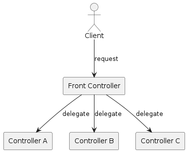
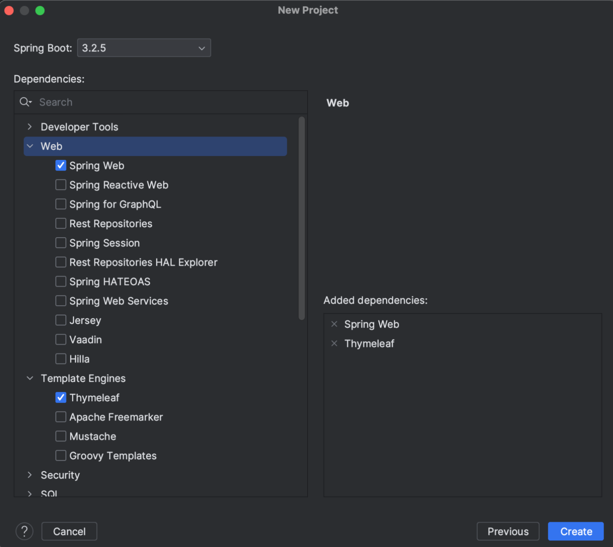
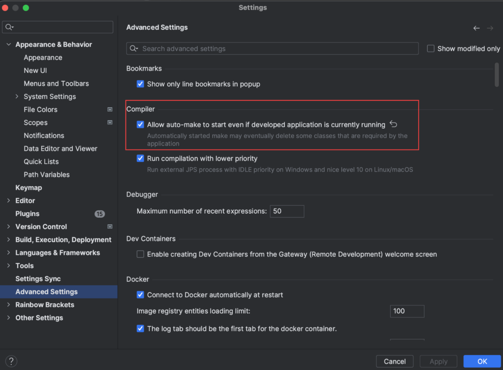
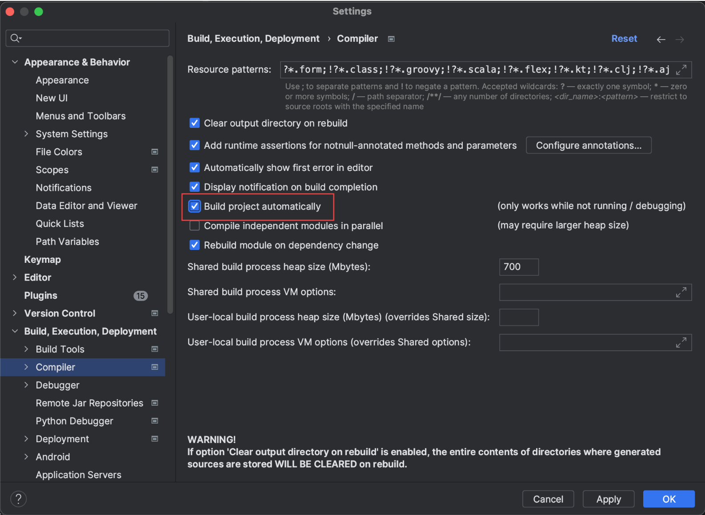

# Spring MVC
- Spring Framework이 직접 제공하는 Servlet API 기반의 웹 프레임워크
    
- Spring MVC 는 다음 패턴의 구현체
    
    - MVC pattern
        
    - Front controller pattern
# MVC Pattern
## Model-View-Controller

- 애플리케이션의 개발 영역을 Model, View, Controller 세 가지 역할로 구분
    
- 역할을 나눔으로서 코드의 복잡도를 줄일 수 있는 장점


## JavaBeans/JSP/Servlet (JSP Model2)


# Front Controller Pattern

> _A controller that handles all requests for a Web site._ - Martin Fowler

- 모든 요청을 Front controller 에서 받아서 요청에 따라 실제 처리할 컨트롤러에 위임
    
- 인증, 인가 등 공통적으로 처리해야 할 부분을 Front controller에서 처리하기 용이



# Spring MVC

- Spring Framework이 직접 제공하는 Servlet API 기반의 웹 프레임워크
## DispatcherServlet

- Spring MVC Framework의 중심이 되는 Servlet
    
- `Controller`로 향하는 모든 웹 요청의 entry point
    
- `Front Controller` 디자인 패턴의 표현


## Spring MVC
### Controller

- 사용자의 요청을 받아 어떻게 처리 할지 결정하고 요청을 분석
    
- 주로 비즈니스 로직을 처리하고 결과를 모델에 추가
    

### Model

- 컨트롤러가 뷰에 전달할 데이터를 보관
    
- 데이터와 비즈니스 로직을 결합하여 뷰에 필요한 정보 제공
    

### View

- 모델 데이터를 기반으로 클라이언트에게 HTML, JSON 등의 형식으로 응답을 생성
    

## Spring boot web MVC

- Spring boot framework 에서는 embedded WAS를 제공
    
- WAS 서버를 별도로 설치하지 않고 내장된 WAS를 이용해서 애플리케이션을 단독으로 실행가능
    
    - Tomcat, Jetty, UnderTow 등이 있음
        
- spring-boot-starter-web 의존성을 추가하는것 만으로 자동 설정된 애플리케이션을 실행 가능
    

## WebMvcAutoConfiguration

- 자동으로 스프링 웹 애플리케이션의 주요 컴포턴트 설정
    
- EnableWebMvcConfiguration과 WebMvcConfigurationAdapter 클래스를 포함
    

### EnableWebMvcConfiguration

- EnableWebMvcConfiguration 클래스는 RequestMappingHandlerMapping과 RequestMappingHandlerAdapter 컴포넌트를 생성하고 설정
    

### WebMvcConfigurationAdapter

- WebMvcConfigurer 인터페이스를 구현
    

### WebMvcConfigurer

*개발자가 Spring MVC의 기본 설정을 커스터마이징할 수 있도록 해줌  
* Spring MVC에 필요한 기본 설정을 추상 메서드를 통해서 커스터 마이징  
* `add~~` : 새로운 빈이나 오브젝트를 추가하는것  
* `configure~~` : 설정작업을 하는것

# 사용해 보기

## IntelliJ 에서 Spring Boot MVC 프로젝트 생성

- File > New > Project...

- Spring Web, Thymeleaf 선택 후 프로젝트 생성

	

- controller 작성
    
    - src/main/java/com.nhnacademy.demo 하위 controller 패키지 생성
        
    - controller패키지 하위에 HomeController.java 파일 생성
        
    
    ```java
    @Controller
    public class HomeController {
        @GetMapping("/")
        public String index() {
            return "index";
        }
    }
    ```
    
- src/main/resources/templates 하위 index.html 파일 생성
    
    ```html
    <!DOCTYPE html>
    <html lang="en">
    <head>
        <meta charset="UTF-8">
        <title>Hello World</title>
    </head>
    <body>
    Hello World!
    </body>
    </html>
    ```
    
- 실행
    

# Dev Tools

- Spring boot 에서 제공하는 웹 개발 편의를 위한 모듈
    
- 코드 수정시 애플리케이션을 매번 재시작 해야 하는 번거로움을 해결
    
- 아래 기능들을 제공
    
    - Property Defaults
        
    - Automatic Restart
        
    - Live Reload
        
    - Global Settings
        
    - Remote Applications
        
- 참조: [https://docs.spring.io/spring-boot/docs/current/reference/html/using.html#using.devtools](https://docs.spring.io/spring-boot/docs/current/reference/html/using.html#using.devtools)
    

# Demo

## 의존성 추가

### Maven

```maven
<dependencies>
    <dependency>
        <groupId>org.springframework.boot</groupId>
        <artifactId>spring-boot-devtools</artifactId>
        <optional>true</optional>
    </dependency>
</dependencies>
```

### Gradle

```gradle
dependencies {
    developmentOnly("org.springframework.boot:spring-boot-devtools")
}
```

## IntelliJ 세팅 변경
- IntelliJ > Settings... > Advanced Settings > Compiler > Allow auto-make to start even if developed application is currently running 체크
	
- IntelliJ > Settings... > Build, Execution, Deployment > Compiler > Build project Automatically 체크
	

# Spring MVC 그림을 다시 보면


## Front Controller: `DispatcherServlet`

## model: Spring bean

- POJO (Spring framework 교육에서 배운...)
    

## View : 일단 Thymeleaf

## 남는 건?

- Controller
    

# Controller

## Controller

- MVC 패턴에서 `Controller` 역할
    
    - 요청 처리 및 흐름 제어 담당
        
- Front Controller 패턴에서 `Command` interface 구현 클래스에 해당
    
    - 실제 웹 요청을 처리하는 역할
        

## Controller 구현

### `@Controller`

- stereo type bean 중 하나: component scan 과정을 통해 자동으로 bean 등록
    

```java
@Controller                         // <-- Controller 임을 지정
public class HomeController {
    @GetMapping("/")                // <-- HTTP Method 지정, URL 맵핑
    public String index() {
        return "index";             // <-- view 이름 지정
    }
}
```

## Request Mapping

### `@RequestMapping`

- 요청을 Controller 메서드에 맵핑
    

### `@RequestMapping`을 통한 URL 맵핑

```java
@RequestMapping("/persons")
```

**=**

```java
@RequestMapping(value = "/persons")
```

### `@RequestMapping`을 통한 HTTP Method 맵핑

```java
@RequestMapping(value = "/persons", method=RequestMethod.GET)
@RequestMapping(value = "/persons", method=RequestMethod.POST)
@RequestMapping(value = "/persons", method=RequestMethod.PUT)
@RequestMapping(value = "/persons", method=RequestMethod.DELETE)
@RequestMapping(value = "/persons", method=RequestMethod.PATCH)
@RequestMapping(value = "/persons", method=RequestMethod.HEAD)
@RequestMapping(value = "/persons", method=RequestMethod.OPTIONS)
@RequestMapping(value = "/persons", method=RequestMethod.TRACE)
```

### HTTP Method 맵핑은 줄여서

- `@GetMapping` **==** `@RequestMapping(method=RequestMethod.GET)`
    
- `@PostMapping` **==** `@RequestMapping(method=RequestMethod.POST)`
    
- `@PutMapping` **==** `@RequestMapping(method=RequestMethod.PUT)`
    
- `@DeleteMapping` **==** `@RequestMapping(method=RequestMethod.DELETE)`
    
- `@PatchMapping` **==** `@RequestMapping(method=RequestMethod.PATCH)`
    

## Request Mapping (`params`)

### request parameter와 연결하는 방법

- **id** parameter가 있는 경우에만
    

```java
@RequestMapping(method = RequestMethod.GET, params = { "id" })
```

- **id** parameter가 없는 경우에만
    

```java
@GetMapping(params = { "!id" })
```

- **type** parameter 값이 **raw**인 경우에만
    

```java
@GetMapping(params = "type=raw")
```

- **type** parameter 값이 **raw**가 아닌 경우에만
    

```java
@GetMapping(params = "type!=raw")
```

## Controller Method

### Ex.)

```java
@GetMapping("/")
public String index() {             // return type: String, method argument: 없음
    return "index";
}
```

```java
@GetMapping("/{id}")
public Person getPerson(@PathVariable Long id) {        // return type: Person
    // ...                                              // method argument: @PathVariable
    return person;
}
```

```java
@PostMapping
public String doLogin(Member loginInfo, HttpSession session) {    // return: `redirect:'
    // ...                                                        // method argument: HttpSession
    return "redirect:/login";
}
```

## Controller Method에서 사용 가능한 method argument

- HttpServletRequest, HttpServletResponse, HttpSession, WebRequest
    
- Locale
    
- InputStream, OutputStream, Reader, Writer
    
- `@PathVariable`, `@RequestParam`, `@RequetHeader`, `@CookieValue`, `@Value`
    
- Map, Model, ModelMap, `@ModelAttribute`, `@RequestBody`
    
- Errors, BindingResult, ...
    

## Controller Method에서 사용 가능한 return type

- ModelAndView, View
    
- Map, Model, ModelMap
    
- String
    
- void
    
- `@ResponseBody`
    
- POJO
    

## Model 이용하기

### Model로 이용할 수 있는 type

- `java.util.Map` interface
    
- `org.springframework.ui.Model` interface
    
- `org.springframework.ui.ModelMap` class
    

### 실제 처리되는 내용

- `Model`에 설정한 속성(attribute)이 `View`에 `request.attribute` 로 전달됨
    

## 요청 parameter 받아오기 (`@RequestParam`)

### `@RequestParam`

- 요청 URL의 Query String을 처리하기 위한 어노테이션
    

### Ex.)

- 요청 URL
    

```
GET http://localhost:8080/persons?order=-createdAt
```

- Controller Method
    

```java
@GetMapping("/persons")
public List<Person> getPersons(@RequestParam(name="order") String order) {
    // ...
}
```

## 요청 URL의 가변 인자 가져오기 (`@PathVariable`)

### `@PathVariable`

- 요청 URL의 Resource(Path)을 처리하기 위한 어노테이션
    
    - `@RequestMapping` 의 path 에 변수명을 입력받기 위한 place holder 가 필요함
        

### Ex.)

- 요청 URL
    

```
GET http://localhost:8080/persons/99499102
```

- Controller Method
    

```java
@GetMapping("/persons/{personId}")
public List<Person> getPersons(@PathVariable(name="personId", required=true) Long personId) {
    // ...
}
```


## 요청 Header 값 읽어오기 (`@RequestHeader`)

### `@RequestHeader`

- 요청의 HTTP 헤더를 처리하기 위한 어노테이션
    

### Ex.)

- 요청
    

```
GET /some-request HTTP/1.1
Host: localhost:8080
User-Agent: Mozilla/5.0 (Windows NT 10.0; Win64; x64) AppleWebKit/537.36 (KHTML, like Gecko) Chrome/100.0.4896.127 Safari/537.36
```

- Controller Method
    

```java
@GetMapping("/some-request")
public List<User> getUsers(@RequestHeader(name = "User-Agent") String userAgent) {
    // ...
}
```


## Cookie 값 읽어오기 (`@CookieValue`)

### `@CookieValue`

- HTTP 쿠키를 처리하기 위한 어노테이션
    

### Ex.)

```java
@GetMapping("/some-request")
public List<Person> getPersons(@CookieValue(name = "SESSION") String sessionId) {
    // ...
}
```


## `@ModelAttribute`

### 메서드 인자로 선언된 경우: 모델에서 속성 값을 추출해올 때 사용

```java
@PostMapping("/user/register")
public String registerUser(@ModelAttribute UserRegisterRequest userRequest) {
    // ...
}
```


## `@ModelAttribute`

### 메서드에 선언된 경우: 모든 `@RequestMapping`에 앞서 호출되어 공통 속성을 제공

```java
@ModelAttribute("user")
public User getUser(@PathVariable("userId") String userId) {
    return userRepository.getUser(userId);
}
```


# View

## View

- client 에게 보여줄 화면을 의미
    
- Spring boot 에서는 Thymeleaf, FreeMarker, JSP 또는 기타 템플릿 엔진을 사용하여 동적 HTML 을 렌더링
    
- Controller에서는 Model를 View에 전달하고, View 템플릿 엔진은 이를 렌더링하여 클라이언트에게 UI를 제공
    

## Thymeleaf

- HTML5 기반의 view template engine
    

[https://www.thymeleaf.org/](https://www.thymeleaf.org/)

### dependency

- `pom.xml`
    

```xml
<dependency>
    <groupId>org.springframework.boot</groupId>
    <artifactId>spring-boot-starter-thymeleaf</artifactId>
</dependency>
```

## Thymeleaf 설정

- Thymeleaf 파일의 기본 경로는 `src/main/resources/templates/'
    
- application.properties 파일의 prefix, suffix 설정을 통해 thymeleaf 파일의 경로를 설정할 수 있음
    

```properties
spring.thymeleaf.prefix=classpath:/templates/
spring.thymeleaf.suffix=.html
```

- cache 설정
    
    - 활성화된 상태에서 템플릿을 변경하면 서버를 재시작하지 않는 한 변경 사항이 반영되지 않음
        
    - 비활성화 함으로서 변경사항이 바로 적용되도록 함 (개발 용도로 사용)
        
    - 기본값은 true
        

```
spring.thymeleaf.cache=false
```


## Thymeleaf 문법 (변수 vs 메세지)

### `${variable}`

- 변수
    

```thymeleaf
<span th:text="${greeting}" />
```

### `#{messageKey}`

- 다국어 메세지
    

```thymeleaf
<span th:text="#{greeting}" />
```

## Thymeleaf 문법

- 기본적으로 HTML5 속성(attribute)을 이용
    

### `th:text`

- 텍스트 출력 (HTML escape 됨)
    

```thymeleaf
<span th:text="'M<b>V</b>C'" />
```

=>

```thymeleaf
<span>M&lt;b&gt;V&lt;/b&gt;C</span>
```

### `th:utext`

- 텍스트 출력 (HTML 태그가 그대로 적용)
    

```thymeleaf
<span th:utext="'M<b>V</b>C'" />
```

=>

```thymeleaf
<span>M<b>V</b>C</span>
```

### `th:each`

- 반복문
    

```thymeleaf
<table>
  <tr>
    <th>NAME</th>
    <th>PRICE</th>
    <th>IN STOCK</th>
  </tr>
  <tr th:each="prod : ${prods}">
    <td th:text="${prod.name}">Onions</td>
    <td th:text="${prod.price}">2.41</td>
  </tr>
</table>
```

### `th:if`, `th:unless`

- 조건문
    

```thymeleaf
<span th:if="${#lists.size(list) > 2}">more than 2</span>
<span th:if="${#lists.size(list) == 2}">two</span>
```

### `th:switch`, `th:case`

```thymeleaf
<div th:switch="${user.role}">
  <p th:case="'admin'">User is an administrator</p>
  <p th:case="#{roles.manager}">User is a manager</p>
  <p th:case="*">User is some other thing</p>
</div>
```

### `th:with`

- 로컬 변수 선언
    

```thymeleaf
<div th:with="firstPer=${persons[0]}">
  <p>
    The name of the first person is <span th:text="${firstPer.name}">Julius Caesar</span>.
  </p>
</div>
```

## Thymeleaf 문법

### Expression Basic Objects

- `#locale`
    
- `#request`
    
- `#response`
    
- `#session`
    
- `#servletContext`
    

### Expression Utility Objects

- strings
    
    - `#strings` : 문자열 객체를 위한 utility 메서드
        

```thymeleaf
${#strings.isEmpty(name)}
${#strings.contains(name,'ez')} 
${#strings.startsWith(name,'Don')}
```

- lists
    
    - `#lists`: list 객체를 위한 utility 메서드
        

```thymeleaf
${#lists.size(list)}
${#lists.isEmpty(list)}
```

- 보다 자세한 내용은 아래 문서 참고  
    [https://www.thymeleaf.org/doc/tutorials/3.0/usingthymeleaf.html](https://www.thymeleaf.org/doc/tutorials/3.0/usingthymeleaf.html)
    
