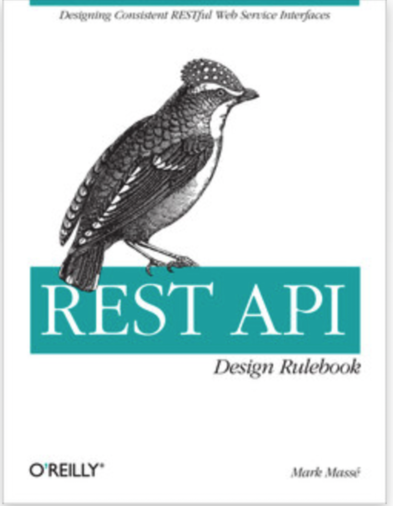

# HTTP API

## HTTP API

### HTTP (Hyper Text Transfer Protocol)

### API (Application Programming Interface)

- 소프트웨어를 위한 웹 인터페이스
    

# REST

## REST (Representational State Trasfer)

### Representational state transfer (REST) is a software architectural style

### REST defines a `set of constraints` for how the `architecture of an Internet-scale distributed hypermedia system`, such as the Web, should behave.

## Roy Thomas Fielding

- `Architectural Styles and the Design of Network-based Software Architectures` (2000년)
    

> 

## Architectural Styles and the Design of Network-based Software Architectures

> The early Web architecture was based on solid principles—separation of concerns, simplicity, and generality— **but lacked an architectural description and rationale**.

## Roy Thomas Fielding

> 

## Architectural properties

- Performance
    
- Scalability
    
- Simplicity of interfaces
    
- Modifiabliity of compoenets
    
- Visibility of components
    
- Reliability
    

## REST가 강조하는 것

- 구성 요소 상호작용의 규모 확장성(scalability of component interactions)
    
- 인터페이스의 범용성 (Genrality of interfaces)
    
- 구성 요소의 독립적인 배포(Independent deployment of components)
    
- 중간적 구성요소를 이용해 응답 지연 감소, 보안을 강화, 레거시 시스템을 인캡슐레이션 (Intermediary components to reduce latency, enforce security and encapsulate legacy systems)
    

> REST emphasizes scalability of component interactions, generality of interfaces,  
> independent deployment of components, and intermediary components to reduce  
> interaction latency, enforce security, and encapsulate legacy systems.

## Web's architectural style - set of constraints

1. Client/Server | 클라이언트 서버
    
2. Stateless | 상태 없음
    
3. Cache | 캐시
    
4. Layered System | 계층 시스템
    
5. Code-on-demand | 주문형 코드
    
6. Uniform Interface | 인터페이스 일관성
    

# Web's architectural style

## Client/Server | 클라이언트 서버

- 관심사의 분리
    
- 클라이언트와 서버의 역할은 분명하게 나뉨
    
- 웹의 일관된 인터페이스 (Uniform Interface)를 따른다는 전제하에 클라이언트와 서버는 독립적으로 구현되고 배포될 수 있다
    

## Stateless | 상태 없음

- 클라이언트가 작업에 필요한 모든 정보를 보내줌
    
- visibility, reliability, scalability
    

## Cache | 캐시

- 응답에 대해, 암시적 혹은 명시적으로 캐시 가능 여부를 표시할 수 있음.
    
- 캐시가능한 응답은, 클라이언트의 캐시가 재사용에 대한 권한을 가짐
    
- 네트워크 효율성을 높일 수 있음
    

## Layered System

- 레이어가 있는 경우 레이어 안쪽을 볼 수 없음
    
    - 레거시 시스템을 encapsulate, 콤포넌트 구성을 단순화
        
- proxy, gateway 등등 배치 가능
    
    - 로드 밸런싱 등을 활용하여 네트웍 성능을 늘릴 수도
        

## Code-On-Demand (optional)

- 코드를 클라이언트로 다운로드 받아서 바로 실행 (애플릿 & 스크립)
    
- 클라이언트에 특정 구현이 미리 있을 필요가 없음
    

## Uniform Interface | 인터페이스 일관성

> The **central feature** that distinguishes the REST architectural style from other network- based styles is its emphasis on a uniform interface between components

## Uniform Interface | 인터페이스 일관성

1. identification of resources | 리소스 식별
    

> The key abstraction of information in REST is a resource.

2. manipulation of resources through representations | 표현을 통한 리소스 조작
    
3. self- descriptive messages | 자기서술적 메세지
    
4. hypermedia as the engine of application state (HATEOAS) | 애플리케이션 상태 엔진으로서 하이퍼 미디어
    

# REST API

- REST 구조대로 작성된 API
    
- RESTful
    

# REST API 디자인 룰

## REST API 디자인 룰

- RFC 같은 표준이 존재하는 것은 아님.
    
- 일종의 Best Practice 관점에서 보는 것이 좋음
    

## REST API Design Rulebook




## 디자인 해야할 것

- URI (or URL)
    
- 메세지 (Representation of Resource)
    

## Uniform Resource Indicator

- `/` 구분자는 계층 관계를 나타내는데 사용
    
    - 예) `/leagues/seattle/teams/trebuchet/players/mike`
        
- URI는 소문자를 권장한다.
    
- `-`은 URI 가독성을 높이는데 사용한다.
    
- `_` 은 URI에 사용하지 않는다.
    
- 확장자는 URI에 포함하지 않는다.
    

## 컬랙션(+스토어), 컨트롤러

- 컬렉션(+스토어)
    
    - 서버에거 관리하는 디렉토리, 저장소
        

```
http://api.soccer.restapi.org/leagues 
http://api.soccer.restapi.org/leagues/seattle/teams
http://api.soccer.restapi.org/leagues/seattle/teams/trebuchet/players
```

- 컨트롤러
    
    - CRUD 외의 표현이 필요한 경우,
        

```
POST /alerts/245743/resend
```

## URI 경로 디자인

- `collection`/`store`/`document`
    
- 도큐먼트 이름으로는 단수명사를 사용한다.
    
- 컬렉션 이름으로는 복수명사를 사용한다.
    

```
http://api.soccer.restapi.org/leagues/seattle/teams/trebuchet/players/claudio
```

- 컨트롤러 이름으로는 동사나 동사구를 사용한다.
    

```
http://api.college.restapi.org/students/morgan/register
```

- 경로 중 변하는 부분은 유일한 값으로 대체한다.
    

```
http://api.soccer.restapi.org/leagues/{leagueId}/teams/{teamId}/players/{playerId}
```

- CRUD 기능을 나타내는 것은 URI 에 사용하지 않는다.
    

```
DELETE /users/1234
```

## Method

```
Request-Line   = Method SP Request-URI SP HTTP-Version CRLF

Method         = "OPTIONS"                ; Section 9.2
               | "GET"                    ; Section 9.3   <-
               | "HEAD"                   ; Section 9.4
               | "POST"                   ; Section 9.5   <-
               | "PUT"                    ; Section 9.6
               | "DELETE"                 ; Section 9.7
               | "TRACE"                  ; Section 9.8
               | "CONNECT"                ; Section 9.9
               | extension-method

```

## HTTP Method

- GET
    
    - list or read
        
- POST
    
    - create
        
- PUT
    
    - update or create
        
- DELETE
    
    - delete
        
- PATCH
    
    - partial update
        
    - [http://tools.ietf.org/html/rfc5789](http://tools.ietf.org/html/rfc5789)
        

```
POST /users
GET /users
GET /users/ne10001
PUT /users/ne10001
DELETE /users/ne10001
```

## HTTP Safe and Idempotant Methods

- Safe Methods
    
    - 읽기 전용의 의미를 가지는 Methods
        
    - GET, HEAD, OPTIONS, TRACE
        
- Idempotant Methods
    
    - 한 번을 실행해도, 여러번을 실행해도 의도한 결과가 동일한 Methods
        
    - PUT, DELETE + Safe Methods
        

## URI Query 디자인

- URI 쿼리로 컬렉션(+스토어)를 필터링 할 수 있다.
    

```
GET /users
GET /users?role=admin
```

- URI 쿼리로 결과를 페이징 할 수 있다.
    

```
GET /users?page=1&size=10
```

## 요청, 응답 메세지 타입

### 요청`Accept`, 응답 `Content-Type`

- `application/json`
    
- `application/vnd.api+json`
    
- `application/vnd.github.v3+json` GitHub 의 예 vendor type
    

```
# 요청
GET /resources HTTP/1.1
Accept: applicatn/json

# 응답
HTTP/1.1 200 OK
Content-Type: application/json
```

## Status-Code

> The first digit of the Status-Code defines the class of response. The last two digits do not have any categorization role. There are 5 values for the first digit:
> 
> - 1xx: Informational - Request received, continuing process
>     
> - 2xx: Success - The action was successfully received, understood, and accepted
>     
> - 3xx: Redirection - Further action must be taken in order to complete the request
>     
> - 4xx: Client Error - The request contains bad syntax or cannot be fulfilled
>     
> - 5xx: Server Error - The server failed to fulfill an apparently valid request
>     

## 주요 Status-Code

```
200 OK
301 Moved Permanently
302 Found
304 Not Modified
401 Unauthorized
403 Forbidden
404 Not Found
405 Method Not Allowedad
500 Internal Server Error
503 Service Unavailable
```

## 응답 규칙

- `200 Ok`은 일반적인 요청 성공을 나타낸다.
    
- `200 Ok`응답 바디에 에러를 전송해서는 안된다.
    
- `201 Created` 는 성공적으로 리소스를 생성했을 때 사용 한다.
    
- `202 Accepted` 는 비동기 처리가 성공적으로 시작되었음을 알릴 때 사용 한다.
    
- `204 No Content`는 응답 바디에 의도적으로 아무것도 포함하지 않을 때 사용한다.
    
- `301 Moved Permanently`는 리소스를 이동시켰을 때 사용한다.
    
- `304 Not Modified`리소스에 변경이 없는 경우. (client cached 된 버전이 최신)
    
- `400 Bad Request` 일반적인 요청 실패
    
- `401 Unauthorized` 는 클라이언트 인증에 문제가 있을 때 사용한다.
    
- `403 Forbidden`은 인증상태에 상관없이, 액세스를 금지할 때 사용한다.
    
- `404 Not Found` 리소스가 없는 경우 사용한다.
    
- `405 Method Not Allowed` HTTP 메서드가 지원되지 않을 때 사용한다.
    
- `406 Not Acceptable`은 요청된 리소스 미디어 타입을 제공하지 못 할 때 사용해야 한다.
    
- `409 Conflict`는 리소스 상태에 위반되는 행위를 했을 때 사용해야 한다.
    
- `412 Precondition Failed`는 조건부 연산을 지원할 때 사용한다.
    
- `415 Unsupported Media Type`은 요청의 페이로드에 있는 미디 어 타입이 처리되지 못했을 때 사용해야 한다
    
- `500 Internal Server Error`는 API가 잘못 작동할 때 사용해야 한다
    

# Richardson Maturity Model

## Richardson Maturity Model


> from: [http://martinfowler.com/articles/richardsonMaturityModel.html](http://martinfowler.com/articles/richardsonMaturityModel.html)

## 예를 들어보자면,

- 간단 네버노트 시스템
    
    - 노트는 본문이 있음.
        
    - 노트는 생성하고 수정하고 지울수 있음.
        
    - 노트는 노트북에 속함.
        
    - 노트는 속한 노트북에서 다른 노트북으로 이동할 수 있음
        
        - 이동이 불가능한 노트도 있음. (노트의 상태 정보)
            
    - 노트는 속한 노트북에서 다른 노트북으로 복사할 수 있음.
        
        - 복사가 불가능한 노트도 있음. (노트의 상태 정보)
            
    - 노트북에 속하지 않은 노트는 없음.
        

## level 0

```
POST /noteService?method=addNote&notebook=rookie
GET  /noteService?method=listNote&notebook=rookie&page=1
GET  /noteService?method=readNote&notebook=rookie&id=1
POST /noteService?method=modifyNote&notebook=rookie&id=1
POST /noteService?method=deleteNote&notebook=rookie&id=1
```

## level 1

```
POST /notebooks/rookie/notes
GET  /notebooks/rookie/notes
GET  /notebooks/rookie/notes/1
POST /notebooks/rookie/notes/1?method=delete
POST /notebooks/rookie/notes/1?method=modify
```

## level 2

```
POST   /notebooks/rookie/notes
GET    /notebooks/rookie/notes
GET    /notebooks/rookie/notes/1
PUT    /notebooks/rookie/notes/1
DELETE /notebooks/rookie/notes/1
```

## level 3

- HATEOAS | hypermedia as the engine of application state
    

```
GET    /notebooks/rookie/notes/1
```

```json
{
    "id": "1",
    "content": "never note", 
    "links": [ {
        "rel": "self",
        "href": "/notebooks/rookie/note/1"
    } ,
    {
        "rel": "copy",
        "href": "/notebooks/rookie/note/1/copy"
    },
    {
        "rel": "move",
        "href": "/notebooks/rookie/note/1/move"
    }
    ]
}
```

# REST API 디자인 실습

## REST API 디자인 실습

```
* 기본 기능
    * 모든 사용자는 게시글(article) 내용의 목록을 볼 수 있습니다.
        * 게시글 내용의 목록은 번호, 제목, 작성자, (수정자), 작성일시, 댓글 개수 입니다.
        * 목록은 페이지 당 20개씩 보이고 페이지 넘기기를 할 수 있습니다.
    * 모든 사용자는 게시글의 내용을 볼 수 있습니다.
        * 게시글 내용은 번호, 제목, 내용, 작성자, 수정자, 작성일시, 수정일시, 댓글 목록 입니다.
    * 로그인 한 사용자는 게시판에 게시글을 등록할 수 있습니다.
    * 게시글 내용을 작성한 사람은 내용을 수정하거나 삭제할 수 있습니다.
    * 관리자는 모든 게시글 내용을 수정 할 수 있습니다.
    * 관리자는 모든 게시글 내용을 삭제 할 수 있습니다.
    * 관리자는 삭제한 게시글 내용을 복구 할 수 있습니다.
    * 로그인 한 사용자는 게시글의 내용을 보고 댓글(comment)을 등록할 수 있습니다.
        * 댓글이 없는 경우 응답.
        * 없는 게시글 번호인 경우 응답.
        * 권한이 없는 게시글 번호인 경우 응답.

* 추가 기능 1
    * 로그인한 사용자는 게시글 내용에 대해 좋아요를 등록할 수 있습니다.
    * 좋아요를 등록한 사용자는 좋아요 취소를 할 수 있습니다.

* 추가 기능 2 
    * 로그인한 사용자는 게시글 내용에 대해 답글(reply)을 쓸 수 있습니다.
    * 로그인한 사용자는 게시글 내용에 대해 답글에 대한 답글을 등록할 수 있습니다.
    * 게시글 목록에서 답글은 최대 5 단계까지 깊이를 제공합니다.

* 추가 기능 3 
    * 좋아요를 등록 사용자는 좋아요한 게시글 내용 목록을 조회할 수 있습니다.
    * 모든 사용자는 제목에 대한 게시글 목록을 검색할 수 있습니다.

* 더 생각해 본다면, 
    * 게시글에 목록에 정렬 기능을 제공한다면, 어떻게 제공할 수 있을까요?
    * 게시판이 어러개가 있다면 어떤 URL 구조여야 할까요?
    * 임시보관함이 있고 이어 쓸 수 있으려면 어떻게 해야할까요? 
    * 임시보관된 게시글은 최종적으로 다른 게시판에 등록할 수 있다면 어떻게 해야할까요?
    * 게시글이 여러 게시판에서 볼 수 있게 정의가 되면 URL 경로가 어떻게 되어야 할까요?
    * 특정 게시판의 글을 다른 게시판으로 옮기려면 어떻게 해야할까요?
    * 파일 업로드는 어떤 경로로 만드는 것이 좋을까요?
    * API 버전을 표시해야 한다면 어떻게 하는 것이 좋을까요? 
    * 에러는 어떻게 표현하는 것이 좋을까요?
    * 게시물의 조회수가 올라가야 한다면, 어떻게 설계하면 좋을까요?
```

# API (Application Programming Interface)

## 일반적으로 좋은 API 디자인

### 직관적인 API

- 이름 - URL, 메세지
    
- 데이터 타입, 포맷
    
- 에러 피드백
    

### 예측가능한 API - 일관성

- 이름, 타입, 경로구조, 호응 관계
    
    - 네이밍 컨벤션
        
    - 어울리는 이름 - from, to, begin, end
        
    - 날짜 시간에 대한 표현, 이름
        
- 일관성의 범위
    
    - API 내부
        
    - 팀 API
        
    - 해당 도메인
        
    - 외부 세계 (표준)
        

### 간결하고 체계적인 API

- API 구조화
    
    - 데이타, 피드백
        
- API 사이징
    

### 안전한 API

- 권한관리
    
    - API 일부만 제공하는 것도 고려
        
- 접근제어
    
- 적절한 에러 피드백
    

### 확장 가능한 API

- 확장 가능한 메세지 디자인 - 봉투
    

# 참고

- [http://www.ics.uci.edu/~fielding/pubs/dissertation/fielding_dissertation.pdf](http://www.ics.uci.edu/~fielding/pubs/dissertation/fielding_dissertation.pdf) R.Fielding 2000년 박사 논문
    
- Microsoft REST API Guidlines: [https://github.com/microsoft/api-guidelines/blob/vNext/Guidelines.md](https://github.com/microsoft/api-guidelines/blob/vNext/Guidelines.md)
    
- 웹 API 디자인: [http://www.yes24.com/Product/Goods/94462254](http://www.yes24.com/Product/Goods/94462254)
    
- GitHub API Specification: [https://docs.github.com/en/rest](https://docs.github.com/en/rest)