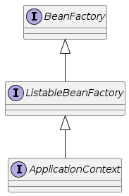
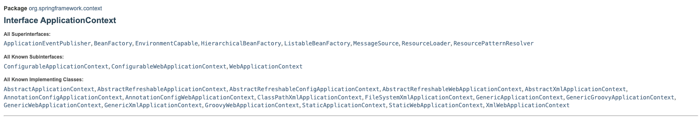
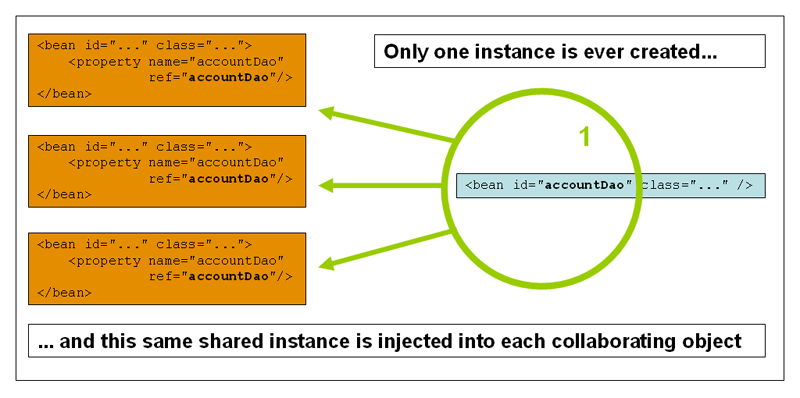
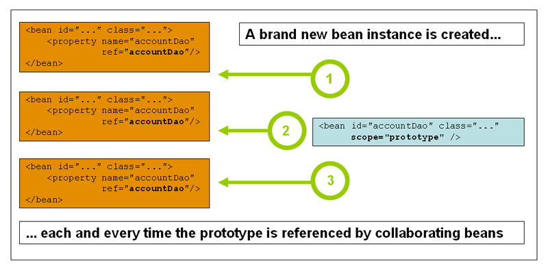

# Java 프로그램 작성

## 인사를 건낸 후 메시지를 보내고 작별 인사를 하는 Communication 프로그램을 작성하려 한다.

```java
public class Main {

    public static void main(String[] args) throws Exception {
        Steps steps = new Communication();
        steps.initialize();
        steps.process();
        steps.destroy();
    }
}
```

```java
public class Communication implements Steps {

    private final Greeting greeting;
    private final Farewell farewell;
    private final Sender sender;

    public Communication() {
        this.greeting = new EnglishGreeting();
        this.farewell = new EnglishFarewell();
        this.sender = new ConsoleSender();
    }

    public void initialize() {
        greeting.sayHello();
    }

    public void process() {
        Request request = new Request("sando", "hello");
        sender.sendMessage(request);
    }

    public void destroy() {
        farewell.sayGoodBye();
    }
}
```

- 요구사항 변경으로 EnglishGreeting, EnglishFarewell 을 KoreanGreeting, KoreanFarewell 로 수정해야한하면?

```java
 public Communication() {
    this.greeting = new KoreanGreeting();
    this.farewell = new KoreanFarewell();
    this.sender = new ConsoleSender();
}
```

- 어렵지 않다!
- 하지만 Communication() 과 같은 클래스들이 아주 많다면?

장점: 코드의 흐름이 명확하다.  
단점:

1. Main() 에서 initialize() -> process() -> destroy() 순서로 호출해야하는데, 실수로 누락하거나 순서를 착각할 여지가 있다.
2. 여러 코드에서 객체(ex. EnglishGreeting)를 사용하는 경우, 여러 곳에서 모두 초기화를 해야한다.
3. EnglishGreeting 을 KoreanGreeting 으로 바꾸려고 하면 Communication 코드를 변경해야 한다. (Communication 에서만 사용하는 게 아니라면?)
4. 주요 객체들의 초기화 시점을 알기가 쉽지 않다. 위 코드에서는 모두 생성자에서 해줬지만, 모든 사용자가 규칙을 지킬 것이라고 기대하기 쉽지 않다.
5. 프로그램을 테스트하기 쉽지 않다. (Communication 클래스를 테스트를 하기를 원하면 의존성이 있는 모든 클래스를 구현해야한다)

# 들어가기 전에 알면 좋을 것들

## 개발 패턴

[factory pattern](https://nhnent.dooray.com/share/pages/6lOTMWVzTr-xWdUPtHXMjw/3762413950122544102)  
[strategy pattern](https://nhnent.dooray.com/share/pages/6lOTMWVzTr-xWdUPtHXMjw/3762414335391420739)

# IoC

## IoC (제어역전)

- 제어권을 프레임워크가 갖는것 == 개발자는 제어권이 없다 == 제어(Control)가 역전(Inversion) 되었다.
    - IoC : Inversion of Control
    - 제어
        - 프로그램의 흐름
        - 객체의 생성
            
- IoC 관점에서 각자의 역할
    - 개발자는 코드의 흐름이나 객체생성에 관련된 코드를 직접 작성하지 않는다.
    - 개발자는 프레임워크가 제공하는 정의 방법을 사용하여 코드를 `정의만 한다.`
    - 프레임워크는 `이 정의`을 보고 `객체를 생성`하고 `코드가 동작하는 순서`를 결정하여 실행한다.

## 가상의 프레임 워크 (Ioc 예제)

- 코드 설명
    - org.example.framework 부분은 사용자가 작성하는 부분의 코드가 아니다.
    - org.example.customcode 부분이 사용자가 작성하는 부분이다.
    - Main() 을 framework 부분으로 보내버렸다.
    - 객체의 생성은 Factory 에서 담당한다.
        
- 프레임워크 규칙 설명
    - Steps 를 구현한 Communication 을 생성하면 프레임워크에서 initialize() -> process() -> destroy() 순서대로 실행해준다.
    - 초기화를 원하는 클래스는 `@Part` 를 붙여주면 프레임워크가 객체를 생성해준다. (기본 생성자로 초기화)
    - `@Part` 가 여러 클래스에 붙어있다면 `@First` 가 붙은 클래스를 우선시 한다.
        
- Communication 프로그램에서 가장 마음에 안 들었던 2가지는 해결되었나?
    1. 내가 제어권을 가지고 있어서 제어를 하면서 실수할 수 있는 여지가 있다.  
        -> 제어권을 넘겼고, 프레임워크의 규칙에 따라 코드를 정의하기만 하면 된다.
    2. 초기화를 각각의 객체에서 하고 있어서 너무 강결합을 가지고 있다. (코드 하나를 바꾸려면 다 들어내야 한다 - 변경 폭이 크다)  
        -> 역시 프레임워크에서 관리해주고 있어서 사용자 코드의 변경은 하지 않아도 된다.

# Spring IoC

## Bean Factory

- Spring 프레임워크의 핵심 컨테이너 중 하나이며 스프링의 스펙이다.
- BeanFactory는 스프링 IoC(Inversion of Control) 컨테이너의 가장 기본적인 `인터페이스`로, 빈(Bean)의 생성 및 관리를 담당한다.
- 이를 통해 의존성 주입(Dependency Injection)을 구현하며, 스프링 애플리케이션에서 객체의 생명주기와 구성을 관리하는 중요한 역할을 한다.

## ApplicationContext

- Spring 프레임워크에서 중앙 `인터페이스`로, 애플리케이션의 설정 정보를 관리한다.
- 이 인터페이스는 빈 팩토리 기능을 확장하여, 애플리케이션 이벤트 처리, 리소스 로딩, 메시지 지원 등의 기능을 제공한다.


## Bean Factory vs ApplicationContext

- ApplicationContext 는 Bean Factory 의 기능을 확장한 것이다.
- Spring IoC container = { Bean Factory | ApplicationContext }



- Bean Factory functionality + α
    

| Feature                                                    | BeanFactory | ApplicationContext |
| ---------------------------------------------------------- | ----------- | ------------------ |
| Bean instantiation/wiring                                  | Yes         | Yes                |
| Integrated lifecycle management                            | No          | Yes                |
| Automatic BeanPostProcessor registration                   | No          | Yes                |
| Automatic BeanFactoryPostProcessor registration            | No          | Yes                |
| Convenient MessageSource access (for Internationalization) | No          | Yes                |
| Built-in ApplicationEvent publication mechanism            | No          | Yes                |
| load file resources                                        | No          | Yes                |

## ApplicationContext 종류



- ~Xml~ApplicationContext
- ~AnnotationConfig~ApplicationContext
- ~Groovy~ApplicationContext
- ~Web~ApplicationContext

[https://docs.spring.io/spring-framework/docs/current/javadoc-api/org/springframework/context/ApplicationContext.html](https://docs.spring.io/spring-framework/docs/current/javadoc-api/org/springframework/context/ApplicationContext.html)

### BeanFactory, ApplicationContext, Ioc Container, Spring Container 등 여러 방법으로 불러질 수 있지만 비슷한 개념으로 보면 된다.

# Spring Bean

## Spring Bean

- Spring Bean은 Spring IoC(Inversion of Control) 컨테이너에서 관리되는 객체를 말한다.
- Spring 프레임워크에서는 애플리케이션의 객체들을 Bean으로 등록하고, 이들의 생성, 생명 주기, 의존성 관리 등을 컨테이너가 담당한다.
- 일반적으로 어노테이션 등으로 의존성 주입이 이루워지고, 이를 통해 느슨한 결합과 코드 재사용성, 테스트 용이성 등의 이점을 얻을 수 있다.
- Spring 에서 중요하게 관리하는 객체로 이해하면 된다.

## cf.) JavaBeans

- 이름만 비슷하지 전혀 다른 개념이다.
- Java Bean은 재사용 가능한 컴포넌트로, 기본 생성자를 가지며, getter와 setter 메소드를 통해 프로퍼티에 접근할 수 있는 단순한 POJO(Plain Old Java Object)이다.
- Spring Beans ≠ JavaBeans

## SpringBoot에서 객체생성

### ApplicationRunner

- Spring 애플리케이션이 시작될 때 같이 실행되는 코드
- 테스트를 위해서 자주 사용될 예정
- 앞선 예제의 Steps 처럼 구현해주면 Spring Boot 에서 자동으로 실행해준다.
## 빈 등록 방법

- 1. @Configuration + @Bean 을 이용한 방법

```java
@Configuration
public class GreetingConfig {

    @Bean
    Greeting englishGreeting() {
        return new EnglishGreeting();
    }
    
}
```

- 2. @Component 를 이용한 방법

```java
@Component
public class EnglishFarewell implements Farewell {

    @Override
    public void sayGoodBye() {
        System.out.println("good bye");
    }
}
```

- 등록된 Bean 을 가져와서 사용 가능

```java
@RequiredArgsConstructor
@Component
public class AppStartupRunner implements ApplicationRunner {

    private final ApplicationContext applicationContext;

    @Override
    public void run(ApplicationArguments args) {

        Greeting greeting = applicationContext.getBean(Greeting.class);

        greeting.sayHello();

        Sender sender = applicationContext.getBean(Sender.class);

        Request request = new Request("sando", "hello");
        sender.sendMessage(request);

        Farewell farewell = applicationContext.getBean(Farewell.class);

        farewell.sayGoodBye();

    }
}
```

## @Configuration + @Bean vs @Component

- @Component 애너테이션은 클래스 레벨에서 사용되며, 해당 클래스의 인스턴스를 스프링 컨테이너가 관리하는 빈으로 등록한다. 주로 서비스, 레포지토리, 컨트롤러와 같은 스테레오타입 컴포넌트에 사용된다.
    
- @Configuration 애너테이션은 클래스가 하나 이상의 @Bean 메소드를 포함하고 있으며, 이 메소드들이 애플리케이션 컨텍스트에 Bean 정의를 제공한다는 것을 나타낸다. @Bean 메소드는 프로그래밍 방식으로 Bean 인스턴스를 생성하고 구성한다.

### @Component는 클래스 자체를 Bean으로 등록하는 반면, @Configuration은 클래스 내의 @Bean 이 붙은 메소드를 통해 Bean을 정의하고 생성한다.


# Spring Bean 객체의 생명주기 설정

- Spring Bean 도 객체이므로 생성과 반환의 주기를 가지고 있다. 언제 초기화되고 언제 죽을지 설정할 수 있다.

## Bean Scope

- 생명주기 종류
    - singleton: ApplicationContext가 시작될 때 초기화되고, ApplicationContext가 종료될 때 소멸됨. 이는 애플리케이션 전체에서 단 하나의 인스턴스만을 유지함을 의미

    - prototype: 요청될 때마다 새로운 인스턴스가 생성. 생성된 각 인스턴스는 호출자에 의해 관리되며, Spring 컨테이너는 생성 이후에 이 인스턴스를 관리하지 않음
        
    - request(web): HTTP 요청 하나가 들어오고 나갈 때 까지 유지되는 스코프, 각각의 HTTP 요청마다 별도의 빈 인스턴스가 생성되고, 관리된다.
        
    - session(web): HTTP Session과 동일한 생명주기를 가지는 스코프
        
    - application(web): 서블릿 컨텍스트( ServletContext )와 동일한 생명주기를 가지는 스코프
        
    - websocket(web): 웹 소켓과 동일한 생명주기를 가지는 스코프

## Singleton vs Prototype

- Singleton (default)
    
- [singleton pattern](https://nhnent.dooray.com/share/pages/6lOTMWVzTr-xWdUPtHXMjw/3762414562986000061)  
    
    
- Prototype  
    
    
- prototype 의 경우 Bean 의 생성과 의존성 주입까지는 스프링 컨테이너에서 관리해주지만, 소멸은 관리해주지 않는다.
    
    - 더 이상 참조되지 않아서 GC 의 대상이 될 때까지 살아있음.
        

## Bean Scope - Singleton, Prototype

- englishGreeting 는 singleton 으로 설정
    
- koreanGreeting 는 prototype 으로 설정
    

```java
@Bean
@Scope("singleton")
Greeting englishGreeting() {
    return new EnglishGreeting();
}
```

```java
@Bean
@Scope("prototype")
Greeting koreanGreeting() {
    return new KoreanGreeting();
}
```

- AppStartupRunner 에서 Bean 호출
    

```java
@RequiredArgsConstructor
@Component
public class AppStartupRunner implements ApplicationRunner {


    private final ApplicationContext applicationContext;

    @Override
    public void run(ApplicationArguments args) {

        System.out.println("=============");

        Greeting greeting = (Greeting) applicationContext.getBean("englishGreeting");
        greeting.sayHello();
        System.out.println(greeting.hashCode());

        System.out.println("=============");

        greeting = (Greeting) applicationContext.getBean("englishGreeting");
        greeting.sayHello();
        System.out.println(greeting.hashCode());

        System.out.println("=============");

        greeting = (Greeting) applicationContext.getBean("koreanGreeting");
        greeting.sayHello();
        System.out.println(greeting.hashCode());

        System.out.println("=============");

        greeting = (Greeting) applicationContext.getBean("koreanGreeting");
        greeting.sayHello();
        System.out.println(greeting.hashCode());

    }
}
```

## Bean 의 생명 주기에 중간 개입하기

- Spring Bean 생명주기  
    `스프링 IoC 컨테이너 생성 → 스프링 빈 생성 → 의존관계 주입 → (초기화 콜백 메소드 호출) → 사용 → (소멸 전 콜백 메소드 호출) → 스프링 종료`
    

이 중 `초기화 콜백 메소드, 소멸 전 콜백 메소드` 를 정의하는 방법

## InitializingBean, DisposableBean 사용

- InitializingBean, DisposableBean 를 구현
    
    - afterPropertiesSet(), destroy() 메소드를 오버라이드한다.
        

```java
public class EnglishGreeting implements Greeting, InitializingBean, DisposableBean {

    public EnglishGreeting() {
        System.out.println("english java constructor");
    }

    @Override
    public void sayHello() {
        System.out.println("hello world");
    }

    @Override
    public void destroy() {
        System.out.println("english DisposableBean destroy");
    }

    @Override
    public void afterPropertiesSet() {
        System.out.println("english InitializingBean afterPropertiesSet");
    }
}
```


## @Bean 어노테이션 설정 사용

- @Component 로 등록한 spring bean 에는 사용할 수 없다
    

- @Bean 어노테이션에 initMethod, destroyMethod 를 선언하고 구현
    

```java
@Configuration
public class GreetingConfig {

    @Bean(initMethod = "customInit", destroyMethod = "customDestroy")
    Greeting englishGreeting() {
        return new EnglishGreeting();
    }
}
```

```java
public class EnglishGreeting implements Greeting {


    public EnglishGreeting() {
        System.out.println("eng java constructor");
    }

    @Override
    public void sayHello() {
        System.out.println("hello world");
    }

    @Override
    public void customInit() {
        System.out.println("eng custom init");
    }

    @Override
    public void customDestroy() {
        System.out.println("eng custom custom destroy");
    }

}
```

## @PostConstruct, @PreDestroy 사용

```java
public class EnglishGreeting implements Greeting {


    public EnglishGreeting() {
        System.out.println("eng java constructor");
    }

    @Override
    public void sayHello() {
        System.out.println("hello world");
    }
    
    @PostConstruct
    public void customPostConstruct() {
        System.out.println("env PostConstruct");
    }

    @PreDestroy
    public void customPreDestroy() {
        System.out.println("env preDestroy");
    }
    
}
```


## 3가지를 동시에 쓰면?

- 순서
    
    - @PostConstruct
        
    - afterPropertiesSet()
        
    - custom init() method
        
    - @PreDestroy
        
    - destroy()
        
    - custom destroy() method
        

## 필요한 이유

- 객체의 생성과 종료 전에 해야하는 작업이 있을 수 있기 때문이다.
    
    - 비즈니스 로직을 실행하기 위한 데이터 로딩.
        
    - 객체가 종료되기 전에 맺고 있는 커넥션 반환.
        
    - 등등
        

## 왜 자바의 생성자가 있는데 위의 설정이 필요한가?

- Java에서 생성자는 객체를 생성하고 초기화 사용
    
- afterPropertiesSet 같은 메소드는 Spring 프레임워크에서 빈(bean)의 모든 속성이 설정된 후에 작업을 실행한다
    
- 모든 의존성 주입이 완료된 후에야 실행할 수 있는 초기화 코드 등이 필요할 수도 있다
    

## 왜 비슷한게 3가지 모두 있는가?

1. 최초에 위와 같은 기능이 필요해서 Spring 에서  
    InitializingBean, DisposableBean 인터페이스가 나와서 구현하면 되었음.
    
2. but 메소드 이름도 제한 되어있고 인터페이스를 구현해야하는게 마음에 안듬.
    
    - @Bean 에서 메소드를 지정하여 사용할 수 있게 됨.
        
3. 이후 Java EE 의 JSR 250 스펙으로 @PostConstruct, @PreDestroy 이 나옴
    

- 하위 호환성 및 세밀한 설정을 위해 모두 유지
    

## BeanPostProcessor

- Spring IoC 의 생명주기 처리를 변경할 수 있는 확장 포인트
    
- BeanPostProcesor 가 설정되면 Bean 생명주기 이벤트를 가로채서 처리할 수 있다.
    
- BeanPostProcesor 는 특정 빈에 종속되지 않는다.
    

```java
@Configuration
public class GreetingPostProcessor implements BeanPostProcessor {

    @Override
    public Object postProcessBeforeInitialization(Object bean, String beanName) throws BeansException {
        System.out.println("before init bean: " + bean + ", beanName: " + beanName);

        if (bean instanceof KoreanGreeting) {
            return new EnglishGreeting();
        } else if (bean instanceof EnglishGreeting) {
            return new KoreanGreeting();
        }

        return bean;
    }


    @Override
    public Object postProcessAfterInitialization(Object bean, String beanName) throws BeansException {
        System.out.println("after init bean: " + bean + ", beanName: " + beanName);

        if (bean instanceof KoreanGreeting) {
            return new EnglishGreeting();
        } else if (bean instanceof EnglishGreeting) {
            return new KoreanGreeting();
        }

        return bean;
    }
    
}
```

## 구현 메소드

- postPostBeforeInitialization : init-method 에 지정된 메서드가 호출되기 전에 호출된다.
    
- postPostAfterInitialization : init-method 에 지정된 메서드가 호출된 후에 호출된다.
    
- init-method 가 지정되어 있지 않더라도 자동으로 호출된다.
    

## [번외] Spring Boot 를 안 쓰고 Bean 설정을 직접하려면 어떻게 해야할까? (Spring framework)

[[번외] xml 로 객체 생성](https://nhnent.dooray.com/share/pages/6lOTMWVzTr-xWdUPtHXMjw/3763095122532954805)

# 요약

### 개발 편의성을 올려주기 위한 Ioc 라는 디자인 패턴이 있는데, Spring 은 이를 지원해주는 프레임워크 중에 하나로 Bean 이라는 기념으로 이 디자인 패턴을 따르고 있다. Bean 을 등록하는 방법을 이번 장에서 배웠다.

### IoC

- 개발 편의성을 올려주기 위한 디자인 패턴의 하나
    
- 프로그램의 제어 흐름이 프로그램 코드에 의해 결정되는 것이 아니라, 외부에서 결정
    
- 주요 객체의 생성 및 객체 간의 의존성을 사용자가 관리하지 않는다.
    

### Spring

- Ioc 를 지원해주는 프레임워크 중 하나로 Bean 이라는 개념을 이용해서 이를 편하게 하고 있음
    

### ApplicationContext

- Spring 에서 Ioc 패턴을 유지해주는 구현체
    
- Bean 의 생성, 등록, 관리를 해준다.
    

### Bean

- ApplicationContext 에 의해서 관리되는 객체
    
- Spring 애플리케이션은 다양한 Bean 들이 상호작용하는 형태로 구성된다.
    
- Bean 은 생명주기를 가지며, 우리는 중간에 개입하는 메소드를 생성할 수 있다.