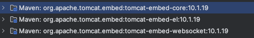
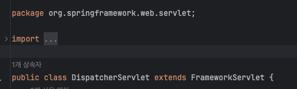

## Spring Boot 를 이용해서 웹어플리케이션을 동작하게 하고 싶다.

### maven 에 라이브러리만 추가했는데, 웹어플리케이션으로 동작한다.

# Auto Configuration 동작 원리

## @EnableAutoConfiguration

- `@Import` 가 있을 경우, 지정된 클래스를 애플리케이션의 설정 컨텍스트에 명시적으로 포함시킨다.
    

```java
@Import(AutoConfigurationImportSelector.class)
```

```java
AutoConfigurationImportSelector.getCandidateConfigurations()
ImportCandidates.load()
ImportCandidates.LOCATION
```

ImportCandidates.java

```java
private static final String LOCATION = "META-INF/spring/%s.imports";
```

```java
{
	protected List<String> getExcludeAutoConfigurationsProperty() {
		Environment environment = getEnvironment();
		if (environment == null) {
			return Collections.emptyList();
		}
		if (environment instanceof ConfigurableEnvironment) {
			Binder binder = Binder.get(environment);
			return binder.bind(PROPERTY_NAME_AUTOCONFIGURE_EXCLUDE, String[].class)
				.map(Arrays::asList)
				.orElse(Collections.emptyList());
		}
		String[] excludes = environment.getProperty(PROPERTY_NAME_AUTOCONFIGURE_EXCLUDE, String[].class);
		return (excludes != null) ? Arrays.asList(excludes) : Collections.emptyList();
	}
}
```

- AutoConfigurationImportSelector 는 `META-INF/spring/%s.imports` 경로의 파일을 해석해서 해당하는 클래스를 로드하려고 시도한다.
    

- [https://github.com/spring-projects/spring-boot/blob/v3.2.0/spring-boot-project/spring-boot-autoconfigure/src/main/resources/META-INF/spring/org.springframework.boot.autoconfigure.AutoConfiguration.imports](https://github.com/spring-projects/spring-boot/blob/v3.2.0/spring-boot-project/spring-boot-autoconfigure/src/main/resources/META-INF/spring/org.springframework.boot.autoconfigure.AutoConfiguration.imports)
    

org.springframework.boot.autoconfigure.AutoConfiguration.imports

```java
...
org.springframework.boot.autoconfigure.web.servlet.WebMvcAutoConfiguration
org.springframework.boot.autoconfigure.web.servlet.DispatcherServletAutoConfiguration
org.springframework.boot.autoconfigure.web.servlet.ServletWebServerFactoryAutoConfiguration
...
```

WebMvcAutoConfiguration.java

```java
@AutoConfiguration(after = { DispatcherServletAutoConfiguration.class, TaskExecutionAutoConfiguration.class,
		ValidationAutoConfiguration.class })
@ConditionalOnWebApplication(type = Type.SERVLET)
@ConditionalOnClass({ Servlet.class, DispatcherServlet.class, WebMvcConfigurer.class })
@ConditionalOnMissingBean(WebMvcConfigurationSupport.class)
@AutoConfigureOrder(Ordered.HIGHEST_PRECEDENCE + 10)
@ImportRuntimeHints(WebResourcesRuntimeHints.class)
public class WebMvcAutoConfiguration {
...
}
```

- 이 파일들을 살펴보면, 상위에 @ConditionalXXX 어노테이션이 붙어있는 걸 알 수 있다. 후에 배울 내용으로 특정 조건에서 동작한다는 뜻이다.
    
    - ex) @ConditionalOnClass({ Servlet.class, DispatcherServlet.class, WebMvcConfigurer.class }) 이 것은 Servlet.class 등 해당 되는 클래스가 존재할 때만 동작한다는 뜻이다.
        

### @EnableAutoConfiguration 를 추가하면 어플리케이션은 자동으로 계속 특정 경로의 클래스를 찾으려고 하고 있다. 그중에 웹관련 설정도 포함되어 있다.

## 라이브러리를 추가하면?

- pom.xml 에 dependency(spring-boot-starter-web) 를 추가해주면, maven 은 해당되는 라이브러리 파일을 프로젝트에 추가한다.
    
      
      
    
    
- DispatcherServlet 이 생겼으니 WebMvcAutoConfiguration Bean 이 동작하는 걸 알 수 있다. (예를 하나만 들었지만. 다른 클래스 파일들도 추가되고, 다른 동작하지 않던 다른 Bean 들도 정상 동작한다)
    
- SpringApplication 실행 시에도 특정 클래스 유무를 확인하여 어떤 방식으로 실행될건지 자동으로 결정한다.
    

```java
SpringApplication.run()
SpringApplication.prepareEnvironment()
SpringApplication.getOrCreateEnvironment()
```

WebApplicationType.java

```java
static WebApplicationType deduceFromClasspath() {
    if (ClassUtils.isPresent(WEBFLUX_INDICATOR_CLASS, null) && !ClassUtils.isPresent(WEBMVC_INDICATOR_CLASS, null)
    && !ClassUtils.isPresent(JERSEY_INDICATOR_CLASS, null)) {
        return WebApplicationType.REACTIVE;
    }
    for (String className : SERVLET_INDICATOR_CLASSES) {
        if (!ClassUtils.isPresent(className, null)) {
        return WebApplicationType.NONE;
        }
    }
    return WebApplicationType.SERVLET;
}
```

### 라이브러리가 추가되어서 특정 조건이 만족되어서 작동하지 않던 빈들이 동작한다.

## Auto Configuration에서 제외

- Auto Configuration 에서 설정을 제외하고 싶다면 @EnableAutoConfiguration의 exclude를 설정한다.
    
    - @SpringBootApplication 을 사용한 경우도 동일한 방법으로 제외 할 수 있다.
        

```java
@SpringBootApplication(exclude = RedisAutoConfiguration.class)
public class Main {
    public static void main(String[] args) {
        SpringApplication.run(Main.class, args);
    }
}
```

## Spring web application 내장 서버를 tomcat 에서 jetty 로 변경한다. 

- tomcat 라이브러리를 제거하고, jetty 라이브러리를 추가한다.
    
- Maven 의존성 제거 방법  
    [https://maven.apache.org/guides/introduction/introduction-to-optional-and-excludes-dependencies.html#dependency-exclusions](https://maven.apache.org/guides/introduction/introduction-to-optional-and-excludes-dependencies.html#dependency-exclusions)

## 서비스 추상화 (PSA)

- 인터페이스로 호출하기 때문에 쉽게 구현을 갈아끼울 수 있다.

[서비스 추상화 (Portable Service Abstraction)](https://nhnent.dooray.com/share/pages/6lOTMWVzTr-xWdUPtHXMjw/3802519025355050185)

### Spring Boot 는 간편한 사용을 지향한다. Web 뿐만 아니라 Jpa, Redis 등 다양한 라이브러리에 추가만 해도 자동으로 프로그램의 동작방식이 적절하게 바뀐다 이를 자동구성이라고 한다.

# @Conditional

- Spring Framework 4.0 부터 제공
    
- 설정된 모든 Condition 인터페이스의 조건이 TRUE 인 경우 동작
    
- 특정 조건에서만 빈이 동작하길 바랄 때 사용
    

## @Conditaionl 의 사용

- org.springframework.context.annotation.Condition 을 구현한다.
    

```java
public class MyCondition implements Condition {
    @Override
    public boolean matches(ConditionContext context, AnnotatedTypeMetadata metadata) {
           return true;
    }
}
```

- @Conditional(MyCondition.class) 과 같이 사용한다.
    
- MyCondition.class 의 matches 의 반환 값이 true 인 경우 MyConfig 가 동작한다.
    

```java
@Configuration
@Conditional(MyCondition.class)
public class MyConfig {

    @Bean
    public MyBean myBean() {
        return new MyBean();
    }

    @Bean
    public MyBean2 myBean2() {
        return new myBean2();
    }
}
```

## @ConditionalOnXXX

- spring-boot 가 제공하는 @Conditional 의 확장
    

| 구분                           | 내용                                     | 비고                      |
| ---------------------------- | -------------------------------------- | ----------------------- |
| @ConditionalOnWebApplication | 프로젝트가 웹 애플리케이션이면 설정 동작                 | -                       |
| @ConditionalOnBean           | 해당 Bean 이 Spring Context 에 존재하면 동작     | Auto configuration only |
| @ConditionalOnMissingBean    | 해당 Bean 이 Spring Context 에 존재하지 않으면 동작 | Auto configuration only |
| @ConditionalOnClass          | 해당 클래스가 존재하면 자동설정 등록                   | -                       |
| @ConditionalOnMissingClass   | 해당 클래스가 존재하지 않으면 자동                    |                         |
| @ConditionalOnResource       | 자원이(file 등) 존재하면 동작                    | -                       |
| @ConditionalOnProperty       | 프로퍼티가 존재하면 동작                          | -                       |
| @ConditionalOnJava           | JVM 버전에 따라 동작여부 결정                     | -                       |
| @ConditionalOnWarDeployment  | 전통적인 war 배포 방식에서만 동작                   | -                       |
| @ConditionalOnExpression     | SpEL 의 결과에 따라 동작여부 결정                  | -                       |

## @ConditionalOnBean

- Bean 이 이미 설정된 경우에 동작
    
- MyService 타입의 Bean 이 BeanFactory 에 이미 등록된 경우에 동작한다.
    
- Configuration 이 AutoConfiguration에 등록된 경우에 사용할 수 있다.
    

```java
@Configuration
   public class MyAutoConfiguration {
  
       @ConditionalOnBean
       @Bean
       public MyService myService() {
           ...
       }
  
   }
```

## @ConditionalOnMissingBean

- BeanFactory에 Bean이 설정되지 않은 경우에 동작
    
- MyService 타입의 Bean이 BeanFactory에 등록되지 않은 경우에 동작한다.
    
- Configuration 이 AutoConfiguration에 등록된 경우에 사용할 수 있다.
    

```java
   @Configuration
   public class MyAutoConfiguration {
  
       @ConditionalOnMissingBean
       @Bean
       public MyService myService() {
           ...
       }
  
   }
```

## @Conditaional 주의 사항

[https://docs.spring.io/spring-boot/docs/current/api/org/springframework/boot/autoconfigure/condition/ConditionalOnBean.html](https://docs.spring.io/spring-boot/docs/current/api/org/springframework/boot/autoconfigure/condition/ConditionalOnBean.html)  
[https://docs.spring.io/spring-boot/docs/current/api/org/springframework/boot/autoconfigure/condition/ConditionalOnMissingBean.html](https://docs.spring.io/spring-boot/docs/current/api/org/springframework/boot/autoconfigure/condition/ConditionalOnMissingBean.html)

```
이 조건은 지금까지 애플리케이션 컨텍스트에서 처리된 빈 정의와 일치할 수 있으므로 자동 구성 클래스에만 이 조건을 사용하는 것이 좋습니다. 다른 자동 구성에서 후보 빈을 만들 수 있는 경우 이 조건을 사용하는 빈이 이후에 실행되는지 확인하십시오.
```

```
The condition can only match the bean definitions that have been processed by the application context so far and, as such, it is strongly recommended to use this condition on auto-configuration classes only. If a candidate bean may be created by another auto-configuration, make sure that the one using this condition runs after.
```

### Spring 은 빈을 등록 할 때 패키지를 위에서 부터 읽으면서 등록하므로, 빈 등록 시 우리가 원하는 대로 동작하지 않을 수 있다. 따라서 몇몇 @ConditionalXXX 은 주의해서 사용해야한다.


## @Conditional 동작 원리

- @ComponentScan 도중에 @Conditaionl 조건을 보고 스킵 여부를 결정한다
    

```
ComponentScanAnnotationParser.parse()
ClassPathBeanDefinitionScanner.doScan()
ClassPathScanningCandidateComponentProvider.findCandidateComponents() 
ClassPathScanningCandidateComponentProvider.scanCandidateComponents()
ClassPathScanningCandidateComponentProvider.isCandidateComponent()
ClassPathScanningCandidateComponentProvider.isConditionMatch()
ConditionEvaluator.shouldSkip()
```

ClassPathScanningCandidateComponentProvider.java

```java
{
	protected boolean isCandidateComponent(MetadataReader metadataReader) throws IOException {
		for (TypeFilter tf : this.excludeFilters) {
			if (tf.match(metadataReader, getMetadataReaderFactory())) {
				return false;
			}
		}
		for (TypeFilter tf : this.includeFilters) {
			if (tf.match(metadataReader, getMetadataReaderFactory())) {
				return isConditionMatch(metadataReader);
			}
		}
		return false;
	}
}
```

# 요약

### Spring Boot 는 편하게 라이브러리를 적용하게 할 수 있게 자동구성이라는 기능을 제공한다. 자동 구성은 내부적으로 @Conditional 을 이용하여 라이브러리가 추가되면 정상 동작하도록 되어있다.

### 자동설정

Spring Boot 에서는 특정 클래스만 추가해도, 어플리케이션의 동작 자체가 수정 되는 기능이 있다. 예를 들면 web application 관련 라이브러리만 추가해도 어플리케이션 자체가 웹 어플리케이션으로 동작한다.

### @Conditional

Spring Boot 에서는 Bean 을 상황에 따라서 빈을 컨트롤 할 수 있다. 자동 설정도 이 기능을 이용해서 동작한다.