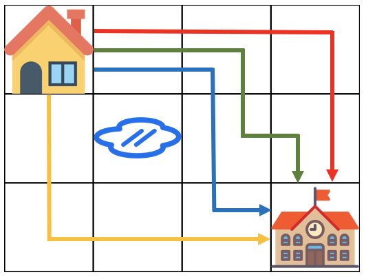

# 문제 설명

계속되는 폭우로 일부 지역이 물에 잠겼습니다. 물에 잠기지 않은 지역을 통해 학교를 가려고 합니다. 집에서 학교까지 가는 길은 m x n 크기의 격자모양으로 나타낼 수 있습니다.

아래 그림은 m = 4, n = 3 인 경우입니다.


가장 왼쪽 위, 즉 집이 있는 곳의 좌표는 (1, 1)로 나타내고 가장 오른쪽 아래, 즉 학교가 있는 곳의 좌표는 (m, n)으로 나타냅니다.

격자의 크기 m, n과 물이 잠긴 지역의 좌표를 담은 2차원 배열 puddles이 매개변수로 주어집니다. **오른쪽과 아래쪽으로만 움직여** 집에서 학교까지 갈 수 있는 최단경로의 개수를 1,000,000,007로 나눈 나머지를 return 하도록 solution 함수를 작성해주세요.

# 제한사항

- 격자의 크기 m, n은 1 이상 100 이하인 자연수입니다.
    - m과 n이 모두 1인 경우는 입력으로 주어지지 않습니다.
- 물에 잠긴 지역은 0개 이상 10개 이하입니다.
- 집과 학교가 물에 잠긴 경우는 입력으로 주어지지 않습니다.

# 입출력 예

|m|n|puddles|return|
|---|---|---|---|
|4|3|[[2, 2]]|4|

# 입출력 예 설명



# 풀이

해당 문제는 다이나믹 프로그래밍의 카테고리에 속하므로 DP를 이용하여 해결할 수 있습니다.

해당 문제에서 오른쪽과 아래쪽으로 만 움직일 수 있으므로 현재 칸에 도달할 수 있는 경우는 오른쪽 칸과 아래 칸에 도달할 수 있는 경우의 수의 합입니다.

그러므로 다음과 같은 점화 식을 세울 수 있습니다.
$$DP[I][J] = DP[I-1][J] + DP[I][J-1]$$
위의 점화식을 코드로 구현하면 아래와 같습니다.

```java
import java.util.*;

class Solution {
    private static final int MOD = 1000000007;
    
    public int solution(int m, int n, int[][] puddles) {
        int[][] map = new int[n][m];
        
        for (int[] puddle : puddles) {
            map[puddle[1] - 1][puddle[0] - 1] = -1;
        }
        
        map[0][0] = 1;
        for (int i = 0; i < n; ++i) {
            for (int j = 0; j < m; ++j) {
                if (map[i][j] == -1) {
                    map[i][j] = 0;
                    continue;
                }
                
                if (i != 0) {
                    map[i][j] = mod(map[i][j], map[i - 1][j]);
                }
                if (j != 0) {
                    map[i][j] = mod(map[i][j], map[i][j - 1]);
                }
            }
        }
        return map[n-1][m-1];
    }
    
    private int mod(int a, int b) {
        return (a % MOD + b % MOD) % MOD;
    }
}
```