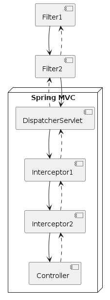

## 예외 처리

### 작성한 애플리케이션에서 exception 이 발생한다면..?

- 아래와 같은 화면이 출력됨
    
- 
    

### 예외가 발생한다면 예외를 잡아서 적절한 처리를 해주는 것이 필요

## `@ExceptionHandler`

- 예외 처리 메서드에 annotation으로 지정
    

```java
@ExceptionHandler({UserNotFoundException.class})          // <-- 어떤 예외를 처리할 것인지 선언
// --> method argument로 여러 객체들을 선언할 수 있다.
public String handleException(UserNotFoundException ex, HttpServletResponse response) {
    // ...

    // --> method return value로 여러 객체들을 반환할 수 있다.
    return "error";
}
```

## `@ExceptionHandler`에서 사용 가능한 method argument

- HttpServletRequest, HttpServletResponse, HttpSession, WebRequest
    
- Locale
    
- InputStream, OutputStream, Reader, Writer
    
- Map, Model, ModelMap
    

## `@ExceptionHandler`에서 사용 가능한 return type

- ModelAndView, View
    
- Map, Model, ModelMap
    
- String
    
- void
    
- `@ResponseBody`
    
- POJO
    

## Controller 기반 예외 처리 (Controller based Exception Handling)

### `@ExceptionHandler` + `@ResponseStatus`

```java
@ExceptionHandler(UserNotFoundException.class)
@ResponseStatus(HttpStatus.NOT_FOUND)
public void notFound() {
    // nothing to do
}
```

### `@ExceptionHandler` + View

```java
@ExceptionHandler(UserNotFoundException.class)
public String notFound(UserNotFoundException ex, Model model) {
    model.addAttribute("exception", ex);
    return "error";
}
```

### `@ExceptionHandler` + `@ResponseBody` + `HttpMessageConverter`

```java
@ExceptionHandler(Exception.class)
@ResponseBody
public ErrorDto handleException(Exception ex) {
    // ...
    // 예외를 처리하고 에러 메세지를 담은 `ErrorDto` 객체를 생성해서 반환
    return errorDto;
}
```

## 전역 예외 처리 (Global Exception Handling)

### `@ControllerAdvice`

- `@Component`의 일종 - component scanning 과정에서 자동으로 빈 등록
    

```java
@ControllerAdvice
public class WebControllerAdvice {
    @ExceptionHandler({ UserNotFoundException.class, PostNotFoundException.class })
    public String handleException(Exception ex, Model model) {
        log.error("resource not found", ex);
        model.addAttribute("exception", ex);
        return "error";
    }
}
```

## 예외 처리 (CheckedException, Unchecked Exception)

### CheckedException

- Exception을 상속 받는 Exception들을 의미
    
    - 해당 예외는 try-catch 를 통해서 예외를 잡아서 처리를 해야하거나
        
    - 메소드의 throws 를 이용해서 메소드를 호출한 쪽으로 던져야 함
        
        - 어떻게 해서든 해당 예외에 대한 처리를 해야한다는 뜻
            
- 그렇지 않다면 컴파일시 에러 발생
    

### UncheckedException

- RuntimeException을 상속 받는 Exception들을 의미
    
- 해당 예외는 처리하지 않는다고 컴파일 에러가 발생하지는 않음
    
- try-catch 나 throws 로 처리하지 않아도 됨
    
- 하지만 상위 객체의 메소드로 예외가 올라가기 때문에 어디에선가는 처리를 해야함
    

## 예외 처리 (CheckedException, Unchecked Exception)

### Spring Framework 에서의 Exception

- Spring Framework에서의 Exception은 대부분 RuntimeException을 상속받는 Unchecked Exception
    
- @ExceptionHandler 및 @ControllerAdvice를 통한 예외처리를 하도록 되어있음
    
    - 비즈니스 로직과 예외처리 코드가 뒤섞이는 상황을 방지
        

# 입력 값 검증 (Validation)

## Bean Validation

### 사용자로 부터 받은 입력 값에 대해 유효한 값인지 검증이 필요

- 예상치 못한 예외를 방지할 수 있음
    
- 
    

#### but..

- 검증 해야할 값이 많다면 코드가 지저분해 지고 비즈니스 로직(Business logic)과 섞이게 됨
    
- 검증해야 하는 메소드 마다 검증 코드를 작성해야 함
    
- `재사용가능 하고 비즈니스 로직과 분리가 필요`
    

## Bean Validation

### Bean Validation

- Java SE, Java EE 플랫폼에서 사용되는 `JavaBeans`에 대한 검증용 Java API spec.
    

### Spec.

- Bean Validation 1.0 (JSR-303)
    
- Bean Validation 1.1 (JSR-349)
    
- Bean Validation 2.0 (JSR-380)
    
- Jakarta Bean Validation 2.0
    
- Jakarta Bean Validation 3.0 - 기능적으로 추가된 것 없음
    

### cf.)

- RFC (Request for Comments) : 인터넷 관련 연구나 기술에 활용되는 메모이나 IETF에서 일부 RFC를 인터넷 표준으로 채택하기도 함
    
- JSR (Java Specification Request) : 자바 플랫폼에 추가된 사양 및 기술을 기술하는 공식 문서
    

## Bean Validation dependency

```xml
<dependency>
      <groupId>org.springframework.boot</groupId>
      <artifactId>spring-boot-starter-validation</artifactId>
</dependency>
```

## Bean Validation Annotation

|Annotation|설명|Spec|
|---|---|---|
|`@NotNull`|not null 검증.  <br>empty string 은 검사하지 못한다.|1.0+|
|`@Pattern`|regular expression 과 match 되는지 검사한다.|1.0+|
|`@Past`|과거의 날짜인지 검증|1.0+|
|`@Min`|대상 값이 @min 값보다 크거나 같아야 한다.|1.0+|
|`@Max`|대상 값이 @max 값보다 작거나 같아야 한다.|1.0+|
|`@Length`|문자열의 길이가 min 과 max 사이에 존재해야함|X|
|`@NotEmpty`|대상 값의 사이즈가 0보다 커야 한다.|2.0+|
|`@NotBlank`|대상 값을 trim 후 그 사이즈가 0보다 커야 한다.|2.0+|
|`@Email`|대상값이 이메일형식인지 아닌지 확인.|2.0+|

## Bean Validation Annotation 사용

### Ex.)

```java
@Value
public class UserModifyRequest {
    @NotNull
    @Size(max = 50)
    String name;

    @Min(0)
    int age;
}
```

## Bean Validation 적용

### Bean Validation 적용

- Controller Method signature 에서
    
    - 요청 객체에 `@Valid` 또는 `@Validated` annotation 적용하고
        
    - 바로 그 다음 argument로 `BindingResult` 또는 `Errors` 객체를 선언한 후
        
- Controller Method 본문에서
    
    - 앞서 선언한 `BindingResult` 또는 `Errors` 객체를 이용해서 validation 결과 확인
        

### Ex.)

```java
public String modifyUser(@Valid @ModelAttribute UserModifyRequest userRequest,
                         BindingResult bindingResult) {
    if (bindingResult.hasErrors()) {
        throw new ValidationFailedException(bindingResult);
    }

    // ...
}
```


### `UserRegisterRequest` 에 아래 조건에 맞는 Annotation을 적용하고 Validation Check를 해보자

- 비밀번호: 8글자 이상 20글자 이하
    
- 나이: 최소값 0
    
- 이름: 공백 제거 후 문자열의 길이가 0보다 커야 함
    

## Spring's Validation

### `Validator` interface

- `org.springframework.validation.Validator` interface를 이용한 Validation 구현
    

```java
public interface Validator {
	boolean supports(Class<?> clazz);
	void validate(Object target, Errors errors);
}
```

## Spring's Validation

### WebDataBinder

- 사용자의 요청과 자바 빈 객체를 바인딩할 수 있는 WebDataBinder 객체를 제공
    
- addValidators() 를 이용해서 validator를 추가할 수 있음
    

### @InitBinder

- 특정 컨트롤러 또는 전체 애플리케이션에 대해 데이터 바인딩과 유효성 검사를 커스터마이징하는 데 사용
    
- WebDataBinder를 설정하여 사용자 요청에 대한 데이터 바인딩을 설정
    
- 전역적으로 사용하고 싶다면 @ControllerAdvice 가 정의된 클래스에서 사용
    
# Spring MVC Components

## Spring MVC Components Overview


[https://terasolunaorg.github.io/guideline/5.4.1.RELEASE/en/Overview/SpringMVCOverview.html](https://terasolunaorg.github.io/guideline/5.4.1.RELEASE/en/Overview/SpringMVCOverview.html)

## Spring MVC Components

- HandlerMapping
    
- HandlerAdapter
    
- HandlerExceptionResolver
    
- RequestToViewNameTranslator
    
- ViewResolver
    
- LocaleResolver
    
- LocaleContextResolver
    
- ThemeResolver
    
- MultipartResolver
    
- FlashMapManager
    

## Handler?

### Handler

- `Controller`
    
- `HttpRequestHandler`
    

### Handler == `Controller`

- `Handler`는 그냥 `Controller`다라고 생각하면 무방함
    

## HandlerMapping

### 서버로 들어온 요청을 어느 핸들러로 전달할 지 결정하는 역할

- `BeanNameUrlHandlerMapping`
    
    - Bean Name + Url + HandlerMapping
        
- `SimpleUrlHandlerMapping`
    
    - Simple Url + HandlerMapping
        
- `RequestMappingHandlerMapping`
    
    - `@RequestMapping` + HandlerMapping
        

## HandlerAdapter

### DispatcherServlet과 실제 핸들러 구현 사이를 이어주는 Object Adapter 역할

- `HttpRequestHandlerAdapter`
    
    - `HttpRequestHandler` + HandlerAdapter
        
- `SimpleControllerHandlerAdapter`
    
    - Simple `Controller` + HandlerAdapter
        
- `RequestMappingHandlerAdapter`
    
    - `@RequestMapping` + HandlerAdapter
        

## ViewController / RedirectViewController

- 컨트롤러 클래스 없이 URL과 view를 매핑 시켜줄수 있음
    
- 복잡한 로직이 필요하다면 컨트롤러 클래스를 작성하는게 좋음
    

### 설정

```java
public class WebConfig implements WebMvcConfigurer {
    // ...

    @Override
    public void addViewControllers(ViewControllerRegistry registry) {
        registry.addViewController("/").setViewName("index");
        registry.addRedirectViewController("/this-is-home", "/");
    }
}
```

### HandlerMapping / HandlerAdapter

- 어떤 URL일 때 어떤 view로 rendering 하라(또는 redirct 하라)는 정보를 `Map` 에 저장해서 사용
    
    - **HandlerMapping** → `SimpleUrlHandlerMapping` 사용
        
- ViewController, RedirectViewController는 모두 `ParameterizableViewController` 라는 구현 클래스를 사용
    
    - `ParameterizableViewController`는 `AbstractController`라는 추상 클래스를 상속받아 구현
        
        - **HandlerAdapter** → `SimpleControllerHandlerAdapter` 사용
            

## ViewResolver

### 문자열 기반의 view 이름을 토대로 실제 View 구현을 결정하는 역할

- InternalResourceViewResolver
    
- VelocityViewResolver
    
- FreemarkerViewResolver
    
- ThymeleafViewResolver
    
- ...
    
## ViewResolver 관련 Components

### LocaleResolver / LocaleContextResolver

view rendering 시 국제화 지원을 위한 Locale과 Timezone을 결정하는 역할

- AcceptHeaderLocaleResolver
    
- CookieLocaleResolver
    
- SessionLocaleResolver
    

이름이 localeResolver인 LocaleResolver 스프링 빈을 생성해서 사용

```java
@Configuration
public class LocaleResolverConfig {
@Bean
public LocaleResolver localeResolver() {
    return new AcceptHeaderLocaleResolver();
}
```

### ThemeResolver

view rendering 시 어떤 테마를 사용할 지 결정하는 역할

- CookieThemeResolver
    
- FixedThemeResolver
    
- SessionThemeResolver
    

### RequestToViewNameTranslator

핸들러가 아무것도 리턴하지 않았을 때 view 이름을 결정하는 역할

## HandlerExceptionResolver

### 요청 처리 과정에서 발생하는 예외를 제어하고자 할 때 사용

- `DefaultHandlerExceptionResolver`
    
    - 표준 Spring 예외를 결정하고 예외에 해당하는 HTTP 상태 코드를 응답
        

## 기타

### MultipartResolver

멀티파트 요청을 처리하는 구현을 결정하는 역할

- CommonsMultipartResolver
    
- StandardServletMultipartResolver
    
    - Servlet 3.0 API 기반
        

### FlashMapManager

redirect와 같이 하나의 요청에서 다른 요청으로 속성 값을 전달하는데 FlashMap을 사용할 수 있는 mechanism을 제공

# Servlet Filter

## Servlet Filter


- Dispatcher Servlet 앞에서 사용자의 요청/응답을 처리
    
- 서블릿 스펙에서 제공하고 WAS 에서 사용가능한 기술
    
- 필터는 보안, 로깅, 요청 수정, 응답 변환 등의 다양한 용도로 활용
    
- jakarta.servlet.Filter 인터페이스를 구현해야 함
    

```java
public interface Filter {
    default void init(FilterConfig filterConfig) throws ServletException {
        // 필터 초기화 작업
    }

    void doFilter(ServletRequest var1, ServletResponse var2, FilterChain var3) throws IOException, ServletException;

    default void destroy() {
        //필터 종료 작업
    }
}
```

### Filter 구현

```java
public class MyFilter implements Filter {

    @Override
    public void doFilter(ServletRequest request, ServletResponse response, FilterChain chain)
            throws IOException, ServletException {
        // 요청 전처리 작업
        //...
        
        // 다음 필터로 요청 전달
        // 없다면 Dispatcher Servlet 코드 실행
        chain.doFilter(request, response);
        
        // 응답 후처리 작업
        // ...
    }
}
```

### Filter 등록

- 스프링 부트는 서블릿 필터를 스프링 빈으로 등록할 수 있는 org.springframework.boot.web.servlet.FilterRegistrationBean 을 제공
    

```java
@Configuration
public class FilterConfig {

    @Bean
    public FilterRegistrationBean<MyFilter> loggingFilter(){
        FilterRegistrationBean<MyFilter> registrationBean = new FilterRegistrationBean<>();
        registrationBean.setFilter(new MyFilter());
        registrationBean.addUrlPatterns("/user/*");
        return registrationBean;
    }
}
```

# HandlerInterceptor

## HandlerInterceptor

- Servlet Filter와 유사하게
    
    - DispatcherServlet이 Controller를 호출하기 전/후에
        
    - 요청 및 응답을 참조, 가공할 수 있는 일종의 필터 역할
        


## `HandlerInterceptor` interface

```java
public interface HandlerInterceptor {
  default boolean preHandle(HttpServletRequest req, HttpServletResponse resp, Object handler) /*..*/ {
    return true;
  }

  default void postHandle(HttpServletRequest req, HttpServletResponse resp, Object handler,
                          ModelAndView mav) /*..*/ {


  default void afterCompletion(HttpServletRequest req, HttpServletResponse resp, Object handler,
                          Exception ex) /*..*/ {
  }
}
```

### preHandle

- DispatcherServlet 이 컨트롤러의 핸들러 메서드를 실행하기전에 실행
    

### postHandle

- 컨트롤러의 핸들러 메서드가 비즈니스 로직을 실행 완료한 후 실행
    
- ModelAndView 를 인자로 받아서 ModelAndView 의 데이터 참조가능
    

### afterCompletion

- DispatcherServlet이 사용자에게 응답하기 전 실행
    

## DispatcherServlet의 HandlerExecutionChain 실행

### HandlerExecutionChain

- 요청을 처리할 하나의 handler(Controller)와 이 요청에 적용될 여러 interceptor들을 아우르는 요청 처리 객체
    

```java
public class HandlerExecutionChain {
  private final Object handler;
  private final List<HandlerInterceptor> interceptorList = new ArrayList<>();

  // ...
}
```

### HandlerExecutionChain 실행

```java
HandlerExecutionChain mappedHandler = /*..*/;
// ...

if (!mappedHandler.applyPreHandle(processedRequest, response)) {
    return;
}

// Actually invoke the handler.
mv = ha.handle(processedRequest, response, mappedHandler.getHandler());

// ...

mappedHandler.applyPostHandle(processedRequest, response, mv);
```

## Servlet Filter vs HandlerInterceptor



### 실행 시점이 다르다

- FIlter: `DispatcherServlet` 실행 전/후에 실행
    
- HandlerInterceptor: `DispatcherServlet` 실행 이후에 Controller 실행 전/후에 실행
    

### ApplicationContext 범위가 다르다

- Filter: Root ApplicationContext에 등록/관리
    
    - FIlter는 Servlet ApplicationContext(MVC의 View나 `@ExceptionHandler`)를 이용할 수 없다
        
- HandlerInterceptor: Servlet ApplicationContext에 등록/관리
    

## HandlerInterceptor 설정

```java
public class WebConfig implements WebMvcConfigurer {
    // ...

    @Override
    public void addInterceptors(InterceptorRegistry registry) {
        registry.addInterceptor(new LocaleChangeInterceptor());
    }
}
```

## `MessageSource`

### `MessageSource` interface

- ApplicationContext's i18n support
    

```java
public interface MessageSource {
  String getMessage(String code, Object[] args, defaultMessage, Locale locale);
  String getMessage(String code, Object[] args, Locale locale) /*..*/;
  String getMessage(MessageSourceResolvable resolvable, Locale locale) /*..*/;
}
```

### `MessageSource` type Bean 등록

- `messageSource`라는 이름의 `MessageSource` 타입의 Bean을 등록해두면
    
    - Spring framework에서 다국어 처리 시 이 Bean을 활용
        

```java
@Bean
public MessageSource messageSource() {
    ResourceBundleMessageSource messageSource = new ResourceBundleMessageSource();
    messageSource.setBasename("message");
//        messageSource.setBasenames("message", "error");

    return messageSource;
}
```
