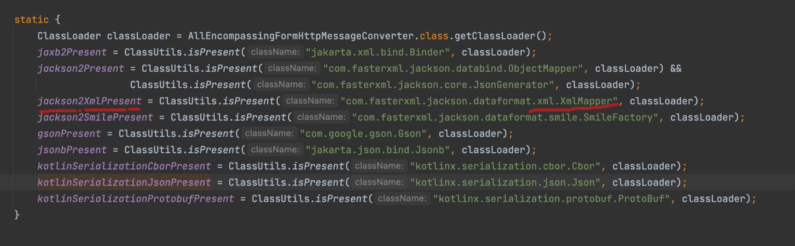
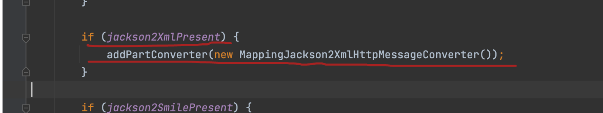

# Content Negotiation

클라이언트가 선호하는 표현 방식을 결정하는 역할

> 같은 API를 클라이언트가 호출하는 방법에 따라 다르게 응답함.  
> 예: json, xml

클라이언트는 아래 3가지 방법으로 응답 포멧을 결정 할 수 있음.

- ~~요청에 URL 접미사 (확장자) 사용 (예 : .xml / .json )~~ 사용중지 (Spring 5.2~)
    
- 요청에서 URL 매개 변수 사용 (예 : ? format = json )
    
- 요청에서 Accept 헤더 사용
    

Content Negotiation은 결국 적절한 `HttpMessageConverte`r를 결정하는 역할

```java
public class WebConfig implements WebMvcConfigurer {
    // ...

    @Override
    public void configureContentNegotiation(ContentNegotiationConfigurer configurer) {
        configurer.parameterName("format")
                  .ignoreAcceptHeader(true)
                    .favorParameter(true)                  .defaultContentType(MediaType.APPLICATION_JSON)
                  .mediaType("json", MediaType.APPLICATION_JSON)
                  .mediaType("xml", MediaType.APPLICATION_XML);
    }
}
```

## 에러가 나지 않았나??

결국 이 또한 HttpMessageConverter를 사용.

xml을 처리하는 컨버터가 존재하지않음.

간단히 xml 컨버터를 사용하는 디펜던시만 추가.

```xml
<dependency>
    <groupId>com.fasterxml.jackson.dataformat</groupId>
    <artifactId>jackson-dataformat-xml</artifactId>
</dependency>
```

dependency 추가했는데?!

AllEncompassingFormHttpMessageConverter.java





