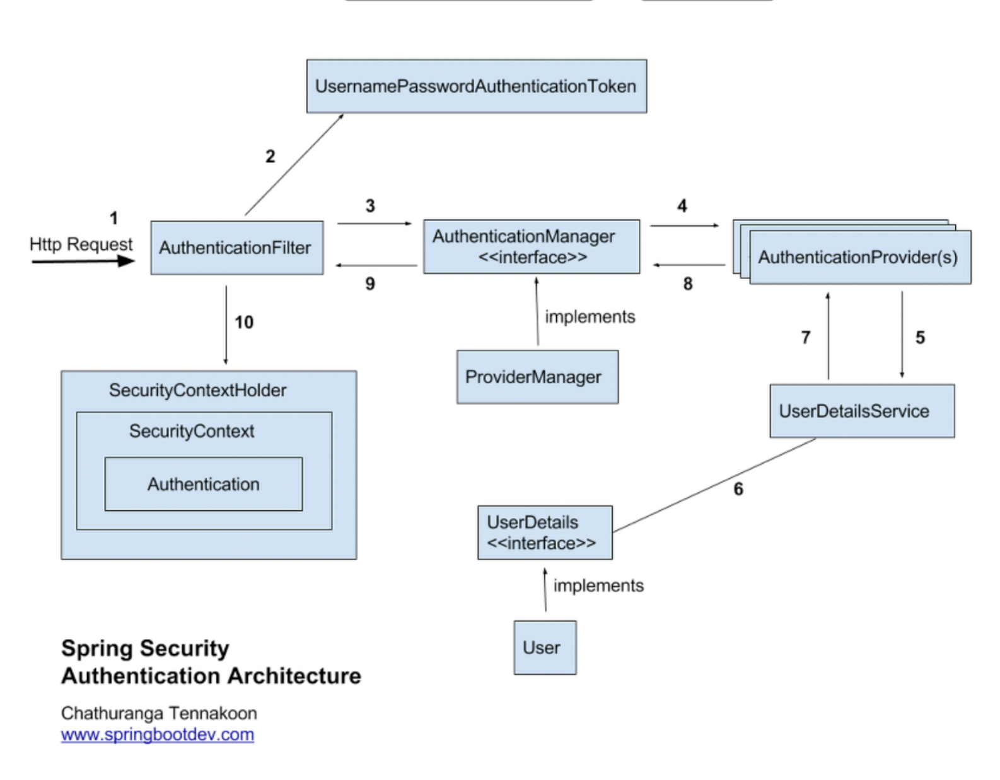
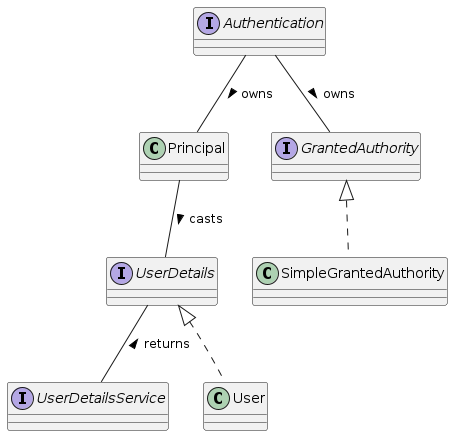

# Spring Security

## Spring Security란?

- Spring 기반 애플리케이션을 위해 선언적 보안 기능을 제공하는 보안 프레임워크
    
- Servlet Filter (Servlet 기반 애플리케이션) 및 AOP 기반
    

### Spring Security (History)

- 2004, first public release
    
- 2006, Spring Framework sub-project (1.0 final release)
    
- 2007, rebranded as Spring Security-
    
- 2008, Spring Security 2.0
    
- 2018, Spring Security 5.0
    
- 현재, Spring Security 6.xx
    

## Spring Security 버전별 주요 변경 사항

- 3.0
    
    - 코드 기반 및 패키지 재구성
        
    - 스프링 표현식 지원
        
- 3.2
    
    - Java Config 지원
        
- 4.0
    
    - 웹소켓 지원
        
    - 테스트 지원
        
- 5.0
    
    - OAuth 2.0 Login
        
    - Webflux 지원
        

## Spring Security 주요 기능

### 다양한 인증(Authentication) 지원

- HTTP BASIC authentication headers
    
- HTTP Digest authentication headers
    
- HTTP X.509 client certificate exchange
    
- `Form-based authentication (아이디/비밀번호 인증)`
    
- LDAP
    
- CAS (Jasig Central Authentication Service)
    
- Authentication based on pre-established request headers **ex.) CA Siteminder**
    
- Kerberos
    
- OpenID authentication
    
- OAuth 2.0 / OpenID Connect(OIDC) 1.0
    
- SAML 2.0
    

### 권한 관리(Authorization)

- `웹 요청 표현식 기반 접근 제어(Expression-Based Access Control)`
    
- `Method Security`
    
- Domain Object Security (ACLs)
    

### 취약점 공격 방어

- `Security Http Response Headers`
    
- `CSRF`
    

## Spring Security Modules

### 기본 모듈

- Core : spring-security-core
    
    - core authentication, access-control
        
- Config : spring-security-config
    
    - XML namespace configuration
        
    - Java Config
        
- Web : spring-security-web
    
    - filters, web security infrastructure
        
- Taglibs: spring-security-taglibs
    
    - JSP tag 구현
        

### 고급 모듈

- ACL : spring-security-acl
    
    - domain object ACL
        
- Remoting : spring-security-remoting
    
    - provides integration with Spring Remoting
        
- `Test : spring-security-test`
    
    - support for testing with Spring Security
        

### 인증 모델별 모듈

- LDAP : spring-security-ldap
    
- CAS : spring-security-cas
    
- OpenID : spring-security-openid
    

### Spring Security 5 OAuth 2.0 Modules

- OAuth 2.0 Core : spring-security-oauth2-core
    
    - core classes and interfaces for OAuth 2.0 Authorization Framework and OpenID Connect Core 1.0
        
- OAuth 2.0 Client : spring-security-oauth2-client
    
    - client support for OAuth 2.0 Authorization Framework and OpenID Connect Core 1.0
        
    - 특히, OAuth 2.0 Login
        
- OAuth 2.0 JOSE : spring-security-oauth2-jose
    
    - support for `JOSE(Javascript Object Signing and Encryption)` framework
        
        - JSON Web Token (JWT)
            
        - JSON Web Signature (JWS)
            
        - JSON Web Encryption (JWE)
            
        - JSON Web Key (JWK)
            
- OAuth 2.0 Resource Server : spring-security-oauth2-resource-server
    

## 정리해보면...

1. 인증
    
2. 인가
    
3. 취약점 공격 방어
    

### 인증 vs 인가

1. 인증
    

- 사용자의 신원을 확인
    

2. 인가
    

- `인증된 사용자`에게 특정한 `리소스`나 기능에 대한 `접근 권한`
    


## 인증

사용자의 신원을 확인

- `기본적인 아이디/비밀번호 인증`
    
- SSO
    
## Security 사용해보기

---

1. pom.xml에 Dependency 추가하기
    

```xml
<dependency>
    <groupId>org.springframework.boot</groupId>
    <artifactId>spring-boot-starter-security</artifactId>
</dependency>
```

2. LoginController/HomeController 제거 (주석처리)
    
3. SecurityConfig.java 파일 생성
    

```java
@Configuration
public class SecurityConfig {


    @Bean
    public SecurityFilterChain securityFilterChain(HttpSecurity http) throws Exception {
        http.authorizeHttpRequests(authorizeRequests ->
                                           authorizeRequests
                                                   .anyRequest().authenticated()
                                  );

        // login
        http.formLogin(Customizer.withDefaults());
        return http.build();
    }
}
```

---

로그인?

> 안되는게 정상.

### Security에서 인증


Principal: 인증된 사용자의 주체 (user details).  
Credentials: 사용자의 인증 자격 증명 (보통 비밀번호).  
Authorities: 사용자의 권한 (roles or permissions).  
Authenticated: 인증 여부를 나타내는 boolean 값.

## Authentication / Authorization

### Authentication (인증: authn)

- 자신이 누구라고 주장하는 **주체**를 확인하는 프로세스
    
    - **주체** (principal) : 사용자, 디바이스, 다른 시스템
        
- (the process of determining whether who or what it declares itself to be)
    

### Authorization (인가, 권한 부여: authz)

- 어플리케이션 내에서 **주체**가 어떤 행위를 수행하도록 허락되었는지 여부를 결정하는 프로세스
    

### Authentication → Authorization

## SecurityContext

### SecurityContext

- Authentication 을 보관하는 역할
    
- Authentication getter/setter 뿐
    

### SecurityContextHolder

- ThreadLocal에 SecurityContext 저장
    
    - MODE_GLOBAL, MODE_INHERITABLETHREADLOCAL 등의 다른 방식도 지원
        

코드로 정리 해보자면....

```java
public void performAction() {
    // 현재 인증된 사용자의 SecurityContext를 가져옴
    SecurityContext context = SecurityContextHolder.getContext();
    Authentication authentication = context.getAuthentication();

    // 인증된 사용자의 정보로 로직 수행
    if (authentication != null && authentication.isAuthenticated()) {
            Object principal = authentication.getPrincipal();
            // 비즈니스 로직 수행
    }
}
```

## 로그인을 가능하게 해보기

`SecurityConfig.java` 파일에  
InMemoryUserDetailsManager 를 `추가`해서 로그인

```java
@Bean
public InMemoryUserDetailsManager userDetailsService() {
        UserDetails admin = User.withDefaultPasswordEncoder()
                                .username("admin")
                                .password("admin")
                                .roles("ADMIN")
                                .build();
        return new InMemoryUserDetailsManager(admin);
}
                               
```

## 실습

1. localhost:8080/ (접근
    
2. 로그인 페이지 확인
    
3. 로그인 해보기 (member/member)
    

```bash
o.s.s.web.DefaultSecurityFilterChain     : Will secure any request with [org.springframework.security.web.session.DisableEncodeUrlFilter@14b528b6, org.springframework.security.web.context.request.async.WebAsyncManagerIntegrationFilter@c412556, org.springframework.security.web.context.SecurityContextHolderFilter@47df5041, org.springframework.security.web.header.HeaderWriterFilter@113f9078, org.springframework.web.filter.CorsFilter@6f930e0, org.springframework.security.web.csrf.CsrfFilter@4a6c0f38, org.springframework.security.web.authentication.logout.LogoutFilter@7436364d, org.springframework.security.web.authentication.UsernamePasswordAuthenticationFilter@2f9b21d6, org.springframework.security.web.authentication.ui.DefaultLoginPageGeneratingFilter@805e72e, org.springframework.security.web.authentication.ui.DefaultLogoutPageGeneratingFilter@450f0235, org.springframework.security.web.authentication.www.BasicAuthenticationFilter@5b2b8d86, org.springframework.security.web.savedrequest.RequestCacheAwareFilter@7e52a26b, org.springframework.security.web.servletapi.SecurityContextHolderAwareRequestFilter@2e56b4d, org.springframework.security.web.authentication.AnonymousAuthenticationFilter@78c262ba, org.springframework.security.web.access.ExceptionTranslationFilter@1b24ea2a, org.springframework.security.web.access.intercept.AuthorizationFilter@30a9e3db]
```

## Spring Security 구조를 살펴보자

### Spring Security의 서블릿 필터


### DelegatingFilterProxy

DelegatingFilterProxy: `지정된 이름의 bean`으로 `서블릿 필터 처리 위임`

### SpringSecurityFilterChain

Spring Security에서 내부적으로 사용되는 `DelegatingFilterProxy의 빈`  
이름: springSecurityFilterChain  
타입: org.springframework.security.web.FilterChainProxy

> Spring Security는 각각의 보안 필터마다 특별한 역할을 가지고 있는 보안 필터 체인을 가지고 있다  
> 보안 필터들 간에 의존관계가 있기 때문에 필터 순서가 중요

```java
public interface SecurityFilterChain {
  boolean matches(HttpServletRequest request);
  List<Filter> getFilters();
}
```

## cf.) SecurityFilters

```java
package org.springframework.security.config.http;

enum SecurityFilters {
    FIRST(Integer.MIN_VALUE),
    CHANNEL_FILTER,
    SECURITY_CONTEXT_FILTER,
    CONCURRENT_SESSION_FILTER,
    WEB_ASYNC_MANAGER_FILTER,
    HEADERS_FILTER,
    CORS_FILTER,
    CSRF_FILTER,
    LOGOUT_FILTER,
    X509_FILTER,
    PRE_AUTH_FILTER,
    CAS_FILTER,
    FORM_LOGIN_FILTER,
    OPENID_FILTER,
    LOGIN_PAGE_FILTER,
    DIGEST_AUTH_FILTER,
    BEARER_TOKEN_AUTH_FILTER,
    BASIC_AUTH_FILTER,
    REQUEST_CACHE_FILTER,
    SERVLET_API_SUPPORT_FILTER,
    JAAS_API_SUPPORT_FILTER,
    REMEMBER_ME_FILTER,
    ANONYMOUS_FILTER,
    SESSION_MANAGEMENT_FILTER,
    EXCEPTION_TRANSLATION_FILTER,
    FILTER_SECURITY_INTERCEPTOR,
    SWITCH_USER_FILTER,
    LAST(Integer.MAX_VALUE);
}
```

## 주요 보안 필터들

### ChannelProcessingFilter

- redirect to a different protocol (http → https)
    

### SecurityContextPersistenceFilter

- SecurityContext 객체를 SecurityContextHolder에 저장
    
    - 어디에 저장? SecurityContextRepository (default: HttpSession)
        
- 요청 처리가 끝나면 제거
    

### ConcurrentSessionFilter

- 현재 Session 유효 여부 파악하여 유효하지 않은 세션에 대한 후처리
    
- SessionManagementFilter와 연동 처리
    

### HeaderWriterFilter

- 현재 요청에 HTTP Header 추가
    
    - Ex.)
        
        - Cache-Control
            
        - X-Content-Type-Options
            
        - X-Frame-Options
            

### CsrfFilter

- Csrf (Cross-site Request Forgery: 사이트 간 요청 위조) 공격을 막기 위한 처리
    

### LogoutFilter

- 특정 URI를 체크하여 Logout을 실행
    
- Logout 처리 (LogoutHandler)
    
- Logout 성공 후 처리 (LogoutSuccessHandler)
    

### PRE_AUTH_FILTER

- `AbstractPreAuthenticatedProcessingFilter`를 상속받아 구현
    
- ex.)
    
    - X.509
        

### UsernamePasswordAuthenticationFilter

- 특정 URL에서 username, password를 통한 인증 프로세스 진행
    
- 인증 처리는 AuthenticationManager에게 위임
    
- 인증 성공 처리 (SuccessHandler)
    
- 인증 실패 처리 (FailureHandler)
    

### RequestCacheAwareFilter

- 인증 성공 후 기존 요청을 찾아가기 위해 기존 요청을 저장
    
    - 어디에 저장? RequestCache (default: HttpSession)
        
        - session attribute : `SPRING_SECURITY_SAVED_REQUEST`
            

### AnonymousAuthenticationFilter

- 인증이 안 된 사용자에게 `anonymousUser`라는 이름의 Authentication 객체를 설정하고
    
- `ROLE_ANONYMOUS` 권한을 부여
    

### SessionManagementFilter

- 세션 타임아웃, 동시 접근 제어 등을 처리
    

### ExceptionTranslationFilter

- 이 필터 이후의 모든 인증(AuthenticationException), 권한(AccessDeniedException) 예외 처리
    

### AuthorizationFilter

- 권한 프로세스를 처리하는 Filter
    
- `<intercept-url />` 내용을 기준으로 권한 처리
    

## Spring Security Filter




## Authentication / UserDetails



## UserDetailsService


## AuthenticationManager / AuthenticationProvider


### _인가_ 구성(AuthorizationFilter)

#### URL 패턴

```java
http.authorizeHttpRequests()
        .requestMatchers("/admin/**").hasAuthority("ROLE_ADMIN")
        .requestMatchers("/private-project/**").hasAnyAuthority("ROLE_ADMIN", "ROLE_MEMBER")
        .requestMatchers("/project/**").authenticated()
        .requestMatchers("/redirect-index").authenticated()
        .anyRequest().permitAll()
```

## 기본 제공 표현식

|표현식|설명|
|---|---|
|hasRole('권한')  <br>hasAuthority('권한')|해당 권한을 가졌는가?|
|hasAnyRole('권한1','권한2')  <br>hasAnyAuthority('권한1','권한2')|지정한 권한 중 하나라도 가졌는가?|
|permitAll|모두 허용|
|denyAll|모두 거부|
|isAnonymous()|익명 사용자인가?|
|isAuthenticated()|인증된 사용자인가?|
|hasIpAddress('ip')|IP나 IP대역에 포함되는가? (web 보안에서만 가능)|

## Custom UserDetailsService

### CustomUserDetailsService.java 파일 생성

```java
public class CustomUserDetailsService implements UserDetailsService {
    private PasswordEncoder passwordEncoder;
    public CustomUserDetailsService(PasswordEncoder passwordEncoder) {
        this.passwordEncoder = passwordEncoder;
    }

    @Override
    public UserDetails loadUserByUsername(String username) throws UsernameNotFoundException {
        return new User("admin", passwordEncoder.encode("admin"), Arrays.asList(new SimpleGrantedAuthority("admin")));
    }
}

```

```java
@Bean
public PasswordEncoder passwordEncoder() {
      return new BCryptPasswordEncoder();
}
```


## Spring Security JSP Tag Library

HTTP API 설계  
-> Stateless 라는 개념을 배웠는데..

### 왜 로그인을 한번만 했는데 문제가 없었을까??

- HTTP 프로토콜은 상태를 유지하지 않는 `stateless 프로토콜` (무상태)  
    -> 모든 요청은 각기 다른 새로운 요청
    

웹에서는 일반적으로 두가지 방법으로 위 문제를 해결함

- `세션 (+쿠키)`
    
- 토큰
    

### 쿠키와 세션!

쿠키와 세션은 웹 애플리케이션에서 사용자의 상태를 유지하고 관리를 도와줌

- 세션 유지 방식중 하나
    

#### `어디`에 저장이 될까요?

쿠키 -> 클라이언트 (예:브라우저)  
세션 -> 서버

### `무엇`을 저장 할까요?

쿠키 -> 세션 아이디  
세션 -> 동일 세션에서는 굳이 반복적으로 요청하지 않아도 되는 `로그인한 회원 정보`

### 쿠키와 세션을 이용하면..

```
1. 클라이언트가 인증
2. 인증 된 정보를 클라이언트마다 개별 세션 ID를 부여
3. 세션 ID를 담은 세션 쿠키와 함께 응답을 전송한다.
4. 클라이언트는 요청할 때마다 세션 ID가 담긴 쿠키를 함께 전송한다.
서버는 세션 ID를 확인하고 이를 통해 클라이언트 정보를 가져와 활용한다.

```

### 쿠키에 남기면 안 되는 정보

> 개인정보 금물!!!  
> * 클라이언트에 저장되므로 위조 및 변조 가능

# 로그인/로그아웃 커스터마이즈

## `formLogin()` 커스터마이즈

### login-page

- 로그인 폼 URL
    
- default: `GET /login`
    

### login-processing-url

- 로그인 처리 URL
    
- default: `POST /login`
    

### username-parameter

### password-parameter

### authentication-success-handler

### authentication-failure-handler

```java
http.formLogin((formLogin) ->
                           formLogin.loginPage("/auth/login")
                                    .usernameParameter("username")
                                    .passwordParameter("password")
                                   .failureUrl("/authentication/login?failed")
                                   .loginProcessingUrl("/auth/login/process")
                  );
```

## `logout()` 커스터마이징

### delete-cookies

- 삭제할 쿠키 이름을 comma 로 구분해서 지정
    

### logout-success-url

- 로그아웃 성공 후 리다이렉트될 url
    

### success-handler-ref

```java
http.logout((logout)->logout.deleteCookies("A-COOKIE", "B-COOKIE")
                                            .invalidateHttpSession(true)
                                            .logoutUrl("/auth/logout")
                                            .logoutSuccessUrl("/")
                                            .addLogoutHandler(null));
```

## 권한 없음 403 화면 커스터마이징

### `accessDeniedPage()` 설정

- 권한 없음 오류 발생 시 리다이렉트될 url
    

```java
http
    .exceptionHandling()
        .accessDeniedPage("/error/403")
```
