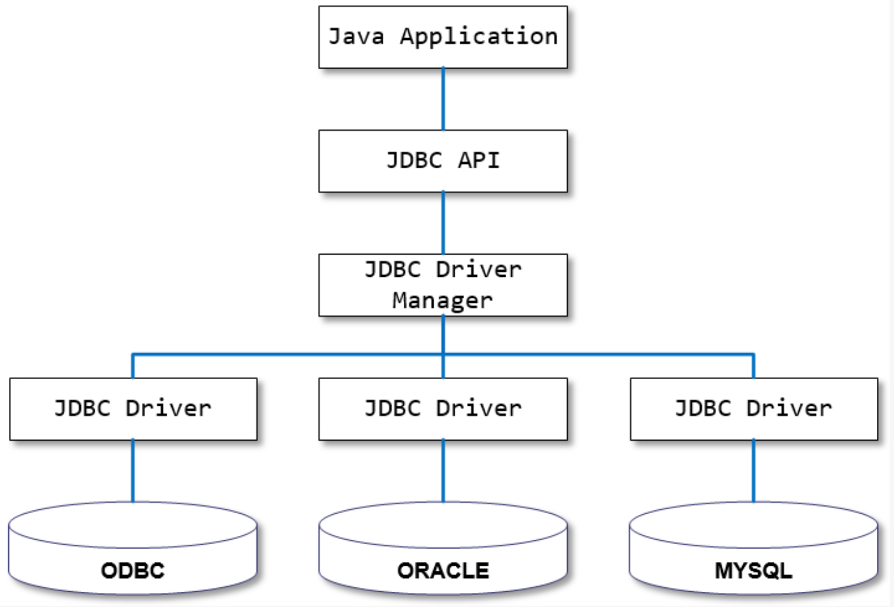
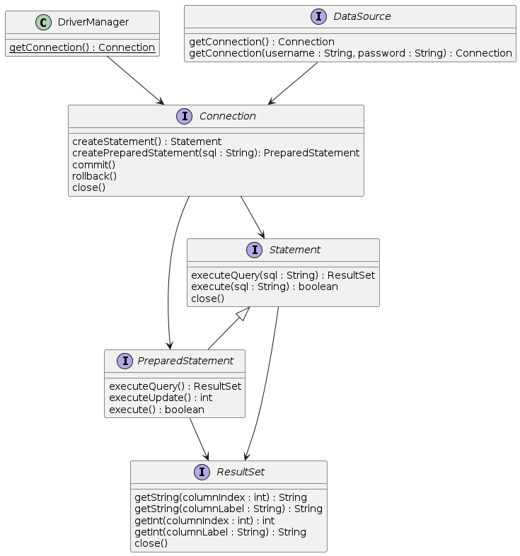
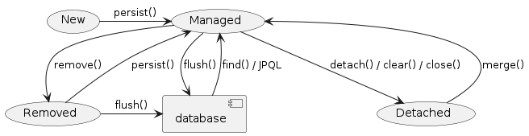

# 1. JPA 소개

## 관계형 데이터베이스와 Java의 데이터 액세스

### 프로그램과 데이터베이스

- 대부분의 프로그램은 사용자 데이터, 설정, 상태 등을 저장할 필요가 있다.
    
- 데이터를 저장하는 대표적인 수단은 데이터베이스이다.
    

### 데이터베이스 (Database)

- 데이터를 효율적으로 관리하기 위한 일종의 창고
    
- 특정 조직의 여러 사용자가 데이터를 공유하여 사용할 수 있도록 통합 저장된 데이터의 집합
    
- 행과 열로 구성된 시트에서 사용자가 정의한 형식으로 데이터를 관리하는 엑셀파일과 유사
    

### 관계형 데이터베이스 (Relational Database)

#### 관계형 데이터베이스

- 1970년에 E. F. Codd 가 제안한 데이터 **관계형 모델**에 기초하는 디지털 데이터베이스
    

#### 관계형 모델 (Relational Model)

- 데이터를 컬럼(column)과 로우(row)를 이루는 하나 이상의 테이블(또는 관계)로 정리
    
- 고유 키(Primary key)가 각 로우(row)를 식별
    
- 로우(row)는 레코드(record)나 튜플(tuple)로 부른다
    
- 관계(Relationship)는 서로 다른 테이블들 사이의 상호작용에 기반을 두고 형성된 논리적 연결이다.
    
    - 관계(Relationship)는 테이블 간에 둘 다 존재한다.
        
    - 이 관계들은 일대일, 일대다, 다대다, 이렇게 세 가지 형태로 이루어진다.
        

### Java 에서의 data access 기술

- JDBC API
    
- Spring Framework 의 JdbcTemplate
    
- MyBatis - SQL mapper framework
    
- JPA (ORM)

## JDBC, JdbcTemplate

### JDBC 소개

- JDBC(Java Database Connectivity)는:
    
    - 관계형 데이터베이스에 저장된 데이터를 접근 및 조작할 수 있게 하는 자바 API 이다.
        
    - 자바 응용프로그램이 다양한 DBMS에 대해 일관된 API로 데이터베이스 연결, 검색, 수정, 관리 등을 할 수 있게 한다.
        
    - 그러므로 자바 응용프로그램 개발자는 DBMS의 종류에 관계없이 JDBC API만을 이용하면 된다.
        

### JDBC 구조

- JDBC 는 네트워크상에 있는 데이터베이스에 접속할 수 있도록 해주는 데이터베이스 연결기능을 제공한다.
    
- JDBC API, JDBC Driver, JDBC Driver Manager 로 구성되어 있다.
    



|구성요소|설명|역할|
|---|---|---|
|Java Application|자바 응용프로그램, 자바 웹 어플리케이션 서버(tomcat, weblogic 등)|응용 프로그램 개발자, 웹어프리케이션 서버 개발사|
|JDBC API|자바 응용프로그램에서 데이터베이스를 연결하고 데이터를 제어할 수 있도록 데이터베이스 연결 및 제어를 위한 인터페이스와 클래스 들|JavaSE 개발사 (Sun microsystems, Oracle)|
|JDBC Driver Manager|자바 응용프로그램이 사용하는 데이터베이스에 맞는 JDBC 드라이버를 찾아서 로드합니다.|JavaSE 개발사 (Sun microsystems, Oracle)|
|JDBC Driver|각 데이터베이스 개발사에서 만든 데이터베이스 드라이버|데이터베이스 개발사(Oracle, MySql, PostgreSQL..|

## JDBC API

### JDBC 동작 과정

- 데이터베이스 연결: `DriverManager`를 통해 `Connection` 객체를 획득한다.
    
- SQL 실행: `Statement` 객체를 생성하고 SQL을 실행한다.
    
- 결과 처리: `ResultSet` 객체를 통해 SQL 쿼리의 결과를 처리한다.
    
- 연결 종료: 모든 처리가 완료된 후에는 `Connection`을 닫아 자원을 해제한다.
    

### JDBC API 구성 요소

- **DriverManager**: 데이터베이스 드라이버를 관리하며, 데이터베이스 연결을 위한 `Connection` 객체를 생성한다.
    
- **Connection**: 데이터베이스와의 연결을 나타내며, SQL 명령의 실행, 트랜잭션 관리 등을 수행한다.
    
- **Statement**: SQL 문을 데이터베이스에 전달하는 데 사용된다. `PreparedStatement`와 `CallableStatement`는 `Statement` 인터페이스를 상속하여 보다 특화된 기능을 제공한다.
    
- **ResultSet**: SQL 쿼리의 결과를 저장하며, 데이터를 순차적으로 읽는 데 사용된다.
    

### JDBC API 구조



## DataSource

### DataSource 개념

- JDBC 스펙에 정의된 인터페이스로 데이터베이스 연결을 생성하는 표준 방법을 정의한다.
    
- JDBC `Connection` 객체의 공장 역할을 한다.
    
    - 즉, 데이터베이스 연결을 생성하는 객체이다.
        
- JDBC 리소스의 재사용성과 연결 관리를 향상시키는 데 도움을 준다.
    

### DriverManager와의 차이

- DriverManager 는 각 요청마다 새로운 연결을 생성한다.
    
- DataSource 는 Connection Pooling 을 제공할 수 있다. 따라서 성능에 대한 확장성이 좋다.
    

### DataSource의 장점

- **연결 풀링**: 연결을 재사용함으로써 연결 생성 및 종료로 인한 오버헤드를 줄인다.
    
- **서비스 추상화**: 데이터베이스 연결 세부 사항을 애플리케이션 로직으로부터 분리한다.
    
- **보안 강화**: 연결 정보를 중앙에서 관리함으로써 보안을 강화한다.
    

## Connection Pool

### 기존 방식의 문제점

- Connection 객체는 새롭게 만들어질 때 많은 시스템 자원을 요구한다.
    

### Connection Pool의 개념

- 미리 생성된 `Connection` 객체의 집합을 관리하는 기술이다.
    
- 요청 시마다 데이터베이스 연결을 생성하고 파기하는 비용을 줄여준다.
    
    - `Connection` 객체는 새롭게 만들어질 때 많은 시스템 자원을 요구한다.
        

### Connection Pool의 작동 원리

- **초기화**: 애플리케이션이 시작될 때, 설정된 수의 `Connection` 객체가 생성되어 풀에 저장된다.
    
- **사용**: 애플리케이션의 요청에 따라 풀에서 `Connection` 객체를 할당받는다.
    
- **반환**: 사용이 끝난 `Connection`은 풀로 반환되어 다시 사용될 수 있다.
    

### Connection Pool의 이점

- **성능 향상**: 데이터베이스 연결의 생성과 소멸에 따른 성능 저하를 방지한다.
    
- **리소스 최적화**: 제한된 수의 연결을 효율적으로 재사용함으로써 시스템 자원을 효과적으로 활용한다.
    
    - Connection 수를 제한 할 수 있어 과다한 접속으로 인한 서버 자원 고갈을 예방한다.
        

### Connection Pool 작동 원리


### 구현체 종류

- 아래의 구현체들은 모두 Connection Pooling 을 내장한 DataSource 구현체이다.
    
    - Apache Commons DBCP
        
    - Tomcat DBCP
        
    - HikariCP
        

## Spring Framework JdbcTemplate

- JDBC API 기반
    
- JdbcTemplate 을 사용하면 지금까지 JDBC 를 사용한 코드에서 많은 부분을 Spring Framework 가 대신 처리해 준다.
    

|Action|Spring Framework|개발자|
|---|---|---|
|Define connection parameters.||X|
|Open the connection.|X||
|Specify the SQL statement.||X|
|Declare parameters and provide parameter values||X|
|Prepare and run the statement.|X||
|Set up the loop to iterate through the results (if any).|X||
|Do the work for each iteration.||X|
|Process any exception.|X||
|Handle transactions.|X||
|Close the connection, the statement, and the resultset.|X||

## SQL을 직접 다룰 때 발생하는 문제점

### SQL 직접 수정

- SQL을 하나하나 전부 수정해주어야 한다.
    
    - 다양한 쿼리문이 많다면?
        
- 텍스트 수정이라 오타가 발생해도 런타임시 확인 가능
    

### 객체와의 매핑은 별개의 일

- 쿼리 수행 결과와 객체와의 매핑은 별도 수작업이 필요하다.
    
- Repository의 CRUD 메서드와 SQL을 한꺼번에 같이 변경해야 한다.
    

### 그 외에도

- 상속 구조의 표현
    
- 연관관계 참조
    
- 객체 그래프 탐색 등
    

### 패러다임의 불일치

- `관계형` 데이터베이스 **≠** `객체 지향` 프로그래밍 언어
    
- 위에서 나열한 DB와 Java 사이의 차이를 메꾸기 위해 개발자는 많은 시간을 들여 수많은 코드와 쿼리를 작성해야 한다.
    

## ORM (Object-Relational Mapping)

- ORM 프레임워크가 중간에서 객체와 관계형 데이터베이스를 매핑
    
    - ORM을 이용하면 DBMS 벤더마다 다른 SQL에 대한 종속성을 줄이고 호환성 향상이 가능

## JPA 기본 개념

### JPA 정의

#### `JPA` (Java Persistence API)

- 자바 ORM 기술 표준
    
- 표준 명세
    
    - JSR 338 - Java Persistence 2.2
        

#### `JPA` (Jakarta Persistence API)

- Jakarta Persistence 3.1
    
- 현재 3.2 개발중
    
- 이름 변경 이유
    
    - Oracle이 Java EE 관리권을 Eclipse Foundation으로 이관, 2017년
        
    - 이전 과정에서 Java 명칭에 대한 상표권 합의 안됨
        
    - Java EE -> Jakarta EE 명칭 변경
        
    - JPA는 Java EE의 일부로 같이 변경
        

### JPA 구현체

#### Hibernate

- JPA 실제 구현
    
    - Hibernate, EclipseLink, DataNucleus
        
- Hibernate가 사실상 표준 (de facto)
    

### JPA를 사용해야 하는 이유

#### SQL 중심적인 개발 -> 객체 중심으로 개발

#### 패러다임 불일치 해결

- JPA는 객체와 관계형 데이터베이스 사이의 패러다임의 불일치로 인해 발생하는 문제 (상속, 연관관계, 객체 그래프 탐색 등)를 해결
    

#### 생산성

- JPA를 사용하면 지루하고 반복적인 CRUD용 SQL을 개발자가 직접 작성하지 않아도 된다
    
- Spring Data JPA를 사용하면 interface 선언만으로도 쿼리 구현이 가능하기 때문에 관리 도구 등에서 가볍게 사용할 수 있는 CRUD 쿼리를 손쉽게 대처할 수 있다
    

#### maintenance

- 컬럼 추가/삭제 시 직접 관련된 CRUD 쿼리를 모두 수정하는 대신 JPA가 관리하는 모델(Entity)을 수정하면 된다
    

#### 데이터 접근 추상화와 벤더 독립성

- 데이터베이스 벤더마다 미묘하게 다른 데이터 타입이나 SQL을 JPA를 이용하면 손쉽게 해결이 가능하다

## Spring Data JPA

### Spring Framework 과 JPA

#### Spring Data

- 다양한 데이터 저장소에 대한 접근을 추상화하기 위한 Spring 프로젝트
    
- JPA, JDBC, Redis, MongoDB, Elasticsearch 등
    

#### Spring Data JPA

- repository 추상화를 통해 interface 선언만으로도 구현 가능
    
- 메서드 이름으로 쿼리 생성
    
- Web Support (페이징, 정렬, 도메인 클래스 컨버터 기능)
    

### Spring Data JPA의 특징

- Spring Data JPA는 기본적인 JPA 기능을 사용하기 위한 구현을 캡슐화하고, 데이터 접근을 효율적으로 관리할 수 있게 해주는 여러 추가 기능을 제공한다.
    
- 이러한 기능들은 개발자가 데이터베이스 코드를 작성할 때 일반적으로 필요로 하는 반복적인 패턴과 코드를 줄이는 데 중점을 둔다.
    
- 아래에서는 Spring Data JPA의 주요 기능과 그 구현 방식에 대해 설명한다.
    

#### 1. 리포지터리 추상화

- Spring Data JPA는 리포지터리 계층의 추상화를 제공한다.
    
- 이를 통해 개발자는 인터페이스만 선언하고 Spring Data JPA가 구현체를 자동으로 생성해준다.
    
- `JpaRepository` 같은 기본 제공 인터페이스를 확장함으로써, 기본적인 CRUD(Create, Read, Update, Delete) 연산과 페이징 및 정렬 기능을 쉽게 추가할 수 있다.
    

#### 2. 쿼리 메서드

- 메서드 이름을 분석하여 SQL 쿼리를 자동으로 생성하는 기능은 Spring Data JPA의 강력한 특징 중 하나다.
    
- 예를 들어, `findByName`, `findByEmailContaining`, `readByLastnameOrFirstname` 같은 메서드 이름을 리포지터리 인터페이스에 선언함으로써, 해당 조건을 만족하는 데이터를 조회하는 쿼리를 자동으로 생성할 수 있다.
    

#### 3. @Query 어노테이션

- 복잡한 쿼리 또는 JPA가 제공하는 기본 쿼리 메서드로 표현하기 어려운 쿼리를 작성할 때 사용한다.
    
- `@Query` 어노테이션을 메서드에 선언하고, JPQL(Java Persistence Query Language) 또는 SQL을 직접 작성하여 사용할 수 있다.
    

#### 4. 트랜잭션 관리

- Spring Data JPA는 선언적 트랜잭션 관리를 제공한다.
    
- `@Transactional` 어노테이션을 사용하여 메서드 또는 클래스 레벨에서 트랜잭션의 경계를 선언할 수 있다.
    
- 이렇게 함으로써, 개발자는 트랜잭션 관리 코드를 직접 작성하지 않고도 트랜잭션을 관리할 수 있다.
    

#### 5. EntityGraph

- 엔티티 그래프 기능을 사용하여 JPA 쿼리 실행 시 페치 조인(fetch join)의 복잡성을 관리할 수 있다.
    
- `@EntityGraph` 어노테이션을 사용하면, 특정 연산을 수행할 때 Eager 또는 Lazy 로딩을 세밀하게 제어할 수 있다.
    

#### 6. Auditing

- 엔티티의 생성 시간, 수정 시간, 생성자 및 수정자 등을 자동으로 관리할 수 있는 Auditing 기능을 제공한다.
    
- `@CreatedDate`, `@LastModifiedDate`, `@CreatedBy`, `@LastModifiedBy` 등의 어노테이션을 엔티티 필드에 적용하여 이러한 데이터를 자동으로 기록할 수 있다.
    

#### 구현 방식

- Spring Data JPA는 프록시와 리플렉션을 사용하여 동적으로 리포지터리 인터페이스의 구현체를 생성한다.
    
- 개발자가 정의한 인터페이스에 대해, Spring은 실행 시간에 구현체를 생성하고, 호출된 메서드에 따라 적절한 JPA 연산을 수행한다.
    
- 이 프로세스는 AOP(Aspect-Oriented Programming)와 비슷하며, 구현의 복잡성을 추상화하고 간소화한다.
    

Spring Data JPA는 JPA의 기능을 활용하면서도, 개발자가 데이터 접근 계층을 더욱 간단하고 효율적으로 구현할 수 있도록 하는 다양한 기능을 제공한다. 이러한 기능은 데이터 접근 코드의 복잡성을 줄이고, 개발 시간을 단축하는 데 기여한다.

# JPA 시작

## 라이브러리 살펴보기

### Maven 설정(`pom.xml`)

- 의존 라이브러리에 `spring-boot-starter-data-jpa` 추가
    

```xml
<dependency>
    <groupId>org.springframework.boot</groupId>
    <artifactId>spring-boot-starter-data-jpa</artifactId>
</dependency>
```

- 의존 라이브러리에 사용할 DB 드라이버 추가
    

```xml
<!-- H2 Database -->
<dependency>
    <groupId>com.h2database</groupId>
    <artifactId>h2</artifactId>
    <scope>runtime</scope>
</dependency>
```


### Spring Boot 설정(`application.yml`)

```properties
spring:
  jpa:
    open-in-view: false # 'Open EntityManager in View' 패턴을 비활성화한다. 이를 false로 설정하면, 세션/엔티티 매니저가 뷰 렌더링까지 열려 있는 것을 방지한다.
    show-sql: true # 콘솔에 SQL 쿼리를 출력한다. 개발 중 쿼리 디버깅에 유용하다.
    properties:
      hibernate:
        format_sql: true # SQL 쿼리를 보기 좋게 포맷팅하여 출력한다.
        use_sql_comments: true # SQL 쿼리에 주석을 포함한다. 쿼리 이해에 도움을 준다.
        highlight_sql: true # Hibernate에서 SQL 로깅을 할 때 SQL 문을 강조(색상 추가)
        auto_quote_keyword: true  # 예약어를 인식하여 자동으로 인용 부호를 추가한다. 데이터베이스 예약어와 충돌을 피할 수 있다.
        #globally_quoted_identifiers: true # 모든 데이터베이스 식별자(테이블 이름, 컬럼 이름 등)를 따옴표로 묶어 SQL 표준에 맞게 만듭니다. 예약어나 대소문자 구분 문제를 회피할 수 있습니다.
    hibernate:
      ddl-auto: create  # 애플리케이션 실행 시 데이터베이스 스키마를 자동으로 생성한다. 개발 초기 단계에서 유용하다.
    #defer-datasource-initialization: true # 데이터 소스 초기화를 지연시킨다. 이는 JPA 엔티티를 데이터베이스 스키마 생성 후에 초기화하도록 해, 데이터베이스 초기화 스크립트 실행에 유리하다.

logging:
  level:
    org.hibernate.orm.jdbc.bind: trace # Hibernate가 SQL 쿼리를 실행할 때, 바인딩되는 파라미터 값을 로깅한다. 쿼리 파라미터 값을 디버깅할 때 유용하다.
    org.springframework.transaction.interceptor: trace # Spring 트랜잭션 관리에 대한 상세 로깅을 활성화한다. 트랜잭션 시작, 커밋, 롤백 등의 이벤트를 추적할 때 도움이 된다.
```

## Entity 매핑 시작

### 테이블 스키마

```sql
# 사용자 테이블
create table user
(
    id       varchar(50) not null
        primary key,
    password varchar(20) not null
);
```

### User 클래스

```java
@Getter
@AllArgsConstructor
public class User {

    private String id;

    @Setter
    private String password;

}
```

### Entity 매핑

JPA 어노테이션을 이용하여 위의 User 클래스에 user 테이블을 매핑한다.

```java
@Getter
@AllArgsConstructor
@NoArgsConstructor(access = AccessLevel.PROTECTED)
@Entity
public class User {

    @Id
    private String id;

    @Setter
    private String password;

}
```

- **@Entity**
    
    - JPA가 관리할 객체임을 명시. name 속성으로 엔티티 이름을 지정한다.
        
    - name 생략하면 엔티티 이름은 클래스 이름
        
- **@Table**
    
    - 매핑할 DB 테이블 정보 설정. 생략하면 엔티티 이름을 테이블 이름으로 매핑한다.
        
    - 여기에선 생략했기 때문에 매핑할 Table 이름은 user
        
- **@Id**
    
    - 기본 키(PK) 매핑
        
- **@NoArgsConstructor(access = AccessLevel.PROTECTED)**
    
    - JPA 어노테이션 아님. JPA Entity에 필수인 매개변수가 없는 생성자 추가
        
- **@Column**
    
    - Java class 필드를 DB Table 컬럼에 매핑. name 속성으로 컬럼 이름 지정
        
    - 생략하면 필드명을 컬럼 이름으로 지정
        
- **매핑 정보가 없는 필드**
    
    - id 필드에 @Column 어노테이션이 없기 때문에 필드명과 동일한 id 컬럼으로 매핑된다.
        
    - password 필드에 @Column 어노테이션이 없기 때문에 필드명과 동일한 password 컬럼으로 매핑된다.

## Repository 추가

### Repository 추가

- User JPA Entity를 관리할 수 있는 UserRepository를 추가한다.
    
- JpaRepository를 확장하여 구현한다.
    
    - JpaRepository는 JPA가 아니라 Spring Data JPA에서 제공하는 기능이다.
        
    - JpaRepository가 없다면 JPA의 EntityManagerFactory와 EntityManager, EntityTransaction을 이용하여 직접 하나하나 구현해야 한다.
        

```java
public interface UserRepository extends JpaRepository<User, String> {
}
```


- JpaRepository만 상속해도 기본적인 CRUD 메소드들을 제공해준다.

## 애플리케이션 개발

앞에서 구성한 Entity와 JpaRepository를 이용한 CRUD 구현 예시

### Create

```java
User user = userRepository.save(new User(id, password));
```

### Read

```java
User user = userRepository.findById(id);
```

### Update

```java
User user = userRepository.findById(id);
user.setPassword(newPassword);
```

### Delete

```java
userRepository.deleteById(id);
```


## Spring Data JPA의 트랜잭션 관리
    

### JPA와 Spring Data JPA의 로직 코드 차이
    
- JPA
    
    - EntityManager를 직접 관리
        
    - EntityManager 통해서 Entity 조회/수정/관리
        
    - EntityTransaction 통해서 트랜잭션 직접 관리
        
- Spring Data JPA
    
    - JpaRepository를 상속한 UserRepository로 Entity 조회/수정
        
        - EntityManager는 내부적으로 자동 구현된 코드에서 사용 됨
            
    - @Transactional 어노테이션 통해서 트랜잭션 자동 관리
        
        - Spring Boot에 의해 자동 생성된 PlatformTransactionManager에 의해 관리
            

#### 기본 JPA만 사용

```java
public User modifyById(String id, String password) {
    EntityManager entityManager = entityManagerFactory.createEntityManager();
    EntityTransaction tx = entityManager.getTransaction();
    try {
        tx.begin();
        User user = getById(id);
        user.setPassword(password);
        entityManager.merge(user);
        tx.commit();
        return user;
    } catch (Exception e) {
        tx.rollback();
        entityManager.close();
        throw e;
    } finally {
        entityManager.close();
    }
}
```

#### Spring Data JPA 사용

```java
@Transactional
public User modifyById(String id, String password) {
    User user = userRepository.findById(id)
            .orElseThrow(() -> new ResourceNotFoundException("User(id = " + id + ") not found."));
    user.setPassword(password);
    return user;
}
```

### Spring Framework의 트랜잭션 추상화

#### PlatformTransactionManager

- Spring Framework 트랜잭션 추상화의 핵심 interface
    

```java
public interface PlatformTransactionManager extends TransactionManager {
    TransactionStatus getTransaction(@Nullable TransactionDefinition definition) throws TransactionException;
    void commit(TransactionStatus status) throws TransactionException;
    void rollback(TransactionStatus status) throws TransactionException;
}
```

#### 선언적 트랜잭션

```
@Transactional
```

### Spring Boot 자동 구성

#### PlatformTransactionManager

- JpaTransactionManager
    

```java
package org.springframework.boot.autoconfigure.orm.jpa;

public abstract class JpaBaseConfiguration {
    // ...

    @Bean
    @ConditionalOnMissingBean(TransactionManager.class)
    public PlatformTransactionManager transactionManager(
            ObjectProvider<TransactionManagerCustomizers> transactionManagerCustomizers) {
        JpaTransactionManager transactionManager = new JpaTransactionManager();
        transactionManagerCustomizers
                .ifAvailable((customizers) -> customizers.customize((TransactionManager) transactionManager));
        return transactionManager;
    }

    // ...
}
```

# 3. JPA 테스트

## @DataJpaTest

@DataJpaTest와 @SpringBootTest는 Spring Boot 테스트에 사용되는 어노테이션들로, 각각 다른 목적과 테스트 환경 구성을 위해 설계되었다. 이 두 어노테이션의 주요 차이점을 이해하면, 테스트 케이스를 작성할 때 어느 상황에 어떤 어노테이션을 사용해야 할지 결정하는 데 도움이 된다.

### @DataJpaTest

- 목적: @DataJpaTest는 JPA 관련 구성요소만을 대상으로 한 경량 통합 테스트를 위해 설계되었다. 이 어노테이션은 주로 리포지토리 레이어의 테스트를 목적으로 하며, 데이터 접근 계층에 집중한다.
    
- 환경 구성: @DataJpaTest를 사용할 때, Spring Test 컨텍스트는 JPA 관련 구성요소(예: 엔티티 매니저, 데이터소스, JPA 리포지토리)만 로드한다. 이 어노테이션은 기본적으로 인메모리 데이터베이스를 사용하며, 테스트 데이터소스 설정을 자동으로 구성한다. 서비스 레이어, 컨트롤러 레이어 등 애플리케이션의 다른 부분은 로드되지 않는다.
    
- 트랜잭션 관리: @DataJpaTest로 표시된 테스트는 기본적으로 트랜잭션을 사용하며, 각 테스트 실행 후 롤백된다. 이는 테스트 간의 데이터 격리를 보장한다.
    

### @SpringBootTest

- 목적: @SpringBootTest는 스프링 부트 애플리케이션의 전체 컨텍스트를 로드하여 보다 포괄적인 통합 테스트를 수행하기 위해 사용된다. 이 어노테이션은 애플리케이션의 모든 빈과 구성을 포함하여, 애플리케이션이 실제 환경에서 실행될 때와 같은 방식으로 테스트하고자 할 때 사용된다.
    
- 환경 구성: @SpringBootTest를 사용하면, 애플리케이션의 전체 스프링 컨텍스트가 로드된다. 이는 컨트롤러, 서비스, 리포지토리 레이어 등 애플리케이션의 모든 부분을 포함합니다. 필요에 따라 실제 데이터베이스 또는 외부 서비스에 연결할 수도 있다.
    
- 트랜잭션 관리: @SpringBootTest는 특별히 명시하지 않는 한 트랜잭션을 자동으로 롤백하지 않는다. 트랜잭션 관리를 테스트에서 직접 제어하려면, @Transactional 어노테이션을 테스트 클래스나 메소드에 추가해야 한다.


    

### 사용 시나리오

- @DataJpaTest: JPA 엔티티, 리포지토리 레이어의 CRUD 연산, 쿼리 메소드 등 데이터 접근 계층에 대한 테스트를 작성할 때 사용한다.
    
- @SpringBootTest: 전체 스프링 애플리케이션의 흐름을 테스트하거나, 여러 빈 간의 상호작용, 전체 애플리케이션의 설정 및 동작을 검증하고 싶을 때 사용한다.
    

결국, 테스트의 범위와 목적에 따라 적합한 어노테이션을 선택해야 한다. 좁은 범위의 데이터 접근 계층 테스트에는 @DataJpaTest를, 애플리케이션의 전체적인 동작을 검증하는 포괄적인 테스트에는 @SpringBootTest를 사용하는 것이 좋다.

## @Sql

`@Sql` 어노테이션은 Spring Framework에서 제공하는 어노테이션으로, 테스트 실행 전후에 SQL 스크립트를 실행하도록 설정한다. 이 어노테이션은 주로 테스트 클래스 또는 테스트 메서드에 적용되며, 데이터베이스를 특정 상태로 초기화하거나, 테스트 후 데이터베이스를 정리하는 용도로 사용된다.

### 주요 속성

1. **value**: SQL 스크립트 파일의 경로를 지정한다. 스크립트 파일은 클래스패스에 위치해야 하며, 여러 파일을 지정할 수 있다.
    
2. **statements**: 직접 SQL 문을 문자열 배열로 지정한다. `value`와 `statements` 중 하나만 사용할 수 있다.
    
3. **executionPhase**: 스크립트 실행 시점을 설정한다. `BEFORE_TEST_CLASS`, `AFTER_TEST_CLASS`, `BEFORE_TEST_METHOD`, `AFTER_TEST_METHOD`의 값으로 설정할 수 있다.
    
4. **config**: `@SqlConfig` 어노테이션을 사용하여 SQL 스크립트의 실행에 대한 추가적인 설정을 제공한다. 이 설정에는 트랜잭션 관리, 에러 처리 방식, 데이터베이스 연결 정보 등을 포함한다.
    

### 사용 예

```java
@DataJpaTest
public class SomeRepositoryTests {

    @Sql(scripts = "classpath:schema.sql", executionPhase = Sql.ExecutionPhase.BEFORE_TEST_METHOD)
    @Sql(scripts = "classpath:cleanup.sql", executionPhase = Sql.ExecutionPhase.AFTER_TEST_METHOD)
    public void testSomeDatabaseOperation() {
        // 데이터베이스 관련 테스트 코드가 실행된다.
    }
}
```

위 예제에서 `schema.sql`은 테스트가 실행되기 전에 실행되어 테스트에 필요한 데이터베이스 스키마를 설정하고, `cleanup.sql`은 테스트 후 실행되어 테스트 과정에서 생성된 데이터를 정리한다.

`@Sql` 어노테이션은 데이터베이스 상태를 테스트가 요구하는 특정 상태로 만들어 정확성과 일관성을 유지하는 데 도움을 준다. 이를 통해 개발자는 데이터베이스 상호작용을 포함하는 테스트를 보다 쉽고 효과적으로 작성할 수 있다.

# 4. Entity 매핑

## JPA Entity

### Entity

- JPA에서 엔티티(Entity)는 데이터베이스에 저장될 수 있는 데이터를 나타내는 POJO(Plain Old Java Object, 일반적인 오래된 자바 객체)일 뿐이다.
    
- 엔티티는 데이터베이스에 저장된 테이블을 나타낸다.
    
- 엔티티의 각 인스턴스는 테이블의 한 행을 나타낸다.
    
## Entity 매핑

- Entity 클래스에 데이터베이스 테이블과 컬럼, 기본 키, 외래 키 등을 설정하는 것
    

### 어노테이션

- `@Entity` : JPA가 관리할 객체임을 명시 (필수)
    
    - `name 속성`: Entity 이름을 지정 (생략 가능)
        
        - 생략하면 클래스 이름
            
- `@Table` : 매핑할 DB 테이블 정보 설정 (생략 가능)
    
    - `name 속성`: Table 이름을 지정 (생략 가능)
        
        - 생략하면 Entity 이름
            
        - 어떤 이름이 지정되든 실제로는 snake_case로 변경된다.
            
- `@Id` : 기본 키(PK) 매핑 (필수)
    
- `@Column` : 필드와 컬럼 매핑 (생략 가능)
    

### 예제

```java
@Entity
@Table(name = "members")
public class Member {
    @Id
    @GeneratedValue(strategy = GenerationType.IDENTITY)
    private Long id;

    private String name;

    @Column(name = "created_at")
    private ZonedDateTime createdDate;

}
```

## 필드와 컬럼 매핑

### `@Column`

- 객체 필드를 컬럼에 매핑 (생략 가능)
    
- 속성
    
    - name: 컬럼 이름을 지정 (생략 가능)
        
        - 생략하면 필드 이름을 컬럼 이름으로 사용
            

### `@Temporal`

- 날짜 타입 매핑
    

```java
public enum TemporalType {
    DATE, 
    TIME, 
    TIMESTAMP
}
```

- 참고. java 8 date/time (`LocalTime`, `LocalDate`, `ZonedDateTime`) 타입은 `@Temporal`을 붙이지 않는다.
    

### `@Transient`

- 특정 필드를 컬럼에 매핑하지 않을 경우에 지정

## 데이터베이스 스키마 자동 생성

### Spring Boot 설정

```
spring.jpa.hibernate.ddl-auto=create
```

#### 속성

- create: 기존 테이블을 삭제하고 새로 생성한다. drop + create
    
- create-drop: create 속성에 추가로 애플리케이션을 종료할 때 생성한 테이블을 제거한다. drop + create + drop
    
- update: 데이터베이스 테이블과 엔티티 매핑 정보를 비교해서 변경 사항만 수정한다.
    
- validate: 데이터베이스 테이블과 엔티티 매핑 정보를 비교해서 차이가 있으면 경고를 남기고 애플리케이션을 실행하지 않는다. 데이터베이스 스키마 수정하지 않는다.
    
- none: 아무 것도 하지 않는다.
    

#### 생략 시 기본 값

- embedded database인 경우: create-drop
    
- 그 외: none

## 기본 키 매핑

### 기본 키(Primary Key) 매핑 전략

#### 자동 생성

- TABLE 전략: 채번 테이블을 사용
    
- SEQUENCE 전략: 데이터베이스 시퀀스를 사용해서 기본 키를 할당
    
    - ex.) Oracle
        
- IDENTITY 전략: 기본 키 생성을 데이터베이스에 위임
    
    - ex.) MySQL
        
- AUTO 전략: 선택한 데이터베이스 방언(dialect)에 따라 기본 키 매핑 전략을 자동으로 선택
    

#### 직접 할당

- 애플리케이션에서 직접 식별자 값을 할당
    

### 예제

```java
public class Item {
    @Id
    @GeneratedValue(strategy = GenerationType.IDENTITY)
    @Column(name = "id")
    private long id;

    // ...
}
```

```java
public @interface GeneratedValue {
    GenerationType strategy() default AUTO;
    String generator() default "";
}
```

```java
public enum GenerationType {
    TABLE, 
    SEQUENCE, 
    IDENTITY, 
    AUTO
}
```

## 복합 키 매핑

### 복합 Key (Composite key)

- `@IdClass`
    
- `@EmbeddedId` / `@Embeddable`
    

### 예제

### `order_item` 테이블

```java
create table if not exists order_item
(
    order_id    bigint not null,
    line_number int    not null,
    item_id     bigint not null,
    quantity    int    not null,
    primary key (order_id, line_number),
    constraint order_item_item_id_fk
        foreign key (item_id) references item (id),
    constraint order_item_order_id_fk
        foreign key (order_id) references "order" (id)
);
```

## `@IdClass` 를 이용한 복합 Key 지정

### `@IdClass`

- Entity class 레벨에서 지정
    

```java
@Entity
@Table(name = "OrderItem")
@IdClass(OrderItem.Pk.class)
public class OrderItem {
    @Id
    @Column(name = "order_id")
    private Long orderId;

    @Id
    @Column(name = "line_number")
    private Integer lineNumber;

    // ...

}
```

```java
@NoArgsConstructor
@AllArgsConstructor
@EqualsAndHashCode
public static class Pk implements Serializable {
    private Long orderId;

    private Integer lineNumber;

}
```

## `@EmbeddedId` / `@Embeddable`를 이용한 복합 Key 지정

### `@EmbeddedId` / `@Embeddable`

- `@EmbeddedId` - Entity 클래스의 필드에 지정
    
- `@Embeddable` - 복합 Key 식별자 클래스에 지정
    

```java
@Entity
@Table(name = "OrderItem")
public class OrderItem {
    @EmbeddedId
    private Pk pk;

    // ...

}
```

```java
@NoArgsConstructor
@AllArgsConstructor
@EqualsAndHashCode
@Embeddable
public static class Pk implements Serializable {
    @Column(name = "order_id")
    private Long orderId;

    @Column(name = "line_number")
    private Integer lineNumber;

}
```

## 복합 Key Class 제약조건

### 복합 Key Class 제약조건

- PK 제약조건을 그대로 따름
    

### PK 제약 조건

- The primary key class must be **public** and must have a **public no-arg constructor**.
    
- The primary key class must be **`serializable`**.
    
- The primary key class must **define `equals` and `hashCode` methods**.

# 5. 영속성 관리

## EntityManager와 EntityManagerFactory

### EntityManager

- Entity의 저장, 수정, 삭제, 조회 등 Entity와 관련된 모든 일을 처리하는 관리자
    
- EntityManagerFactory 가 생성 → 생성 비용이 크지 않다
    
- EntityManager는 **thread safe 하지 않음**
    
    - 여러 thread 간에 절대 공유하면 안 됨
        
- 각각의 요청마다 별도의 EntityManager를 생성해서 사용
    

```java
package jakarta.persistence;

public interface EntityManager extends AutoCloseable {
    public <T> T find(Class<T> entityClass, Object primaryKey);
    public <T> T find(Class<T> entityClass, Object primaryKey, Map<String, Object> properties); 
    public <T> T find(Class<T> entityClass, Object primaryKey, LockModeType lockMode);
    public <T> T find(Class<T> entityClass, Object primaryKey, LockModeType lockMode, Map<String, Object> properties);

    public void persist(Object entity);

    public <T> T merge(T entity);

    public void remove(Object entity);

    // ...

}
```

### EntityManagerFactory

- EntityManager를 생성하는 팩토리
    
- 데이터베이스를 하나만 사용하는 애플리케이션은 일반적으로 EntityManagerFactory를 하나만 사용
    
    - EntityManagerFactory를 만드는 비용이 매우 크기 때문에 하나만 만들어서 전체에서 공유
        
    - thread safe
        

```java
package jakarta.persistence;

public interface EntityManagerFactory extends AutoCloseable {
    public EntityManager createEntityManager();
    public EntityManager createEntityManager(Map map);
    public EntityManager createEntityManager(SynchronizationType synchronizationType);
    public EntityManager createEntityManager(SynchronizationType synchronizationType, Map map);
    // ...
}
```

### LocalContainerEntityManagerFactoryBean

- Spring 컨테이너 내에서 EntityManagerFactory를 생성하는 데 사용된다.
    
- JPA EntityManagerFactory를 Spring의 빈으로 등록하기 위해 사용되며, JPA 엔티티 매니저의 설정과 초기화를 담당한다.
    
- 데이터 소스 설정, JPA 벤더 어댑터, 엔티티 패키지 위치 등을 구성요소로 갖고 있다.
    

```java
package org.springframework.orm.jpa;

public class LocalContainerEntityManagerFactoryBean extends AbstractEntityManagerFactoryBean
		implements ResourceLoaderAware, LoadTimeWeaverAware {
    // ...
}
```

#### Spring Boot 자동 구성

```java
package org.springframework.boot.autoconfigure.orm.jpa;

public abstract class JpaBaseConfiguration {
    // ...

    @Bean
    @Primary
    @ConditionalOnMissingBean({ LocalContainerEntityManagerFactoryBean.class, EntityManagerFactory.class })
    public LocalContainerEntityManagerFactoryBean entityManagerFactory(EntityManagerFactoryBuilder factoryBuilder,
            PersistenceManagedTypes persistenceManagedTypes) {
        Map<String, Object> vendorProperties = getVendorProperties();
        customizeVendorProperties(vendorProperties);
        return factoryBuilder.dataSource(this.dataSource)
                .managedTypes(persistenceManagedTypes)
                .properties(vendorProperties)
                .mappingResources(getMappingResources())
                .jta(isJta())
                .build();
    }

    // ...
}
```

## 영속성 컨텍스트

### 영속성 컨텍스트

- Entity를 영구 저장하는 환경
    

```java
@PersistenceContext
```

### Entity의 생명주기



### 비영속 (new/transient)

- 영속성 컨텍스트와 전혀 관계 없는 상태
    

### 영속 (managed)

- 영속성 컨텍스트에 저장된 상태
    

### 준영속 (detached)

- 영속성 컨텍스트에 저장되었다가 분리된 상태
    

### 삭제 (removed)

- 삭제된 상태
    

## 영속성 컨텍스트가 Entity를 관리하면 얻을 수 있는 이점

- 1차 캐시
    
- 동일성 보장
    
- 트랜잭션을 지원하는 쓰기 지연
    
- 변경 감지
    
- 지연 로딩