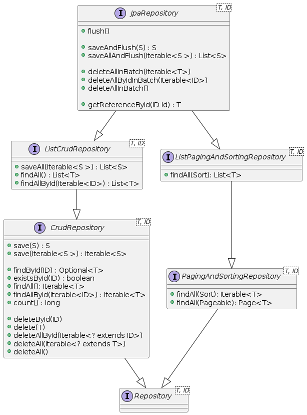
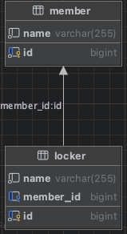
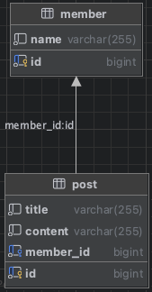

# Repository 소개

## Repository 소개

### Repository의 정의

- 도메인 객체에 접근하는 컬렉션과 비슷한 인터페이스를 사용해 도메인과 데이터 매핑 계층 사이를 중재(mediate)
    
    - 마틴 파울러, P of EAA
        
- a mechanism for encapsulating storage, retrieval, and search behavior which emulates a collection of objects
    
    - 에릭 에반스, DDD
        

### 주의할 점

- Repository는 JPA의 개념이 아니고, Spring Framework가 제공해주는 것임.

## Spring Data Repository

- data access layer 구현을 위해 반복해서 작성했던, 유사한 코드를 줄일 수 있는 추상화 제공
    

> The goal of Spring Data repository abstraction is  
> to significantly reduce the amount of boilerplate code  
> required to implement data access layers for various persistence stores.

```java
// EntityManager를 통해 entity를 저장, 수정, 삭제, 조회
// create, update, delete, and look up entities through EntityManager
Item entity1 = new ItemEntity();
entity1.setItemName("peach");
entity1.setPrice(135L);
entityManager.persist(entity1);

Item entity2 = entityManager.find(ItemEntity.class, entity1.getItemId());
entity2.setPrice(235L);
entityManager.merge(entity2);

// JPQL, Criteria API를 이용해서 복잡한 쿼리 수행
// complex query can be executed by using JPQL, Criteria API
String jpql = "select item from Item item where item.itemName like '%peach%'";
List<ItemEntity> entites = entityManager.createQuery(jpql, ItemEntity.class)
                                        .getResultList();
```

## @Repository와 Spring Data Repository의 차이점

### @Repository

- org.springframework.stereotype.Repository
    
- Spring Stereotype annotation
    
    - Ex.) @Controller, @Service, @Repository, @Component
        
- **@ComponentScan** 설정에 따라 classpath scanning을 통해 빈 자동 감지 및 등록
    
- 다양한 데이터 액세스 기술마다 다른 예외 추상화 제공
    
    - `DataAccessException`, `PersistenceExceptionTranslator`
        

### Spring Data Repository

- org.springframework.data.repository
    
- **@EnableJpaRepositories** 설정에 따라 Repository interface 자동 감지 및 동적으로 구현 생성해서 Bean으로 등록
    
- cf.) **@NoRepositoryBean**
    
    - Spring Data Repository bean으로 등록하고 싶지 않은 중간 단계 interface에 적용

## Repository 생성

### Ex.) `ItemRepository` 인터페이스

- `JpaRepository` interface 상속
    

```java
public interface ItemRepository extends JpaRepository<Item, Long> {
}
```

## JPA Repository interface 계층 구조



## JPA Repository interface

- 웬만한 CRUD, Paging, Sorting 메서드 제공
    

```java
package org.springframework.data.jpa.repository;

@NoRepositoryBean
public interface JpaRepository<T, ID> extends ListCrudRepository<T, ID>, ListPagingAndSortingRepository<T, ID>, QueryByExampleExecutor<T> {

    void flush();
    <S extends T> S saveAndFlush(S entity);
    <S extends T> List<S> saveAllAndFlush(Iterable<S> entities);

    @Deprecated
    default void deleteInBatch(Iterable<T> entities) {
        deleteAllInBatch(entities);
    }

    void deleteAllInBatch(Iterable<T> entities);
    void deleteAllByIdInBatch(Iterable<ID> ids);
    void deleteAllInBatch();

    @Deprecated
    T getOne(ID id);

    @Deprecated
    T getById(ID id);

    T getReferenceById(ID id);

    @Override
    <S extends T> List<S> findAll(Example<S> example);

    @Override
    <S extends T> List<S> findAll(Example<S> example, Sort sort);
}
```

```java
package org.springframework.data.repository;

@NoRepositoryBean
public interface ListCrudRepository<T, ID> extends CrudRepository<T, ID> {
    <S extends T> List<S> saveAll(Iterable<S> entities);
    List<T> findAll();
    List<T> findAllById(Iterable<ID> ids);
}
```

```java
package org.springframework.data.repository;

@NoRepositoryBean
public interface CrudRepository<T, ID> extends Repository<T, ID> {
    <S extends T> S save(S entity);
    <S extends T> Iterable<S> saveAll(Iterable<S> entities);
    
    Optional<T> findById(ID id);
    
    boolean existsById(ID id);
    
    Iterable<T> findAll();
    Iterable<T> findAllById(Iterable<ID> ids);
    
    long count();
    
    void deleteById(ID id);
    void delete(T entity);
    void deleteAllById(Iterable<? extends ID> ids);
    void deleteAll(Iterable<? extends T> entities);
    void deleteAll();
}
```

```java
package org.springframework.data.repository;

@NoRepositoryBean
public interface ListPagingAndSortingRepository<T, ID> extends PagingAndSortingRepository<T, ID> {
    List<T> findAll(Sort sort);
}
```

```java
package org.springframework.data.repository;

@NoRepositoryBean
public interface PagingAndSortingRepository<T, ID> extends Repository<T, ID> {
    Iterable<T> findAll(Sort sort);
    Page<T> findAll(Pageable pageable);
}
```

## JpaRepository가 제공하는 메서드들이 실제 수행하는 쿼리

```java
// insert / update
<S extends T> S save(S entity);

// select * from Items where item_id = {id}
Optional<T> findById(ID id);

// select count(*) from Items;
long count();

// delete from Items where item_id = {id}
void deleteById(ID id);

// ...
```

## 메서드 이름으로 쿼리 생성

- Spring Data JPA에서 제공하는 기능으로 이름 규칙에 맞춰 interface에 선언하면 쿼리 생성
    
- 참고
    
    - [https://docs.spring.io/spring-data/jpa/reference/repositories/query-keywords-reference.html#appendix.query.method.subject](https://docs.spring.io/spring-data/jpa/reference/repositories/query-keywords-reference.html#appendix.query.method.subject)
        
    - [https://docs.spring.io/spring-data/jpa/reference/jpa/query-methods.html#jpa.query-methods.query-creation](https://docs.spring.io/spring-data/jpa/reference/jpa/query-methods.html#jpa.query-methods.query-creation)

## `@Query`

### `@Query`

- JPQL 쿼리나 Native 쿼리를 직접 수행
    
    - nativeQuery = true 옵션을 통해 Native SQL 쿼리를 수행할 수 있다.
        
    - 파라미터 바인딩
        
        - 위치 기반: 1 부터 시작, 권장하지 않음
            
        - 이름 기반: `@Param({name})`으로 바인딩 할 수 있다.
            
            - Java8 이상 + -parameters 옵션으로 컴파일하면 `@Param`이 필요 없다.
                

```java
// JPQL 쿼리 (파라미터 바인딩 = 위치 기반)
@Query("select i from Item i where i.price >= ?1")
List<Item> findAllByPriceAtLeastByQuery(long price);

// JPQL 쿼리 (파라미터 바인딩 = 이름 기반)
@Query("select i from Item i where i.price >= :price")
List<Item> findAllByPriceAtLeastByQueryParam(long price);

// 네이티브 SQL 쿼리 (파라미터 바인딩 = 위치 기반)
@Query(value = "select * from item where price >= ?1", nativeQuery = true)
List<Item> findAllByPriceAtLeastByNativeQuery(long price);

// 네이티브 SQL 쿼리 (파라미터 바인딩 = 이름 기반)
@Query(value = "select * from item where price >= :price", nativeQuery = true)
List<Item> findAllByPriceAtLeastByNativeQueryParam(long price);
```

### `@Modifying`

- `@Query` 를 통해 insert, update, delete 쿼리를 수행할 경우 붙여줘야 한다.
    
- 영속성 컨텍스트를 거치지 않고 바로 DB에 반영되기 때문에 수정 후 바로 조회할 때 주의해야 한다.
    
    - clearAutomatically = true 옵션을 통해 자동으로 영속성 컨텍스트를 초기화할 수 있다.
        

```java
@Modifying
@Query("update Item i set i.name = :name where i.id = :id")
int updateNameByIdByQuery(long id, String name);

// `@Modifying` with `clearAutomatically`
@Modifying(clearAutomatically = true)
@Query("update Item i set i.name = :name where i.id = :id")
int updateNameByIdByQueryAndClear(long id, String name);
```

# 연관 관계 매핑

## JPA 연관 관계(association)란?

### 데이터베이스 테이블 사이의 관계(relationship)

#### 데이터베이스 정규화

- 정규화는 데이터 중복으로 인해 발생하는 데이터 불일치 현상을 해소하는 과정이다.
    
- 정규화는 주로 테이블을 더 작고, 잘 조직된 테이블로 나누는 과정이고, 나누어진 테이블 사이의 관계(relationship)를 외래 키(Foreign Key, FK)로 연결한다.
    

#### 테이블 사이의 관계

- 테이블 사이의 관계(relationship)는 주로 외래 키(Foreign Key, FK)를 사용하여 한 테이블의 데이터가 다른 테이블의 데이터와 어떻게 연결되는지 정의한다.
    
- 연관된 데이터를 결합하여 조회할 필요가 있을 때, 여러 테이블 간의 관계(relationship)를 JOIN 연산을 이용하여 결합하여 조회할 수 있다.
    

### Java 객체 사이의 관계

- Java 객체는 참조를 사용해서 관계를 맺는다.
    
- 한 객체의 필드가 다른 객체의 주소를 참조함으로써 관계 맺는다.
    

### JPA 연관 관계(association)

- Java 객체의 참조와 테이블의 외래 키를 매핑하여, 테이블 사이의 관계를 Java 객체 사이의 관계로 나타내고 사용(CRUD) 할 수 있게 한다.
    

```
No object is an island.

 - Kent Beck, Ward Cunningham
```


## 관계의 종류

JPA 연관 관계는 관계의 다중성(Multiplicity)과 관계의 방향(Direction)에 의해 결정된다.

- 일대일 단방향 관계(One-to-one unidirectional association)
    
- 일대일 양방향 관계(One-to-one bidirectional association)
    
- 일대다 단방향 관계(One-to-many unidirectional association)
    
- 일대다 양방향 관계(One-to-many bidirectional association)
    
- 다대일 단방향 관계(Many-to-one unidirectional association)
    
- 다대일 양방향 관계(Many-to-one bidirectional association)
    
- 다대다 단방향 관계(Many-to-many unidirectional association)
    
- 다대다 양방향 관계(Many-to-many bidirectional association)
    

### 다중성 (Multiplicity)

- One-to-one(일대일, 1:1): `@OneToOne`
    
- One-to-many(일대다, 1:N): `@OneToMany`
    
- Many-to-one(다대일, N:1): `@ManyToOne`
    
- Many-to-many(다대다, M:N): `@ManyToMany`
    

### 방향 (Direction)

- 단방향(unidirectional)
    
- 양방향(bidirectional)
    

#### 관계의 주인 (The owner of the relationship)

- 관계를 관리하는 책임이 있는 필드를 가리키며, 그 필드가 관계를 제어한다.
    
    - 관계를 관리한다. = 외래 키나 조인 테이블을 관리(저장, 수정, 삭제)한다.
        
- 관계의 주인인 필드가 있는 엔티티를 소유 측(Owning side)라고 한다.
    
    - 소유 측은 보통 외래 키(FK)가 있는 테이블이 된다.
        
- 소유 측의 반대쪽을 비소유 측이라고 한다.
    
    - 양방향 관계에서 비소유 측 엔티티에는 `mappedBy` 속성으로 관계의 주인을 지정해주어야 한다.
        

#### 단방향 vs 양방향

- 단방향 매핑만으로 연관 관계 매핑은 완료된다.
    
- 단방향을 양방향으로 만들면 반대 방향으로의 객체 그래프 탐색이 가능해진다.
    
- 단방향에 비해 양방향은 복잡하다.
    
    - 엔티티 매핑도 양쪽으로 해주어야하고, 관계의 주인도 설정해야하며, 각각 적절한 어노테이션과 그 속성들도 지정해주어야한다.
        
    - 객체 참조는 JPA에서 자동으로 양쪽이 어긋나지 않도록 관리해주지 않는다. 객체의 상호 참조가 서로 어긋나지 않도록 추가 구현을 해서 관리해주어야 비즈니스 로직에서 문제가 생기지 않는다.

## 관계 정의

- `@ManyToOne`: 다대일(N:1)
    
- `@OneToMany`: 일대다(1:N)
    
- `@OneToOne`: 일대일(1:1)
    
- `@ManyToMany`: 다대다(M:N)
    

### fetch 속성 (Fetch 전략 지정)

- 연관 대상 엔티티를 즉시 로딩할지 지연 로딩할지 지정한다.
    
- 기본 값
    
    - *ToOne: 즉시 로딩(FetchType.EAGER)
        
    - *ToMany: 지연 로딩(FetchType.LAZY)
        

### cascade 속성 (영속성 전이)

- 연관된 Entity에게 영속성 연산을 전파할지 여부를 지정한다.
    
- 여러 개를 동시에 지정할 수 있다.
    
- 기본 값: `{}` (아무 연산도 전파하지 않는다.)
    

#### 예시

```java
@OneToOne(cascade = CascadeType.PERSIST)
@OneToMany(cascade = CascadeType.ALL)
@ManyToOne(cascade = {CascadeType.PERSIST, CascadeType.REMOVE})
```

#### cascade 종류

```java
public enum CascadeType {
    ALL,        // PERSIST, MERGE, REMOVE, REFRESH, DETACH
    PERSIST,    // EntityManager.persist() 전파
    MERGE,      // EntityManager.merge() 전파
    REMOVE,     // EntityManager.remove() 전파
    REFRESH,    // EntityManager.refresh() 전파
    DETACH      // EntityManager.detach() 전파
}
```

## 외래 키(Foreign Key, FK) 지정

- `@JoinColumn` : 외래 키 지정
    
- `@JoinColumns` : 복합 외래 키 지정

# 다양한 연관 관계 매핑

## 일대일(1:1) 단방향 관계

### 매핑 어노테이션

- `@OneToOne`: 일대일 연관 관계를 정의한다.
    

### 연관 관계의 주인인 테이블에 외래 키(FK)가 있는 경우

#### ERD


#### 스키마

```sql
create table locker
(
    id   bigint       not null
        primary key,
    name varchar(255) not null
);

create table member
(
    id        bigint       not null
        primary key,
    name      varchar(255) not null,
    locker_id bigint       null,
    constraint member_locker_id_uindex
        unique (locker_id),
    constraint member_locker_id_fk
        foreign key (locker_id) references locker (id)
);
```

### 연관 관계의 주인이 아닌 테이블(locker)에 외래 키(FK)가 있는 경우

#### ERD



#### 스키마

```sql
create table member
(
    id   bigint       not null
        primary key,
    name varchar(255) not null
);

create table locker
(
    id        bigint       not null
        primary key,
    name      varchar(50)  not null,
    member_id varchar(255) null,
    constraint locker_member_id_uindex
        unique (member_id),
    constraint locker_member_id_fk
        foreign key (member_id) references member (id)
);
```

#### JPA에서 지원하지 않는다

- 연관 관계의 주인을 Member에서 Locker로 수정해야 한다.

## 일대일(1:1) 양방향 관계

### 매핑 어노테이션

- `@OneToOne`: 일대일 연관 관계를 정의한다.
    
    - `mappedBy` 속성: 관계를 소유하는 필드를 지정한다.
        
        - 주인이 아닌 쪽(외래 키가 없는 쪽)에는 `mappedBy` 속성을 이용하여 주인이 아님을 지정한다.

## 일대일(1:1) 식별 관계

### 매핑 어노테이션

- `@OneToOne`: 두 엔티티 간의 1:1 관계를 명시한다.
    
- `@MapsId`: 자식 엔티티에서 부모 엔티티의 기본 키를 자신의 기본 키로 사용하도록 설정한다.
    
    - 여기에서 자식 엔티티란 외래 키를 통해 부모 엔티티를 참조하는 엔티티를 말한다.
        
- `@JoinColumn`: 외래 키 컬럼을 지정한다.
    
    - 만약 생략하면 기본 값은 `@OneToOne이 붙어있는 필드 명(snake_case) + "_" + 참조 대상의 기본 키 필드 명(snake_case)`이다.
        

### ERD


### 테이블 스키마

```sql
create table board
(
    id    bigint      not null
        primary key,
    title varchar(50) not null
);

create table board_detail
(
    board_id bigint       not null
        primary key,
    content  varchar(255) null,
    constraint board_detail_board_id_fk
        foreign key (board_id) references board (id)
);
```

## 다대일(N:1) 단방향 관계

- `@ManyToOne`: 다대일 연관 관계를 정의한다.
    

### ERD



### 테이블 스키마

```sql
create table member
(
    id   bigint auto_increment
        primary key,
    name varchar(255) not null
);

create table post
(
    id        bigint auto_increment
        primary key,
    title     varchar(255) not null,
    content   varchar(255) not null,
    member_id varchar(255) not null,
    constraint post_member_id_fk
        foreign key (member_id) references member (id)
);
```

## 일대다(1:N) 단방향 관계

### 매핑

- `@OneToMany`: 일대다(1:N) 연관 관계를 정의한다.
    

### 특징

- 사용을 권장하지 않는다.
    
    - 장점보다 단점이 많은 관계이므로 다대일 단방향 또는 다대일 양방향을 사용하는 것이 낫다.
        
- 외래 키가 없는 일(1) 쪽이 연관 관계의 주인이 되는 일반적이지 않는 관계이다.
    
- 연관 관계 매핑 중에서 유일하게 mappedBy가 없는 쪽(연관 관계의 주인)에 외래 키가 없는 관계이다.
    
    - 다른 연관 관계는 전부 mappedBy가 없는 연관 관계의 주인인 쪽에 외래 키가 있다.
        
- @JoinColumn으로 외래 키를 지정해주지 않으면 조인 테이블 전략을 이용하여 연관 관계를 매핑한다.
    
- 조인 컬럼 전략인 경우
    
    - 외래 키가 null인 데이터를 먼저 저장한 후에 외래 키를 수정하는 방식으로 동작한다.
        
    - 테이블 스키마에서 외래 키를 nullable 하게 생성해야한다.
        
        - 실제로는 not null 정책일지라도 특이한 동작 방식 때문에 어쩔 수 없다. -> 단점
            

### 단점

- 다른 테이블에 외래 키가 있으면 연관 관계 처리를 위해 추가적인 UPDATE 쿼리 실행
    

### 해결

- 일대다(1:N) 단방향 관계보다는 다대일(N:1) 양방향 관계를 사용하자.

## 다대일(N:1) 양방향 관계

### 연관 관계 매핑

- `@ManyToOne`: 연관 관계의 주인인 쪽에 다대일 연관 관계를 정의한다.
    
- `@OneToMany(mappedBy = "")`: 연관 관계의 주인이 아닌 쪽에 일대다 연관 관계를 정의한다.