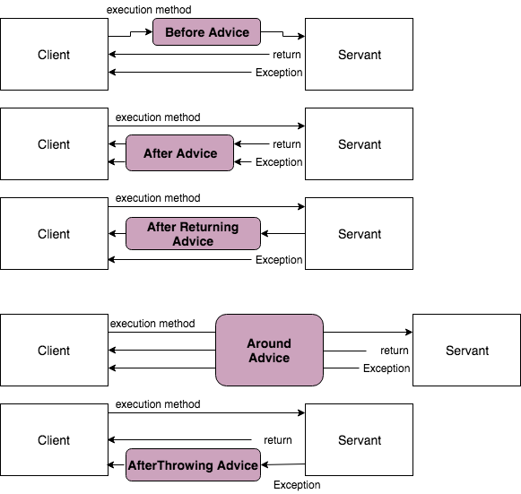

# Join Point

- 타겟의 여러 조인포인트 중에 어드바이스를 적용할 대상을 지정하는 키워드이다.
    
- 스프링 AOP 는 스프링 빈의 메소드 실행 조인포인트만 지원한다.
    
- 포인트컷 선언은 `포인트컷 표현식`과 `포인트컷 시그니쳐`로 구성된다.
    

```java
 @Pointcut("execution(* org.example.greeting.Greeting.sayHello())") // the pointcut expression
public void cut() { // the pointcut signature
}
```

- @Pointcut("execution(* org.example.greeting.Greeting.sayHello())") // the pointcut expression -> 포인트컷 표현식: 조건
    
- public void cut() {} -> 포인트컷 시그니쳐: 이름
    

## 포인트컷 표현식

```java
@Pointcut(
          "execution("           // Pointcut Designator
           + "[접근제한자 패턴] "   // public
           + "리턴타입 패턴"       // long
           + "[패키지명, 클래스 경로 패턴]"          // org.example.greeting.EnglishGreeting.sayHello()
           + "메소드명 패턴(파라미터 타입 패턴|..)"  // .greet(User, String)
           + "[throws 예외 타입 패턴]"            
           +")"   
          )
```

```java
@Pointcut("execution(public * org.example.greeting.Greeting.sayHello(..) throws RuntimeException) ")
```

- 지시자
    
    - 어떤 타입에 적용할 지를 결정
        
    - execution(), within(), this(), target(), args(), @annotation(), @within(), @target(), @args() 등등
        
- 접근제한자
    
    - 생략 가능
        
    - public, private 등이 들어올 수 있으나, 큰 의미는 없음
        
- 리턴 타임
    
    - `*` 와일드 타입 사용 가능
        
- 패키지명, 클래스 경로 패턴
    
    - `..`, `*`, `+` 와일드 카드 사용 가능
        
- 메소드명 패턴
    
    - `*`, `..` 와일드 카드 사용가능
        
- throws 예외 타입 패턴
    
    - 생략 가능
        

## 와일드 카드

1. `*` (별표)  
    하나의 클래스, 메소드, 패키지 이름 등을 대신하는 와일드카드이다. 예를 들어, execution(* get*(..))는 get으로 시작하는 모든 메소드에 매칭
    
2. `..` (점 두 개)  
    매개변수 목록에서 어떤 타입과 수의 매개변수도 매칭되거나, 패키지 경로에서 하나 이상의 하위 패키지를 포함할 수 있음을 의미한다. 예를 들어, execution(* com.example..*(..))는 com.example 패키지와 모든 하위 패키지의 모든 메소드와 매칭
    
3. `+` (플러스)  
    클래스 이름 뒤에 사용되며, 지정된 클래스 또는 인터페이스를 구현하거나 확장하는 모든 클래스와 매칭된다. 예를 들어, within(com.example.service.Service+)는 Service 인터페이스를 구현하는 모든 클래스에 매칭
    

## 포인트컷 지정자 옵션

- execution
    
    - 가장 일반적으로 사용되는 지시자로, 메소드 실행을 가로채는 데 사용
        
- within
    
    - 특정 타입(클래스나 인터페이스) 내의 모든 조인 포인트를 매칭
        
    - 주로 특정 패키지나 클래스 내의 메소드를 대상으로 할 때 사용
        
- this
    
    - 주어진 타입을 구현한 스프링 AOP Proxy 객체에 매칭
        
- target
    
    - this와 유사하지만, 주어진 타입을 구현한 타겟 객체에 매칭
        
- args
    
    - 메소드가 받는 인자의 타입을 기반으로 조인 포인트를 매칭
        
- @taget
    
    - 인자가 아닌, 객체의 클래스에 붙은 어노테이션을 기준으로 조인 포인트를 매칭
        
- @args
    
    - 메소드의 인자에 적용된 어노테이션을 기준으로 조인 포인트를 매칭
        
- @within
    
    - 클래스 레벨에 적용된 어노테이션을 기준으로 조인 포인트를 매칭
        
- @annotation
    
    - 메소드 레벨에 적용된 어노테이션을 기준으로 조인 포인트를 매칭
        
- bean
    
    - 특정 빈 이름에 해당하는 빈에 대해서만 조인 포인트를 매칭
        

## 포인트컷 - 조합

- 포인트컷 표현식은 &&, ||, ! 으로 조합할 수 있다.
    

```java
// anyPublicOperation 포인트컷은 모든 public 메소드 실행에 매칭 된다.
@Pointcut("execution(public * *(..))")
private void anyPublicOperation() {} 

// inTrading 포인트컷은 com.xyz.myapp.trading 패키지 내의 메소드 실행에 매칭
@Pointcut("within(com.xyz.myapp.trading..*)")
private void inTrading() {} 

// tradingOperation 포인트컷은 com.xyz.myapp.trading 패키지 내의 퍼블릭 메소드 실행에 매칭
@Pointcut("anyPublicOperation() && inTrading()")
private void tradingOperation() {} 
```

## 포인트컷 - 공통 포인트컷 공유

- 대규모 시스템에서 공통적인 포인트컷을 정의하여 참조하는 방식을 사용하는 것이 유리하다.
    

```java
package com.xyz.myapp;

import org.aspectj.lang.annotation.Aspect;
import org.aspectj.lang.annotation.Pointcut;

@Aspect
public class CommonPointcuts {

    /**
     * com.xyz.myapp.web 패키지와 서브패키지(web layer)를 
     * 지정하는 포인트컷
     */
    @Pointcut("within(com.xyz.myapp.web..*)")
    public void inWebLayer() {}

    /**
     * com.xyz.myapp.service 패키지와 서브패키지(service layer)를 
     * 지정하는 포인트컷
     */
    @Pointcut("within(com.xyz.myapp.service..*)")
    public void inServiceLayer() {}

    /**
     * com.xyz.myapp.dao 패키지와 서브패키지(data access layer)를 
     * 지정하는 포인트컷
     */
    @Pointcut("within(com.xyz.myapp.dao..*)")
    public void inDataAccessLayer() {}

    /**
     * 아래 businessService 포인트컷 정의는 서비스인터페이스가 service 패키지에 있고 
     * 구현체가 service 패키지 하위에 포한된 것을 가정하고 선언되어 있다.
     *
     * com.xyz.myapp.send.service, com.xyz.myapp.receive.service 와 같이 기능단위의 패키지 구성이라면  "execution(* com.xyz.myapp..service.*.*(..))" 포인트컷 표현식을 사용할 수 있다.
     * 
     * 만약 스프링빈 이름이 Service 로 항상 끝난다면 "bean(*Service)" 표현식을 사용할 수도 있다.
     */
    @Pointcut("execution(* com.xyz.myapp.service.*.*(..))")
    public void businessService() {}

    /**
     * 아래 dataAccessOperation 포인트컷 정의는 Dao 인터페이스가 dao 패키지에 있고 
     * 구현체가 dao 패키지 하위에 포한된 것을 가정하고 선언되어 있다.
     */
    @Pointcut("execution(* com.xyz.myapp.dao.*.*(..))")
    public void dataAccessOperation() {}

}
```

## 포인트컷 - 표현식 예제

- Spring AOP 는 주로 execution 포인트컷 지정자를 사용한다.
    

```java
execution(modifiers-pattern? ret-type-pattern declaring-type-pattern?name-pattern(param-pattern) throws-pattern?)
```

- 모든 public 메소드
    

```java
execution(public * *(..))
```

- get~ 으로 시작하는 모든 메소드
    

```java
execution(* get*(..))
```

- `org.example` 패키지에 있는 모든 메소드
    

```java
execution(* org.example..*(..))
```

- `org.example.greeting.Greeting` 인터페이스에 정의된 모든 메소드
    

```java
execution(* org.example.greeting.Greeting.*(..))
```

- `org.example.greeting` 패키지의 모든 메소드실행
    

```java
within(org.example.greeting.*)
```

- `SpecialGreeting` 프록시 구현체의 메소드 실행
    

```java
this(org.example.greeting.SpecialGreeting)
```

- `SpecialGreeting` 인터페이스의 구현 객체의 메소드 실행
    

```java
target(org.example.greeting.SpecialGreeting)
```

- 런타임에 `SpecialHelloTarget` 타입의 단일 파라미터가 전달되는 메소드 실행 (인자값 검사 기능에 많이 사용된다.)
    

```java
args(org.example.greeting.SpecialHelloTarget)
```

- @Transactional 어노테이션을 가진 모든 타겟 객체의 메소드 실행
    

```java
@target(org.springframework.transaction.annotation.Transactional)
```

## PointCut 에서 범위 제한이 필요한 이유

- 스프링 프레임워크에서 AOP(Aspect-Oriented Programming)를 사용할 때, this(), target(), @this(), @target(), args() 같은 포인트컷 지시자들은 within() 등과 같이 사용해서 범위를 제한하는 작업이 필요한다.
    
- 범위를 지정하지 않는 경우, Spring Boot 에서 내부적으로 scan 하는 과정에서, 우리가 생성한 어노테이션을 활용하는 과정에서 final 클래스가 AOP 위빙의 개상이 될 수 있다. 자바에서 final 클래스는 상속이 금지되어 있어, 프록시 생성을 위해 필요한 클래스 확장이 불가능하기 때문에 오류가 발생한다.

# Advice

- Advice 는 포인트컷과 관련하여 메소드 실행 전, 후, 전/후 를 결정하기위해 사용
    

|Advice 형태|설명|
|---|---|
|Before|Join Point 앞에서 실행할 Advice|
|After|Join Point 뒤에서 실행할 Advice|
|AfterReturning|Join Point가 완전히 정상 종료한다음 실행하는 Advice|
|Around|Join Point 앞과 뒤에서 실행되는 Advice|
|AfterThrowing|Join Point에서 예외가 발생했을때 실행되는 Advice|


## Advice - Advice 선언

- Advice 의 포인트컷은 미리 선언한 포인트컷을 참조하거나 직접 포인트컷 표현식을 사용할 수 있다.
    

## Advice - Before

- Aspect 내에 조인포인트 전에 실행을 위한 @Before Advice 를 다음과 같이 선언한다.
    

```java
@Aspect
public class BeforeExample {

    // case1 조인포인트를 바로 설정 가능
    @Before("execution(* org.example.greeting..sayHello())")
    // case2 클래스 경로와 메소드 명으로 사용 가능
    @Before("org.example.aop.GreetingAop.cut()")
    // case3 같은 클래스인 경우 메소드명만 사용 가능
    @Before("cut()")
    public void before() throws Throwable {
        // ...
    }
}
```

## Advice - AfterReturning

- Aspect 내에 조인포인트(메소드 실행) 반환 후에 실행을 위한 @AfterReturning Advice 를 다음과 같이 선언.
    
- 메소드 실행중에 Exception 이 발생하여 throw 될때는 @AfterReturning Advice가 실행되지 않는다.
    

```java
@Aspect
public class AfterReturningExample {

    @AfterReturning("cut()")
    public void AfterReturning() {
        // ...
    }
}
```

- Advice 내부에서 반환 값에 접근해야 하는 경우, returning 속성을 이용해서 advice 메소드 파라미터에 바인드 할 수 있다.
    

```java
@Aspect
public class AfterReturningExample {

    @AfterReturning(
        pointcut="cut())",
        returning="retVal")
    public void AfterReturning(Object retVal) {
        // ...
    }
}
```

## Advice - After Throwing Advice

- Aspect 내에 조인포인트(메소드 실행) 에서 Exception 이 발생한 후에 실행을 위한 @AfterThrowing Advice 를 다음과 같이 선언한다.
    

```java
@Aspect
public class AfterThrowingExample {

 @AfterThrowing("cut()")
    public void afterThrowing() {
        // ...
    }
}
```

- 원하는 타입의 Exception 이 발생할때만 매칭이 되고, 발생한 Exception 에 접근하기를 원한다면 throwing 속성을 추가할 수 있다.
    

```java
@Aspect
public class AfterThrowingExample {

    @AfterThrowing(
        pointcut="cut()",
        throwing="ex")
    public void afterThrowing(RuntimeException ex) {
        // ...
    }
}
```

## Advice - After (Finally) Advice

- Aspect 내에 조인포인트(메소드 실행) 에서 종료될때 실행을 위한 @After Advice 를 다음과 같이 선언한다.
    
- try-catch 구문의 finally 구문과 유사하기 때문에 메소드 실행중에 exception이 발생하더라도 실행한다.
    

```java
@Aspect
public class AfterFinallyExample {

    @After("cut()")
    public void after() {
        // ...
    }
}
```

## Advice - Around Advice

- 메소드 실행의 전, 후에 advice를 실행할 수 있는 기회를 제공한다.
    
- 심지어 대상 메소드가 실행하거나 하지 않도록 제어할 수도 있다. (proceed() 를 실행하지 않으면 됨)
    
- Object 를 반환해야한다.
    
- ProceedingJoinPoint 의 proceed() 를 호출하면 타겟메소드가 실행된다.
    

```java
@Aspect
public class AroundExample {

    @Around("cut()")
    public Object around(ProceedingJoinPoint pjp) throws Throwable {
        // ...
        Object retVal = pjp.proceed();
        // ...
        return retVal;
    }
}
```

## Advice - JoinPoint 활용하기

- 모든 Advice 메소드에는 첫번째 인자로 JoinPoint 를 받을 수 있다.
    
- Around Advice 는 JoinPoint의 서브클래스인 ProceedingJoinPoint 를 반드시 사용해야 한다

## JoinPoint 의 메소드

- getArgs() : 타겟 메소드의 인자
    
- getThis() : 프록시 객체
    
- getTarget() : 타겟 객체
    
- getSignature() : 타겟 객체의 메소드 시그니쳐
    
- toString() : 타겟 객체의 메소드 정보
    

## Advice - Advice에 파라미터 넘기기

- args 포인트컷 지정자를 이용해서 Advice에 파라미터를 넘길 수 있다.
    

```java
@Before("cut() && args(name,..)")
public void before(JoinPoint joinPoint, String name) throws Throwable {}
```

- args(name,..) 표현식은 두가지 의미를 내포한다.
    
    - 1개 이상의 파라미터를 받는 메소드 실행에 매칭, 첫번째 인자는 Account 클래스의 인스턴스 이어야 한다.
        
    - Account 객체는 Advice의 account 파라미터에 바인딩한다.
        
- 포인트컷과 Advice 를 분리해서 선언하는 경우는 다음과 같이 설정할 수 있다.
    

```java
@Pointcut("args(name,..)")
public void cut2(String name) {
}


@Before("cut() && cut2(name)")
public void before(JoinPoint joinPoint, String name) throws Throwable {}
```

## Advice - Custom Annotation 매칭

- Annotation 을 기준으로 매칭한 경우의 예제는 다음과 같다.
    
- Method.java 로 Annotation 을 작성한다.
    

```java
@Target(ElementType.METHOD)
@Retention(RetentionPolicy.RUNTIME)
public @interface Method {
    String value() default "";
}
```

- @annotation 포인트컷 지정자로 설정된 Annotation 을 Advice 파라미터로 참조 할 수 있다.
    

```java
@Before("@annotation(annotationName) && within(org.example.greeting.*)")
public void before(Method annotationName) {
    System.out.println(annotationName.value());
    // ...
}
```

## Advice - 파라미터와 제네릭

- 스프링 AOP 는 제네릭도 지원한다.

```java
public interface Sample<T> {
    void sampleGenericMethod(T param);
    void sampleGenericCollectionMethod(Collection<T> param);
}
```

- Advice의 파라미터의 타입으로 매칭을 제한할 수 있다.

```java
@Before("execution(* ..Sample+.sampleGenericMethod(*)) && args(param)")
public void beforeSampleMethod(MyType param) {
    // Advice implementation
}
```

- 아래의 Collection 의 내부의 엘리먼트까지 검사해주지 않는다.

```java
@Before("execution(* ..Sample+.sampleGenericCollectionMethod(*)) && args(param)")
public void beforeSampleMethod(Collection<MyType> param) {
    // Advice implementation
}
```

-  꼭! 해야 한다면 Advice의 파라미터 타입을 Collection\<?\> 으로 지정하고 Advice 내에서 검사할 수 있다.

## Advice - argNames 속성

- 포인트컷 표현식에서 파라미터 이름으로 매칭하는 방법을 제공한다.
    
- @Pointcut 과 Advice 에는 모두 argNames 속성을 옵션으로 제공한다.
    
```java
@Before(value = "cutAnnotation(annotationName) && withInGreeting()", argNames = "annotationName")
public void before(Method annotationName) {
    System.out.println(annotationName.value());
}
```

## Advice - Argument 로 proceed 호출

- Around Advice 에서 Argument 를 넘기는 방법도 비슷하다.
    

```java
    @Around(value = "cutAnnotation(annotationName) && withInGreeting()", argNames = "proceedingJoinPoint, annotationName")
    public Object around(ProceedingJoinPoint proceedingJoinPoint, Method annotationName) throws Throwable {
        // ...
    }
```

## Advice - Ordering

- 같은 조인포인트에 여러 Advice 가 적용된다면 org.springframework.core.Ordered 를 implements 하거나 @Order 로 우선순위를 결정할 수 있다.
    
- Order 의 우선순위는 숫자가 낮을 수록 높은 우선순위를 가진다. ( org.springframework.core.Ordered 참고 )
    

```java
@Order(value = Ordered.HIGHEST_PRECEDENCE)
@Aspect
@Component
public class Highest {
    //... advice
}

@Order(value = Ordered.LOWEST_PRECEDENCE)
@Aspect
@Component
public class Lowest {
    //... advice
}
```
## AOP 선택 - Spring AOP vs Full AspectJ

|Spring AOP|AspectJ| 
|---|---|---| 
|구현|순수 자바|자바 언어 확장 사용| 
|Goal|Simple Solution|Complete Solution| 
|특징|별도의 컴파일 과정 불필요|AspectJ compiler(ajc)가 필요| 
|Weaving|Runtime weaving|compile-time, post-compile, load-time weaving 지원| 
|대상|Spring Container 에 의해서 관리되는 `Spring Bean`|모든 객체들|
|JoinPoint|Method 실행시에만 가능|Method 실행시, Constructor 실행시, field 참조시, field 할당시 등등|
|성능|비교적 느리다|비교적 빠르다|

## Spring AOP Proxies

- Spring AOP 는 JDK Proxy 와 CGLIB 을 활용하여 AOP 기능을 제공한다.
    
- Target 메소드가 실행되는 시점에 IoC 컨테이너에 의해 Proxy 빈을 생성한다.(Runtime Weaving)
    

## 사용하는 프록시 변경 방법

- 기본 프록시: CGLIB
    
- JDK Proxy 를 사용하려면
    
    - `spring.aop.proxy-target-class` 를 `false` 로 설정
        
    - 인터페이스 구현이 필요
        
- CGLIB 는 인터페이스가 필요하지 않고, JDK Proxy 는 인터페이스가 필요
    
- AspectJ 를 사용하려면
    
    - class path 에 AspectJ 가 존재하면 자동으로 AspectJ 를 사용한다. (자동 구성)
    - 
[https://docs.spring.io/spring-boot/docs/3.2.0/reference/htmlsingle/#features.aop](https://docs.spring.io/spring-boot/docs/3.2.0/reference/htmlsingle/#features.aop)

# 자주할 수 있는 실수

## Final 및 Private 메소드에 대해 aop 적용을 함

- 문제: Spring AOP는 프록시를 사용하여 메소드 호출을 가로채는데, final 또는 private 메소드는 프록시를 통해 접근이 불가능하다. Final 클래스는 확장될 수 없으며, private 메소드는 프록시에서 접근할 수 없다.
    
- 해결 방법: 리팩토링이 필요하다. 가능한 한 상속(extends) 대신 구성을 사용하는 것이 좋다. final 클래스를 사용하는 대신 인터페이스를 사용하여 설계하면 Spring AOP가 더 효과적으로 프록시를 적용할 수 있다. private 메소드의 경우, AOP를 통해 조언을 받아야 한다면 접근 레벨을 변경하거나, 별도의 non-private 메소드로 로직을 리팩토링하여 가로챌 수 있도록 고려해야 한다.
    

## Pointcut 표현식이 너무 넓은 경우

- 문제: 포인트컷 표현식이 너무 넓은 경우  
    포인트컷 표현식이 너무 넓게 설정되어 있다면, 어드바이스가 의도하지 않은 너무 많은 메소드에 적용되어 성능 문제를 일으키거나 예상치 못한 부작용을 발생시킬 수 있다. 성능 뿐만 아니라 자동 설정으로 인해 생기는 클래스, 메소드와 충돌을 일으켜서 문제가 생길 수 있다.
    
- 해결방법  
    더 구체적인 포인트컷 사용: 특정 클래스나 패키지의 메소드만을 대상으로 하는 포인트컷을 사용한다.
    

## 내부 메소드를 실행 하는 경우

`git checkout -f feature/spring_aop_inner_proxy`

- 스프링 빈 내부에서 내부 메소드를 실행하는 경우, Proxy 가 개입할 수 없기 때문에 AOP 가 동작하지 않는다.
    

## 코드 해석

-@Method 가 붙은 메소드가 aop 를 타도록 작성했다.

- businessLogic() 메소드에서 aTest() 메소드와 BService 의 bTest() 메소드를 호출한다.
    

```java
@RequiredArgsConstructor
@Service
public class AService {

    private final BService bService;

    public void businessLogic() {
        this.aTest();
        bService.bTest();
    }

    @Method
    public void aTest() {
        System.out.println("aTest");
    }

}
```

```java
@RequiredArgsConstructor
@Service
public class BService {

    @Method
    public void bTest() {
        System.out.println("bTest");
    }

}
```

### 실행결과

- 기대한 바
    

```
=== around start === 
aTest
=== around end === 
=== around start === 
bTest
=== around end === 
```

- 실제 실행
    

```
aTest
=== around start === 
bTest
=== around end === 
```

### spring aop 는 프록시 기반으로 동작하기 때문에 외부에서 받은 호출만 aop 로 감쌀 수 있다.

## 해결 방법1 (self injection)

```java
@Service
public class AService {

    private AService aService;
    private final BService bService;

    public AService(BService bService) {
        this.bService = bService;
    }

    public void businessLogic() {
        aService.aTest();
        bService.bTest();
    }

    @Autowired
    void setAService(AService aService) {
        this.aService = aService;
    }

    @Method
    public void aTest() {
        System.out.println("aTest");
    }

}
```

- 이 경우 옵션을 바꿔줘야한다.
    
    - spring.main.allow-circular-references=true
        

### 해결 방법2 (추천)

순환 참조를 하는 것은 좋은 방법이 아니므로, 구조를 리팩토링하는 것이 좋다.

# 요약

### Spring aop 문법

- Spring AOP 설정할 때, 어디에 (Join Point) 무엇을 (Advice) 등록하는지를 배웠고, 설정에 대해서 자세히 배웠다.
    

### Spring aop 주의할 점

- 범위가 너무 넓으면 안 된다는 점과 같은 클래스의 메소드를 호출 할 때 실패다는 것을 배웠다.